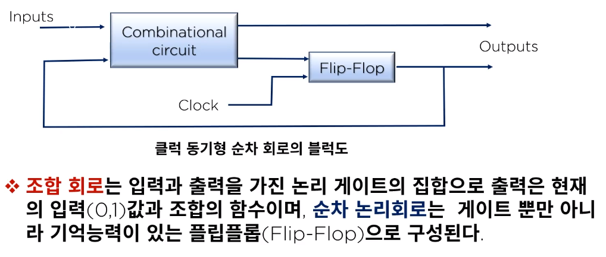
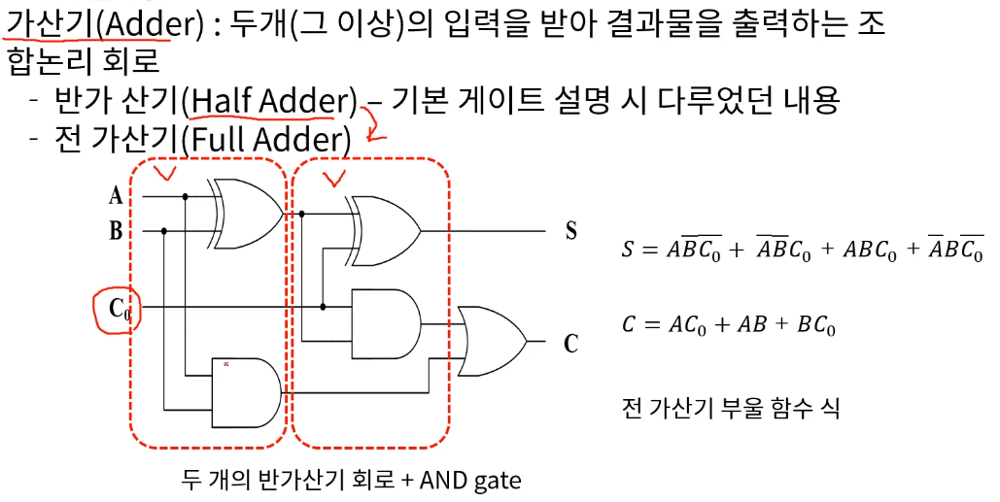
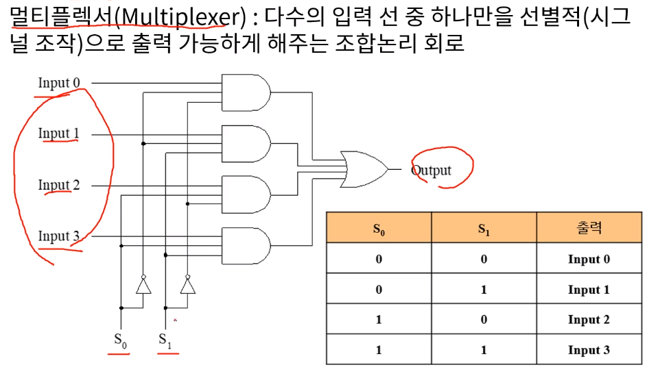
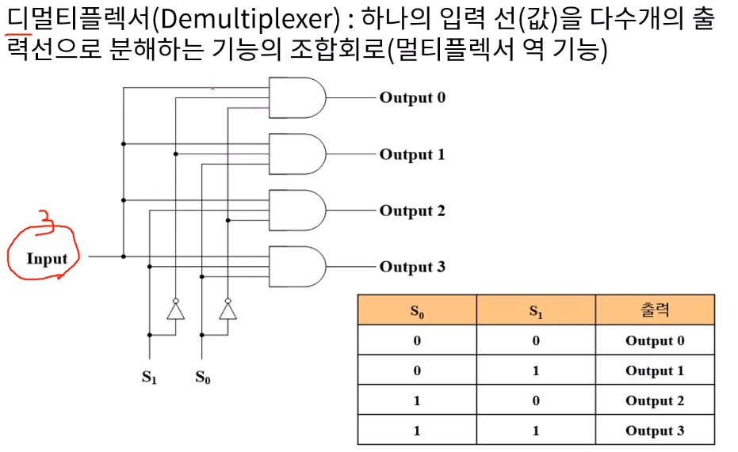
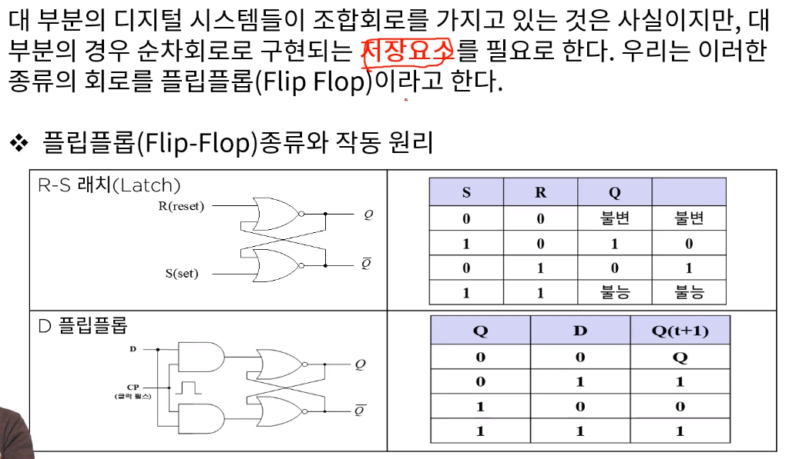
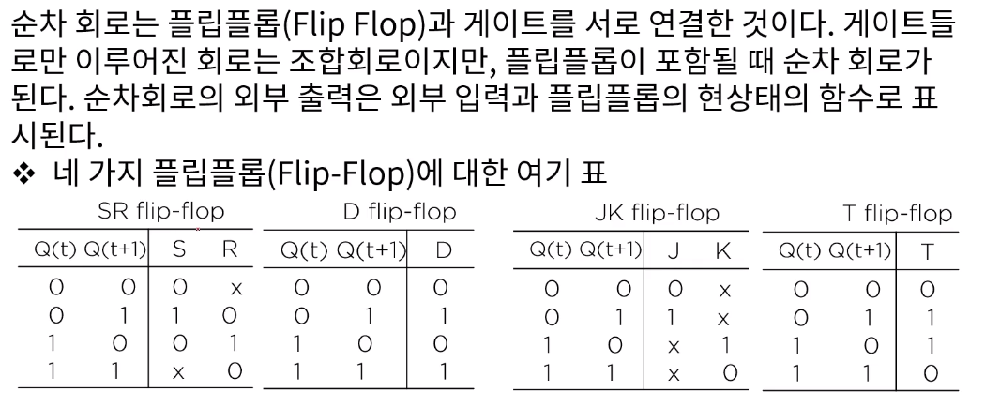
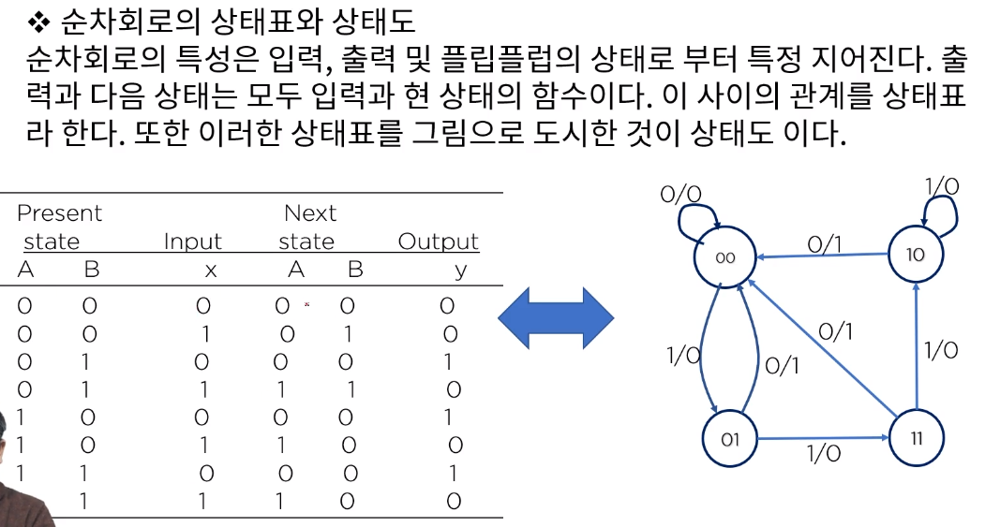

[toc]

# 조합&기억 논리회로

## :heavy_check_mark: 조합논리 회로

### 조합회로의 설계 절차

- 문제 제시
- 입력 출력 변수에 문자 기호 붙인다
- 입력 출력 사이의 관계를 정의하는 진리표 유도
- 각 출력에 대한 간소화된 부울 함수 얻기
- 논리도 작성

## :heavy_check_mark: 대표적 조합 회로

### 가산기

- 반가산기
- 전가산기

### 멀티 플렉서 (Multiplexer)

### 디멀티플렉서

## :heavy_check_mark: 기억회로의 구성 및 작동 원리

### 플립플롭(Filp-Flop)

## :heavy_check_mark: 네가지 플립플롭 표

## :heavy_check_mark: 순차회로

