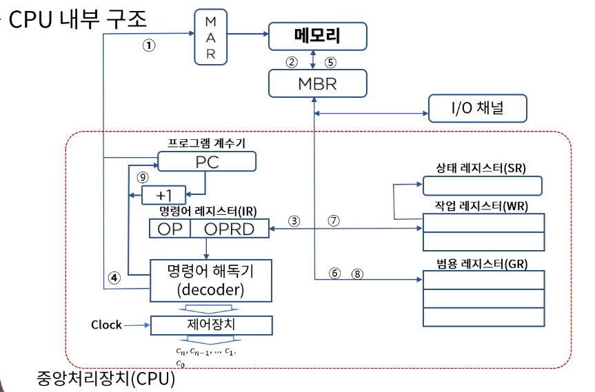
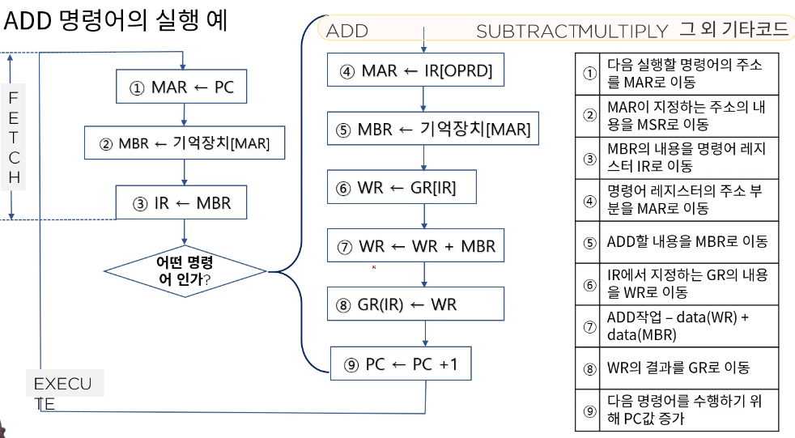

[toc]

# 중앙 처리 장치 CPU 내부 구조와 레지스터

## :heavy_check_mark: CPU (Central Proccessing Unit)

- 레지스터 세트 - 명령어를 실행하는 필요한 데이터를 보관
- 산술 논리 장치(ALU) - 명령어 실행을 위한 마이크로 연산 수행
- 제어장치 (Control Unit) - Rs간 정보 전송 감시, ALU에게 수행할 동작을 지시

## :heavy_check_mark: CPU 내부 구조

## :heavy_check_mark: 각종 레지스터 들의 명칭과 기능

- 작업 레지스터 (working register)

  산술 논리 연산을 실행할 수 있도록 자료를 저장하고 그 결과를 저장 (GPR과의 차이점은 ALU에 연결되어있나?의 차이점)

- 상태 레지스터 (status register)

  CPU의 상태를 나타내는 특수 목적의 레지스터 - 연산결과의 상태, 영 Z(zero), 부호 S(sign) , 오버플로우 V(overflow), 캐리 C(carry), 인터럽트 I(interrupt)

### ADD 명령어의 실행 예

