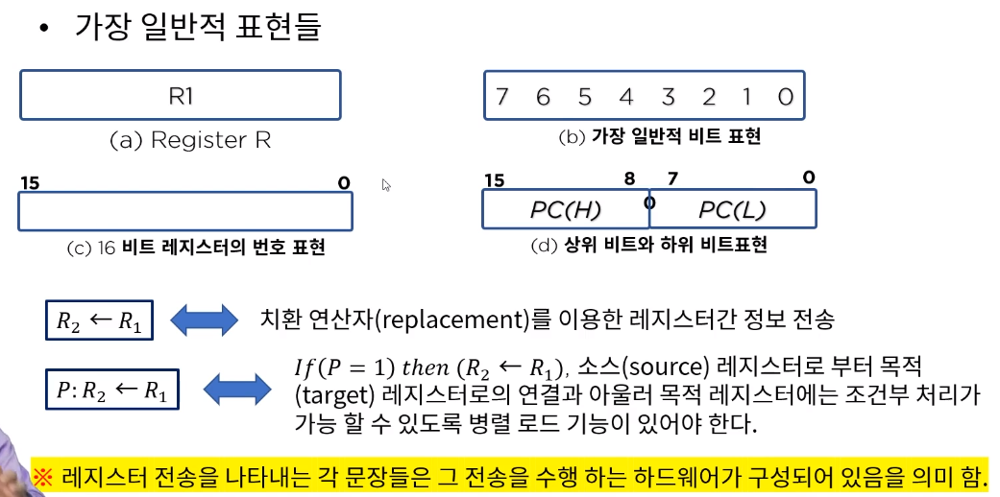
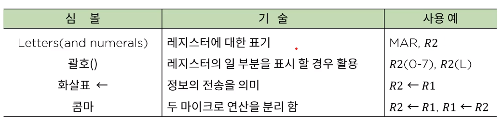
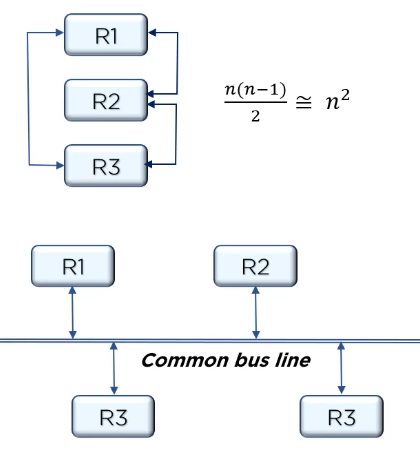
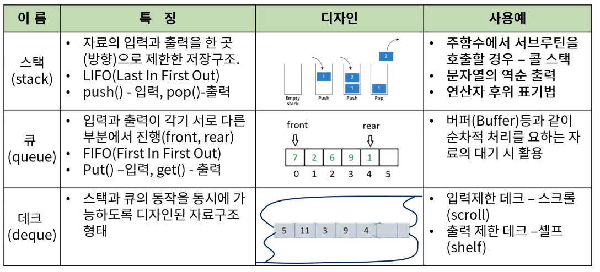

[toc]

# CPU 내부구조와 명령어 집합

## :heavy_check_mark: 레지스터 전송 언어

레지스터에 저장된 데이터의 조작을 위해 실행되는 동작을 마이크로 연산이라한다.

이는 하나의 클럭펄스 내에서 실행되는 기본 적인 동작 (시프트, 카운트, 클리어, 로드 ...)

- 디지털 컴퓨터의 구조를 정희하기 위해 논의 되어야할 내용
  - 레지스터의 종류와 기능
  - 레지스터에 저장된 이진 정보를 가지고 수행되는 일련의 마이크로 연산들
  - 일련의 마이크로 동작을 온/오프 시킬 수 있는 제어 기능

## :heavy_check_mark: 레지스터 전송

- 치환 연산자(replicement), 조건부 연산

## :heavy_check_mark: 레지스터 전송의 기본 기호

## :heavy_check_mark: CPU 디자인

- CPU 내의 다양한 디바이스들간의 상호 연결
  - 직접 연결: 연결 복잡도가 장치수의 제곱에 비례
  - 버스 연결: 공용선에 의한 연결
    - 가장 가성비 높은 연결 방식
    - 관리를 위한 다양한 방법이 제시된다.

### 스택, 큐, 데크의 특징 비교 및 활용

