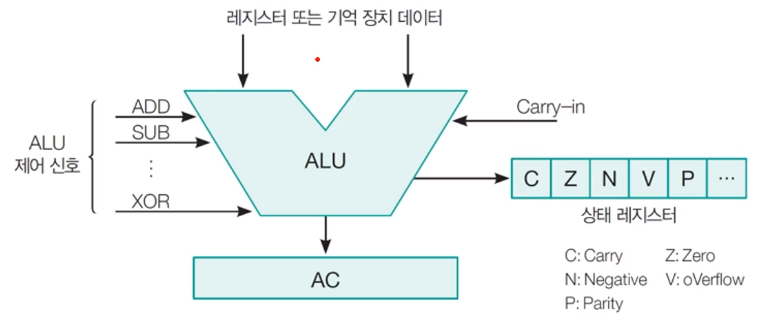

[toc]

# 마이크로 명령과 ALU

## :heavy_check_mark: 마이크로 연산

마이크로 연산은 레지스터에 지정된 데이터에 대해 수행되는 기본적인 연산으로

디지털 컴퓨터에서 흔히 사용되는 마이크로 연산은 다음과 같이 네 가지로 분류된다

- 레지스터 사이에서 이진 정보를 전송하는 레지스터 전송 마이크로 연산
- 레지스터에 저장된 수치 데이터에 대해 산술 연산을 수행하는 산술 마이크로 연산
- 레지스터에 저장된 비수치 데이터에 대해 비트 조작 연산을 수행하는 논리 마이크로 연산

- 레지스터에 저장된 데이터에 대해 시프트 연산을 수행하는 시프트 마이크로 연산

## :heavy_check_mark: 마이크로 연산과 ALU

### 산술 논리 연산 장치 (Arithmetic Logic Unit, ALU): 산술 연산과 논리연산

- 주로 정수 연산을 처리
- 부동 소수(Floating-point Number)연산: FPU(Floating-Point Unit)
- 최근에는 ALU가 부동 소수 연산까지 처리

### 산술연산

덧셈, 뺄셈, 곱셈, 나눗셈, 증가, 감소, 보수

### 논리연산

AND, OR, NOT, XOR, 시프트(shift)

## :heavy_check_mark: 부제

## :heavy_check_mark: 부제

