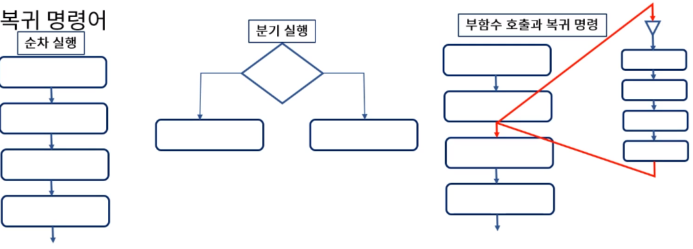
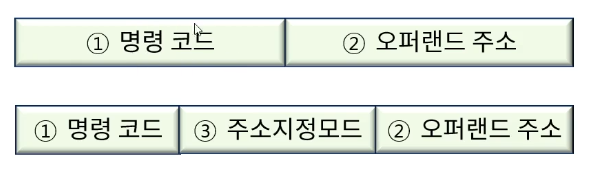
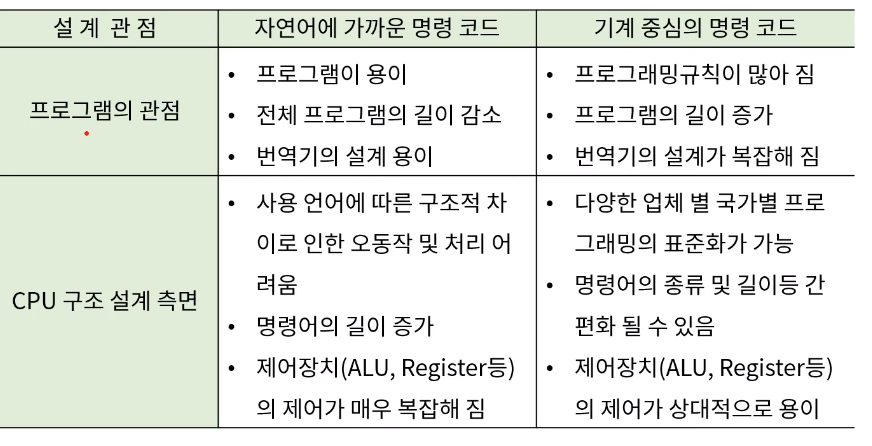
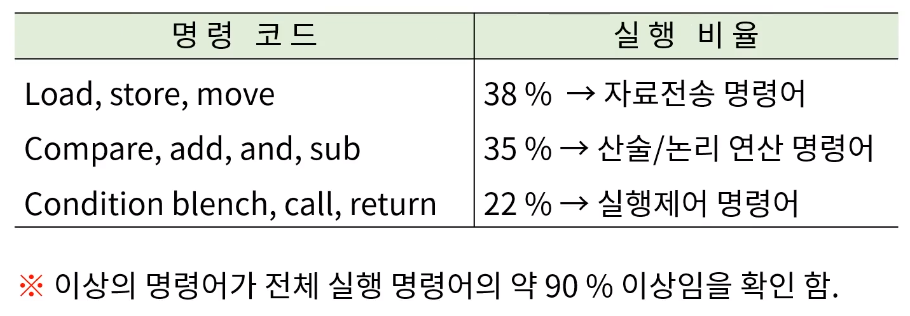
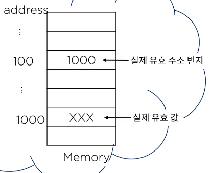
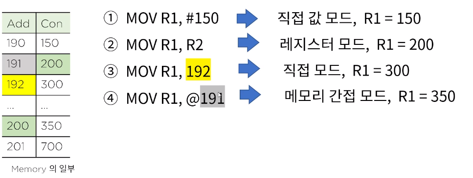

[toc]

# 마이크로 명령어 집합과 구성

## :heavy_check_mark: 명령어(instruction) 집합

- 실행 순서에 따른 명령어 분류
  - 순차적 실행 명령어 - 전체 실행 명령어의 70~80% 차지
  - 분기 명령어
  - 부 함수 호출 명령어
  - 복귀 명령어

## :heavy_check_mark: 명령어 구문 형식

1. 명령코드 : CPU가 실행할 수 있도록 디자인 된 연산
2. 오퍼랜드: 연산에 사용되는 자료 값, 자료가 저장된 주소에 관한 정보
3. 주소 지정 모드(addressing mode): 오퍼랜드가 저장된 위치를 인덱싱(지정)하는 방법

## :heavy_check_mark: 명령어 집합의 설계

### 현업에서 활용되는 명령어 군의 활용 비율

## :heavy_check_mark: 주소 지정 모드 (addressing mode)

명령어의 구조상 자료가 저장되어 있는 장소를 지정하는 방법이 필요함.

최대한 하드웨어와 소프트웨어의 독립성을 유지하여 프로그램의 유연성(pointer, indexing 등..)을 가능하게 하여 명령어의 수와 길이를 줄이기 위한 세계적 표준화 기법

### 묵시적 모드(operand가 명령어에 포함되어 있지 않은 특수모드)

- NOP: NO operation, 오퍼랜드가 필요없는 명령어
- INC: 묵시적 오퍼랜드인 누산기(AC)의 연산 명령어
- ADD: 스택 구조의 명령어 (스택에 오퍼랜드가 저장)

### 직접 값 모드(operand 자체가 명령어에 포함되어 있는 모드)

- MOV R1, #100; 십진수 값 100이 두번째 오퍼랜드로 직접 명령문에 포함되어 있는 경우

### 레지스터 모드(Register mode: 오퍼랜드가 레지스터에 저장된 모드)

- ADD R1, R2; 레지스터 R1과 R2에 보유하고 값이 오퍼랜드임

### 메모리 직접 주소 모드 (Direct mode: 오퍼랜드가 저장된 메모리 주소를 나타내는 모드)

- MOV R1, 100; R1에 100번지 내용을 이동하라는 내용 (물론 기종에 따라 반대도 가능), 결국 100번지의 내용이 두번째 오퍼랜드임

### 메모리 간접 주소 모드 (Memory indirect addressing mode: 메모리를 이용해 간접적으로 주소를 지정)

- MOV R1, @100; R1 <- M[100] or M[100] <- R1

  

## :heavy_check_mark: 다음 마이크로 명령을 수행한 후 변화

- 주어진 일부 메모리 내용 참조, R1=100, R2=200으로 가정

