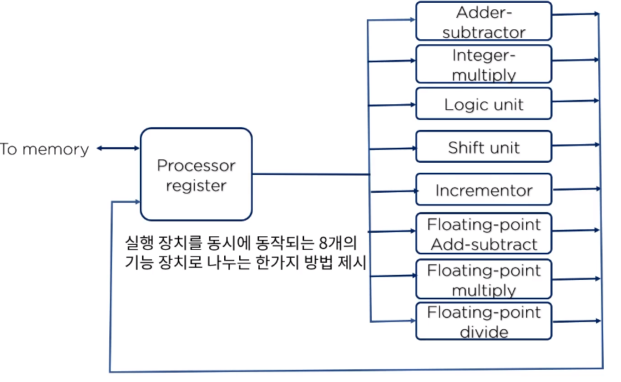
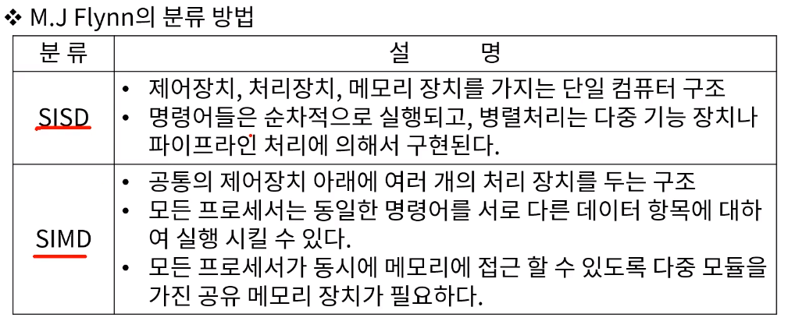
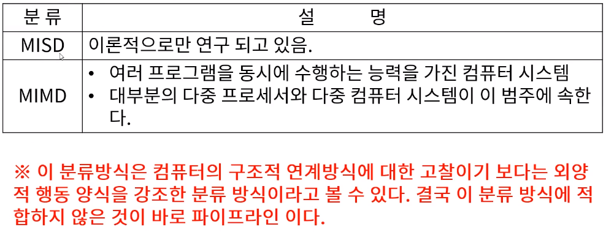
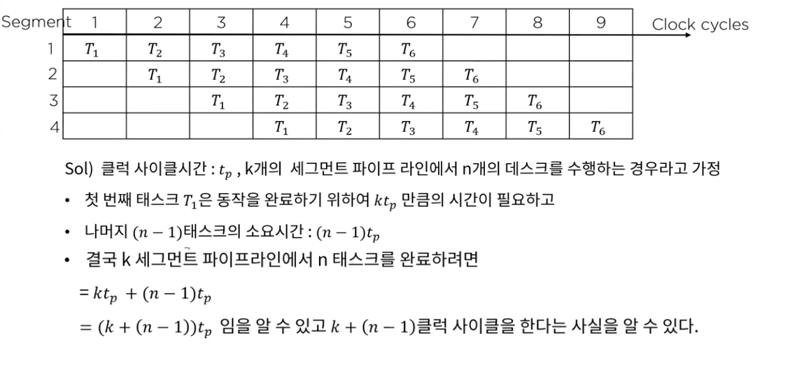
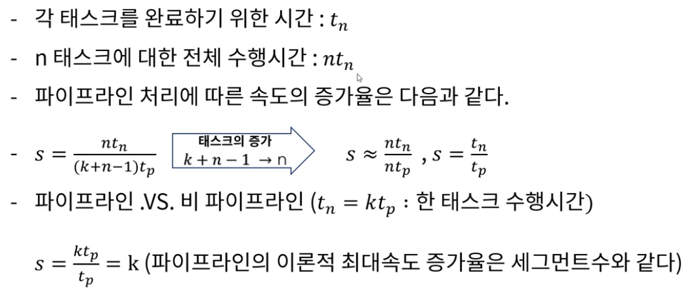

[toc]

# 벡터처리, 데이터의 종속성 - 병렬처리, 파이프라인

## :heavy_check_mark: 병렬처리 (paraller processging)

- 병렬처리는 컴퓨터 시스템의 계산 속도 향상을 목적으로 하여 동시 데이터 처리기능을 제공하는 광범위한 개념의 기술

### 복잡도에 따른 병렬처리의 다양한 단계

- 사용 레지스터의 형태에 따른 병렬 성 구현 (시프트 레지스터 vs 워드 당 동시에 전송이 가능한 병렬성을 갖는 레지스터)
- 동일한 또는 서로 다른 동작을 동시에 수행하는 여러개의 기능 장치를 가지고서 데이터를 각각의 장치에 분산시켜 작업을 수행하는 경우 (산술, 논리, 시프트 동작을 세개의 장치로 분류하고, 제어장치의 관리에 따라 피 연산자를 각 장치들 사이에서 전환)

### 다중 기능 장치를 가진 예

### M.J Flynn의 분류방법

> 동시에 처리되는 명령어와 데이터 항목 수에 의해 컴퓨터 시스템의 구조를 파악하려는 분류 방법 제안(명령어 흐름(instruction stream) -> 메모리로 부터 읽어온 명령어의 순서, 데이터 흐름(data stream) -> 데이터에 대해 수행되는 동작)

- SISD -> 단일 명령어 흐름, 단일 데이터 흐름
- SIMD -> 단일 명령어 흐름, 다중 데이터 흐름
- MISD -> 다중 명령어 흐름, 단일 데이터 흐름
- MIMD -> 다중 명령어 흐름, 다중 데이터 흐름

## :heavy_check_mark: 파이프라인

### 파이프라인 구조의 성능

파이프라인의 동작은 공간/시간표에 의해 설명되는데, 이것은 시간에 대한 함수로서 세그먼터의 사용상황을 보여준다

## 비 파이프라인의 경우

