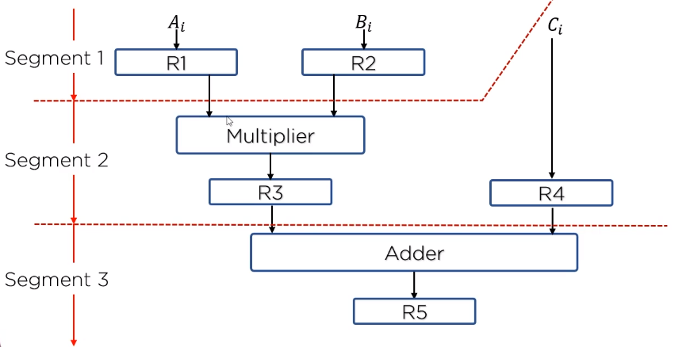
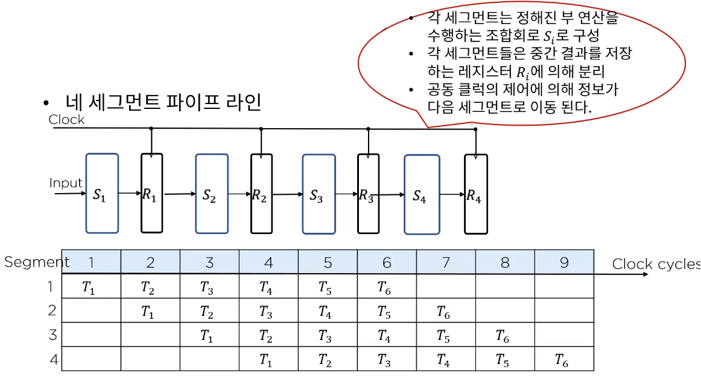
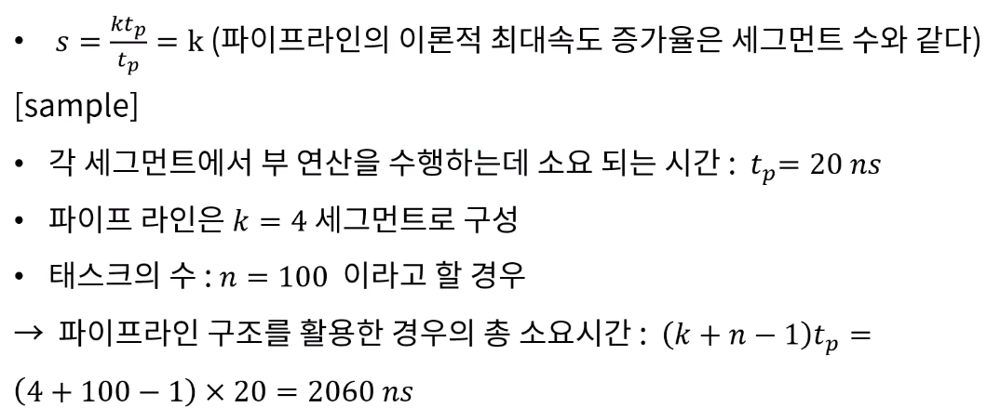
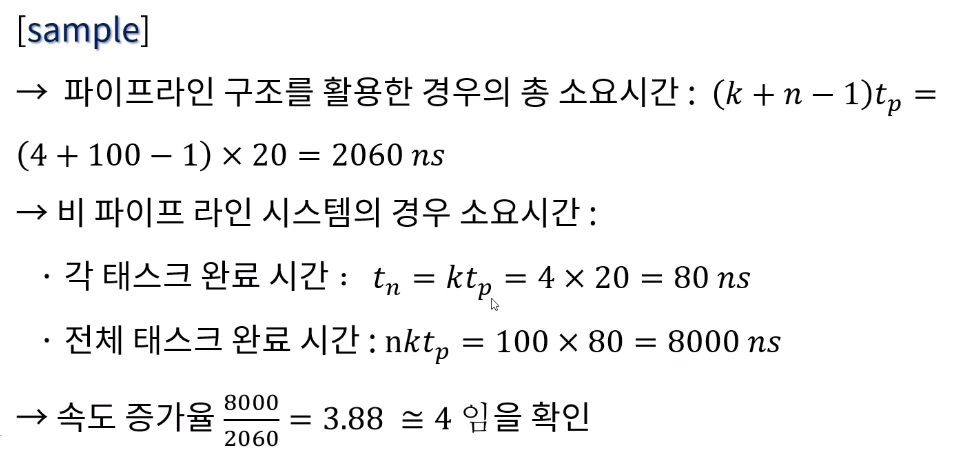

[toc]

# 파이프라인 구조 - 데이터/구조

## :heavy_check_mark: 파이프라인의 구현

- 하나의 프로세스를 서로 다른 기능을 가진 여러개의 서브프로세스(Subprocess)로 나누어 각 프로세스가 동시에 서로 다른 데이터를 취급하도록 하는 기법
- 각 세그먼트(segment)에서 수행된 연산 결과는 다음 세그먼트로 연속적으로 넘어가게 되어 데이터가 마지막 세그먼트를 통과하게 되면 최종적인 연산결과를 얻게 된다
  - 하나의 프로세스를 다양한 연산으로 중복시킬 수 있는 근간은 각 세그먼트마다의 **레지스터**이다.

### 간단한 파이프라인 구현 예제 

> 곱셈과 덧셈이 섞여있는 다항식 연산

### 파이프라인 처리 예

## :heavy_check_mark: 파이프라인의 일반적 고찰

- 동일한 복잡도의 부연산들로 나뉘어지는 어떠한 연산 동작도 파이프라인 프로세서에 의해 구현 될 수 있다.
- 파이프라인 기술은 매번 다른 데이터 집합을 동일한 태스크에 적용시켜 여러번 반복하는 응용에 효과적이다.

