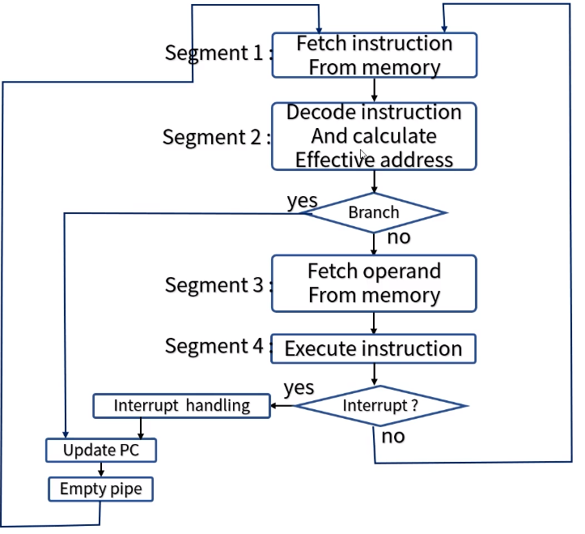

[toc]

# 파이프라인 구조 - 산술 & 명령어 파이프라인

## :heavy_check_mark: 파이프라인 구조 vs 병렬적인 다중 기능 장치

- 실제 파이프라인 구조가 이론적인 최대 속도를 구현하지 못하는 이유

  - 각 세그먼트들이 부연산을 수행하는 시간이 서로 다르다.
  - 또한 각 레지스터를 제어하는 클럭 사이클은 최대 전파시간을 갖는 세그먼트의 지연시간과 싱크를 맞춰야한다.

- 다음 그림과 같이 병렬적인 다중 기능 장치(파이프라인 처리속도)를 고려할 수 있다.

  - 각 P 회로는 전체 파이프라인 회로에서와 동일하게 태스크를 수행한다.
  - 그러나 이 구조는 순차적 처리가 아니라 모든 회로가 동시에 데이터를 입력받아 4가지 태스크를 한번에 수행한다 (SIMD 구조일 뿐)

- 파이프라인 구조> 순차적 처리 구조

  

## :heavy_check_mark: 파이프라인 구조가 적용되는 컴퓨터 설계

- 산술(arithmetic) 파이프 라인: 산술 연산들을 부연산으로 나누어 파이프라인의 세그먼트에서 수행
  - 고속 컴퓨터에서 부동 소수점 연산, 고정 소수점 수의 곱셈, 과학계산용으로 활용
  - 파이프라인 승산기(배열 승산기 - 부분 곱 사이의 캐리(carry) 전파시간의 최소화를 위한 가산기 보유)
- 명령어(instruction) 파이프 라인: 명령어 사이클의 fetch, 디 코드, 실행단계를 중첩시킴으로 명령어 흐름에 동작

### 산술 파이프라인

### 부동 소수점 덧셈과 뺄셈을 위한 파이프 라인

### 부동 소수점 파이프라인의 구성 요소

- 비교기, 시프터, 가산/감산기, 인크리멘터, 디크리멘터 -> 조합회로

## :heavy_check_mark: 명령어 실행과 파이프라인 구조

- 명령어 파이프라인은 이전 명령어가 다른 세그먼트에서 실행되고 있는 동안 메모리에 연속적으로 저장되어 있는 다음 명령어를 읽어옴으로써 fetch와 실행이 중첩되어 동시에 수행되는 구조이다.
- 분기가 발생할 경우(가장 큰 취약점) - 현재의 파이프라인은 모두 비워져야하고, 분기명령 후에 메모리에서 읽어온 명령어는 모두 무시되어야 한다.

## :heavy_check_mark: 보다 효율적 명령어 실행을 위한 파이프라인 구조

- 명령어 fetch장치와 명령어 실행 장치로서 두 세그먼트 파이프라인을 구성하는 컴퓨터를 고려
  - 명령어 fetch장치 -> FIFO에 의한 QUEUE로 구성되어 queing기법에 의한 메모리 참조에 의해 평균 메모리 접근 시간을 효과적으로 줄여준다.
- 명령어 파이프라인이 수행되는데 있어 발생하는 애로사항
  - 세그먼트의 수행시간이 서로 다름(실행되지 않는 세그먼트도 있을 수 있음 ex)레지스터 모드 명령의 경우 - 유효주소 계산 불필요)
  - 두 개 이상의 세그먼트에 의해 동일한 주소 공간이 참조되는 경우

### 네 세그먼트 명령어 파이프라인의 예 - 명령어 파이프라인의 시간 관계 

## :heavy_check_mark: 보다 효율적 명령어 실행을 위한 파이프라인 구조

