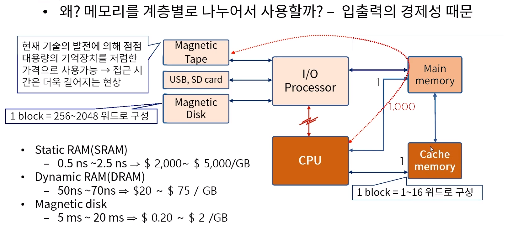
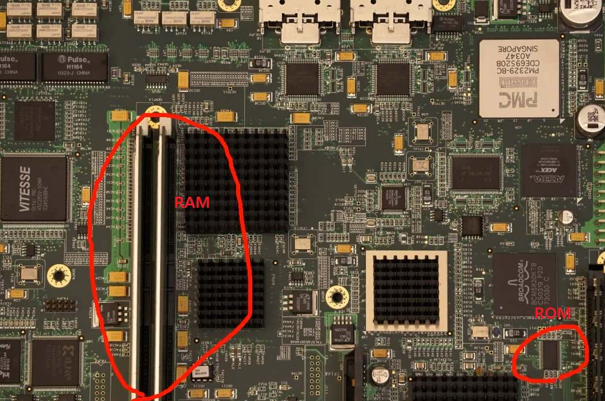
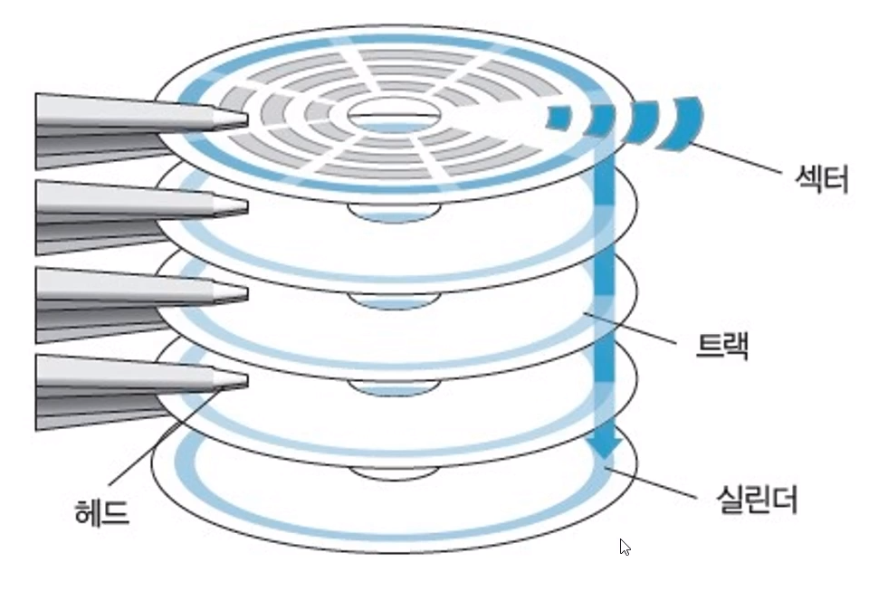

[toc]

# 메모리 구조

## :heavy_check_mark: 메모리 계층	

> 기억장치는 CPU에 의해 시행될 프로그램이 저장되는 곳으로 **주 기억장치**, **보조 기억장치**, **Cache 메모리**로 분류

### 주 기억장치

- 마더 보드에 장착 - RAM

  : 비교적 대용량, 고속의 속도, 휘발성 성질

- ROM(Read Only Memory)도 주 기억장치의 일종

  : 부스터라고도 함, OS의 기능들을 RAM으로 끌어 올리는..

 

### Cache 메모리 (buffer)

- 주 기억장치 접근 시간 > 프로세스 논리 회로 => MMS & CPU 배치
- 현재 진행되고있는 프로그램의 일부 또는 사용빈도가 높은 임시데이터 저장

 

### 보조 기억장치

- 비교적 저속, 대용량 자료 보관 (당장 쓰지 않는 자료들)
- 보조기억 장치 내 자료는 필요한 경우 주 기억장치로 옮겨져야(Loading)함
- Magnetic Tape, USB, SD card - 필요한 파일의 생성 및 삭제가 가능
- Magnetic drum, disk - back up 저장 장치
- 코어(core) 메모리, Magnetic bubble, CCD 등의 대용량 저장 장치

- cpu가 cache memory에 먼저 hit (확인) 없으면 main memory로

- cpu는 보조기억장치를 직접 관리 못함 (퍼포먼스 저하됨)

- cpu는 cache와 main memory만

- 보조장치는 main memory로 I/O Processor로 로딩

- SRAM: Cache Memory에 활용

  DRAM: 주기억장치에 활용

## :heavy_check_mark: 주 기억장치

- RAM

  - SRAM
    - 전원이 연결되어있는 동안 정보 유지
    - 사용 편리, 읽기 쓰기 시간 짧음 (Cache 기억장치)
  - DRAM
    - 주기적으로 재 충전해줘야 정보 유지
    - 전력소비 적음, 하나 칩으로 대량 정보 저장 가능

  

- ROM

  - 부트 스트랩 로더

## :heavy_check_mark: 보조 기억장치

- 접근 시간: 메모리내의 기억장소에 도달해 그 내용을 얻는데 요구되는 평균 시간
  - 시크 타임:  read/write head가 지정된 기억장소에 도달하는데 소요되는 시간
  - 트랜스퍼 타임: 추출된 데이터를 장치내 또는 장치 밖 필요한 곳으로 전송하는데 요구되는 시간
  - 레코드: 일반적으로 데이터가 기록되는 단위
  - 전송률: 장치가 레코드의 시작점에 위치한 다음 단위 시간 

