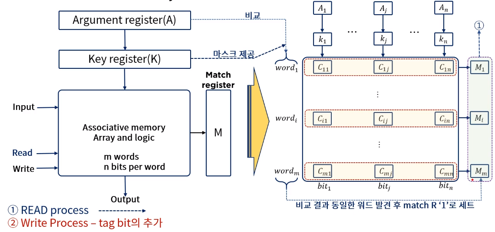
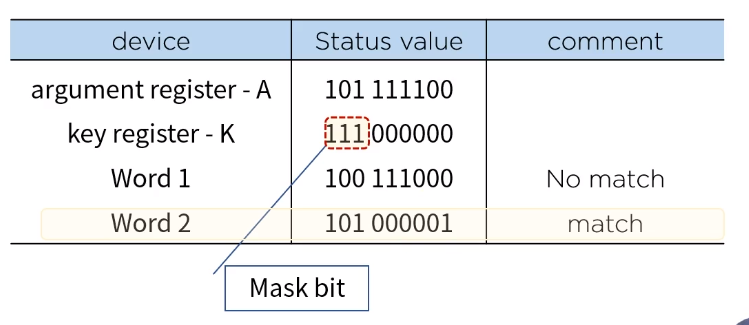
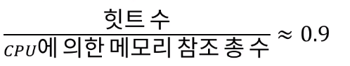

[toc]

# 효율적인 메모리 관리 정책

## :heavy_check_mark: Associative 메모리

- 내용에 의해 접근하는 메모리 장치를 이르는 용어
  - 메모리 장치(memory device)란 자료(data)의 저장(store)과 접근(access)을 용이하게 하기 위해 필요로 하는 장치이다.
  - 결국 이상의 필요에 따라 CPU는 필요한 자료를 얻기 위해 메모리 장치에 탐색(search)을 하게 될 수 밖에 없고
  - 좀 더 효율적 탐색이 가능 할 수 있는 저장 공간의 필요에 의해 만들어진 저장 형태를 우리는 이렇게 명명 (또는 내용 지정 메모리(content addressable memory,CAM))한다.
- 이 방식은 데이터의 **내용을 병령 탐색**을 하기에 적합하도록 구성되어 있으며, 탐색은 전체 워드 또는 한 워드 내의 일부만을 가지고 실행 될 수 있다.

- associative memory는 각 셀이 저장 능력뿐아니라  외부의 인자와 내용을 비교하기 위한 논리회로를 갖고 있기 때문에 RAM보다 값이 비싸다. 따라서 탐색시간이 필히 짧아야하고, 그것이 중요한 이슈일 경우 활용된다.

### Associative memory 하드웨어 구성과 메모리

#### Key register의 역할

- 인자 워드(argument register(A))의 특정한 영역이나 키를 선택하기 위한 마스크를 제공한다

## :heavy_check_mark: Cache 메모리

### 참조의 국한성 (locality of reference)

- 프로그램이 수행되는 동안 메모리 참조는 국한된 영역에서만 이뤄지는 경향이 있음
  - 프로그램 루프와 서브루틴의 빈번한 활용
  - 순차적 프로그램의 실행
  - 데이터 메모리 참조에서도 동일한 경향이 있음을 확인할 수 있음
    - 테이블 룩업(look-up) 절차
    - 공통메모리와 배열 사용 예

### 캐시 메모리

- 참조의 국한성을 이용해 속도는 빠르고 (거의 CPU처리 속도와 동일), 조그마한 메모리를 이용하여 프로그램을 수행시킬 경우 평균 메모리 접근 시간의 단축과 프로그램 수행 시간의 절약을 담보할 수 있다
- 이 기억 공간을 캐쉬 메모리! 라고함!

### 캐시 메모리 동작과 성능

- Cache의 기본 동작 (CPU가 메모리에 접근할 필요하 있을 경우)

  - cache를 체크
  - 워드가 cache에서 발견되면 (hit) 읽고, 아닐경우(miss) 주 기억장치에 접근
  - 이 워드를 포함한 블록 (1~16워드, 환경에 따라 다름)을 cache로 전송

- 힛트 율 (hit ratio)

  

  - ex) cache 접근시간: 100ns, 주 기억장치 접근시간: 1000ns

    힛트 율: 0.9인 경우 데이터 접근 시간: 평균 200ns 

### cache 메모리의 매핑 프로세스

- 효율적 메모리 관리를 위해 효과적으로 cache를 구성하는 방법이 현존하는 메모리 관리 방법중 최고의 방법!
  - associative mapping
  - direct mapping
  - set-associative mapping

