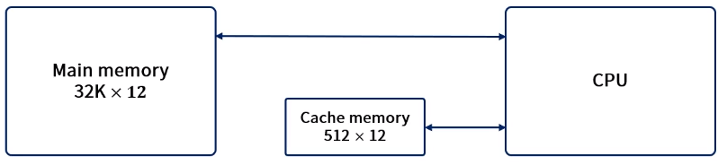
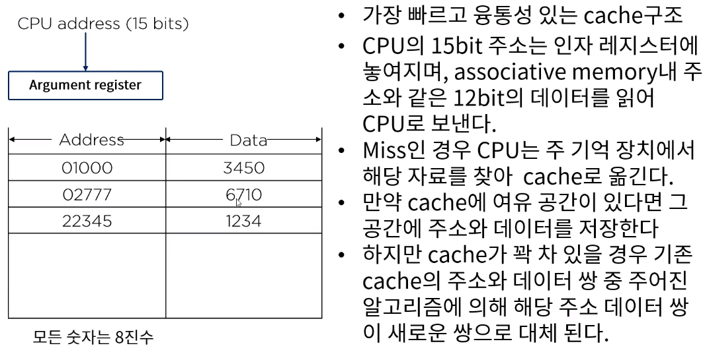
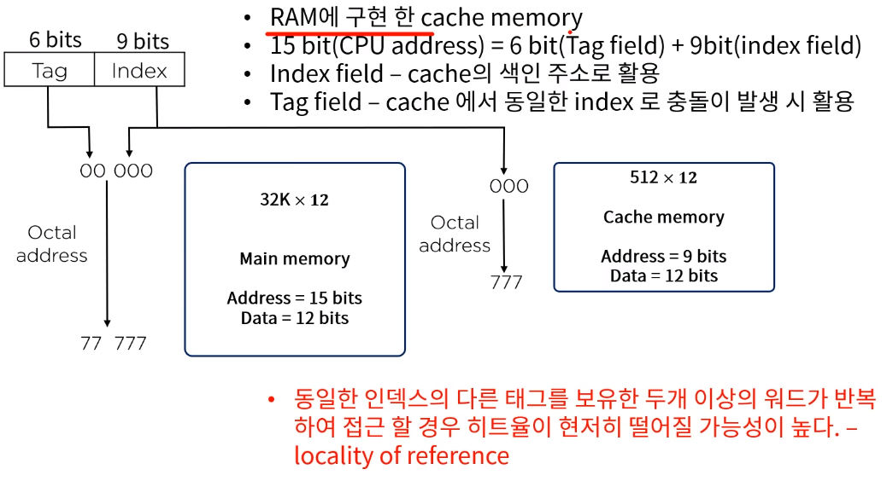
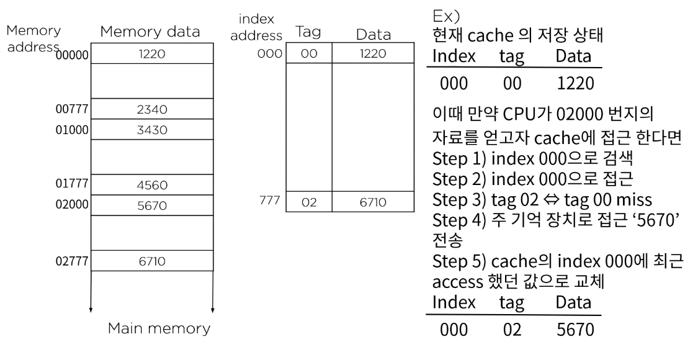
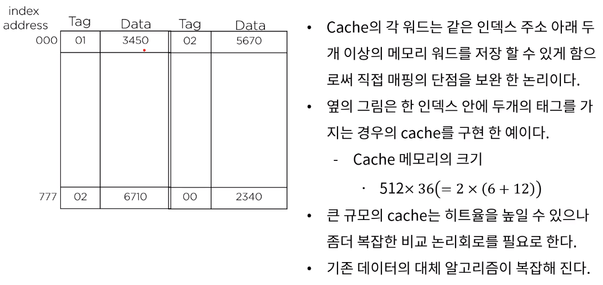
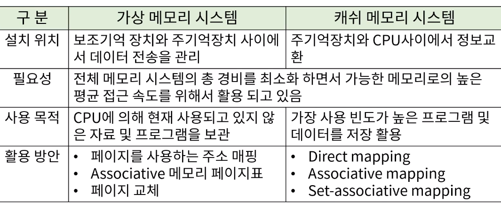

[toc]

# 컴퓨터 성능개선을 위한 메모리 관리

### :heavy_check_mark: cache 메모리의 매핑 프로세스

- Associative mapping
- Direct mapping
- Set-associative mapping

> 가정
>
> 
>
> 주기억장치: 12bit 32K워드 저장
>
> cache memory: 512 words/주어진 시간 내 저장
>
> CPU는 main/cache memory모두 통신 가능
>
> - 우선 15bit의 주소를 cache로 보내 hit가 발생하면 cache로 부터 12bit의 데이터를 받아들인다.
> - 만약 miss가 발생하면 주기억장치로부터 워드를 읽고, 이를 cache로 이동 저장한다.

## :heavy_check_mark: cache 메모리 전송을 위한 다양한 매핑 기법

### Associative mapping

### Direct mapping

### Set - associative mapping

같은 index에 2개 이상

## :heavy_check_mark: 가상메모리

### Virtual Memory vs Cache Memory

## :heavy_check_mark: 메모리 관리 시스템

- 메모리의 광역화  (가상 메모리 + 캐쉬 메모리)와 멀티 프로그램의 발달로 인한 시스템내 상호 간섭도 시스템 기능 저하요인의 중요한 부분이다.
- 프로그램과 프로그램사이의 데이터 흐름, 선후 데이터의 활용, 사용 메모리의 양 조절, 다른 프로그램의 흐름에 영향을 끼치지 못하게 하는 제어 등의 역할을 담당
- 메모리 내의 여러 프로그램을 관리하기 위한 HW와 SW절차의 집합체로 메모리 관리 소프트웨어는 운영체제의 일부이다.

## :heavy_check_mark: 메모리 관리 하드웨어

- 논리 메모리 참조를 물리 메모리 주소로 변환하는 동적 저장 장소 재배치를 위한 기능
- 메모리 내에서 서로 다른 사용자가 하나의 프로그램을 같이 사용하기 위한 편의
- 사용자 간의 허락되지 않은 접근을 방지하고 사용자가 OS의 기능을 변경하지 못하도록 하는 정보의 보호

