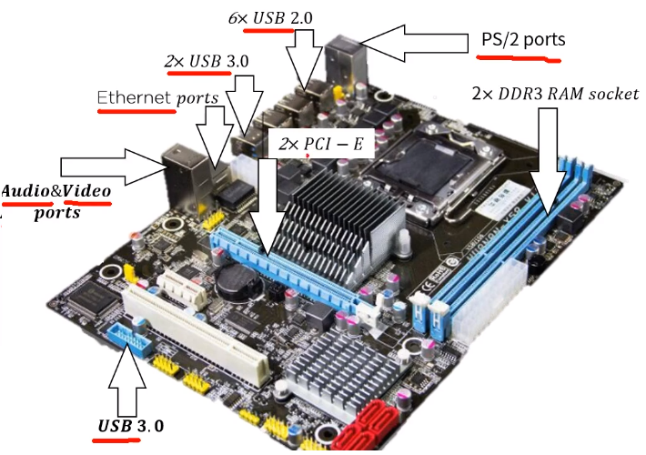
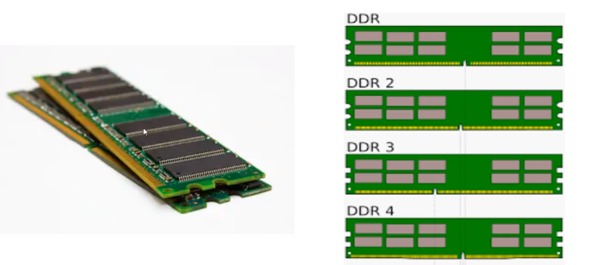

[toc]

# 다양한 기억장치들에 대한 이해

## :heavy_check_mark: 주 기억장치

### DDR

- RAM 규격 (SD, DDR)의 일종으로 1997년 삼성에 의해 발표된 새로운 규격
  - SDRM (Synchronous Dynamic Random Access Memory) -> DRAM의 발전된 형태, 동기식 DRAM (제어장치 입력=클럭펄스 주기 (Clock pulse Frequency))라고 할 수 있다
  - SDR(Single Data Rate) SDRAM-> 클럭 펄스의 변이(0<->1)시 단 한차례의 정보 전송만을 허용하는 구조

### DDR SDRAM (Double Data Rate SDRAM)

- 클럭 신호의 상승 및 하강 (0 -> 1 -> 0)에서 데이터를 전송 (double pumping)함으로서 더 큰 대역폭을 달성하는 DDR이다.
- 이는 클럭 주파수를 증가시키지 않고도 전송 속도를 두 배로 향상 시킬 수 있다.
- DDR의 전송속도는 266~400MT/s, 제폼: DDR266, DDR400

### DDR2 SDRAM (Double Data Rate Two SDRAM)

- 향상된 버스 신호에 의해 DDR2의 free batch buffer는 4비트
- 내부 클럭속도 (133~200MHz)는 DDR과 같지만 DDR2의 전송 속도는 향상된 I/O버스 신호로 인해 533~800 MT/s에 도달 할 수 있다.
- DDR2 533 및 DDR2 800 메모리 타입이 출시 됨

### DDR3 SDRAM (Double Data Rate Three SDRAM)

- DDR2 모듈에 비해 40%의 전력 소비로 낮은 작동 전류&전압 제공
  - 1.5V < 1.8V(DDR2) < 2.5V(DDR)
- ASR(Automatic Self-Refresh) 및 SRT(Self-Refresh Temperature)등 기능의 추가

### DDR4 SDRAM (Double Data Rate Fourth SDRAM)

- 낮은 작동 전압 (1.2V)과 높은 전송 속도 (2133~3200MT/s)를 제공
- DBI(Data Bus Inversion), CRC(Cyclic Redundancy Check)및 CA parity등의 기능 추가로 신호 무결성을 향상시킴, 데이터 전송/액세스의 안정성을 향상

