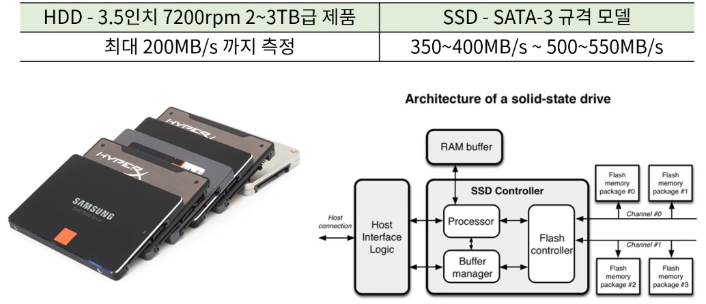
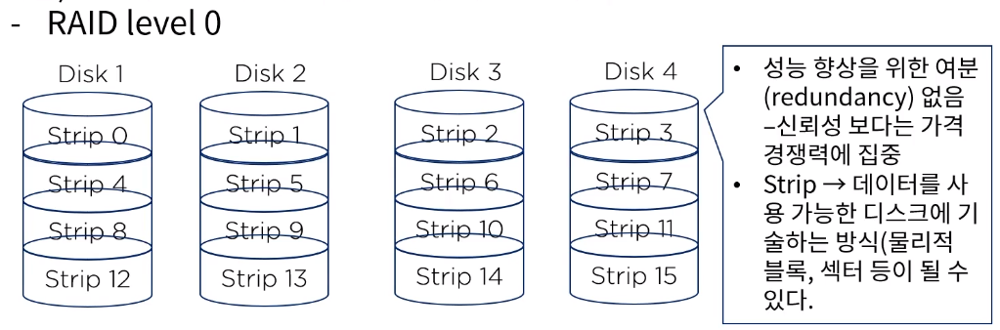
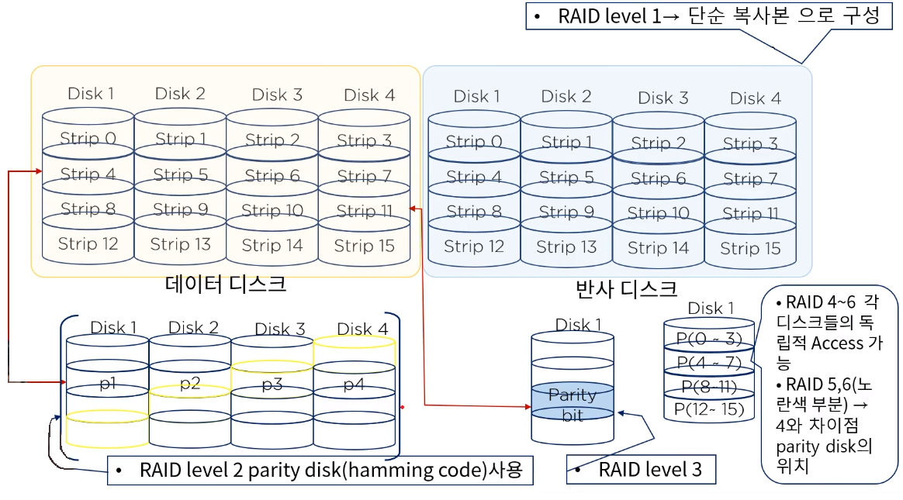

[toc]

# 다양한 기억장치들에 대한 이해

## :heavy_check_mark: 보조 기억 장치

### SSD (Solid State Drive)

- 고형 상태 보조 기억 장치, 고체상태(Solid-state)와 소체 (트랜지스터)를 뜻함
- 출력장치인 액정 디스플레이 vs AMOLED 디스플레이와 비슷한 사례, 기능면에서 보면 SDD와 HDD가 같은 저장 매체임에는 틀림 없다
  - HDD는 자기 디스크
  - SSD는 플래시 메모리로 구성
- 구동 부(모터)가 없으므로 소음도 대폭 감소, 소모 전력, 발열 수준도 낮음
- 이렇게 회전판이 제거된 컴퓨터를 **제로 스핀** 시스템 이라고함

## :heavy_check_mark: SSD의 특징 및 장점

- 가장 큰 장점은 데이터 입/출력 속도

## :heavy_check_mark: RAID(Redundant Array of Inexpensive (or Independent) Disk)

- 성능의 향상을 위해 가격이 저렴하고 크기가 작은 여러개의 하드 디스크들을 묶어 하나의 기억 장치처럼 사용할 수 있게 하는 방식
- 다수의 하드 디스크들은 오류 복구에 대한 정책에 따라 여러가지 방식(0~6레벨)으로 구분된다. 다만 상호 계층적은 아님!

## :heavy_check_mark: USB

## :heavy_check_mark: 부제

## :heavy_check_mark: 부제

