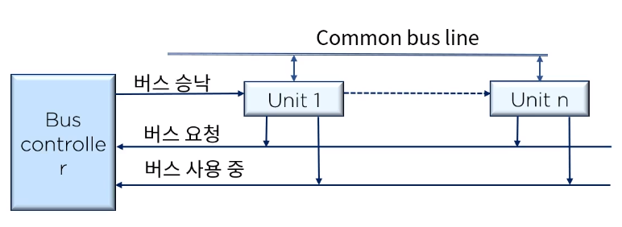
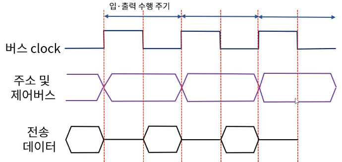
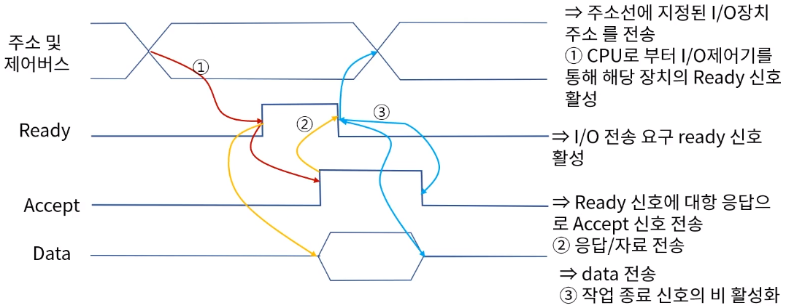

[toc]

# 입출력 구조 - 입출력 연결과 주소 지정

## :heavy_check_mark: 입출력 주소 지정

- 컴퓨터 시스템에는 다양한 입출력(I/O)장치 및 통신 포트 등이 연결 됨 

  - 서로 구분하기 위해 각 입출력 장치 또는 통신 포트에 고유한 주소를 할당

- 하나의 입출력 장치에 그 상태나 데이터의 입출력 등 용도에 따라 다수의 주소 할당이 가능하다 (일반 저장공간에 할당된 주소에 비해 입출력 장치의 개수는 작기 때문)

  - 메모리 맵 입출력(memory mapped I/O) -> 메모리에 부여된 주소 공간의 일부를 입출력 주소 공간으로 활용 
    - 동일한 주소선과 제어선으로 입출력 관리 가능
    - 시스템은 지정된 주소값에 의해 데이터 저장 공간과 I/O 장치 구분
    - 모든 CPU에 대해 구현이 가능하나, H/W적 (주소값에 따라) 분류 접근 구현이 필요하다.
  - 입출력 맵 입출력(I/O mapped I/O) -> 독립된 메모리 주소 공간과 입출력 주소 공간을 구분해 할당
    - 메모리와 입출력 주소를 구분하는 제어 선을 사용
    - 상호 구분되는 명령어 (상호 동일한 주소일 경우)가 필요하다.
    - 제어 신호를 통해 메모리/입출력 장치에 접근이 가능하도록 H/W적 구현이 필요하다.

  > 메모리 맵 입출력은 모든 CPU에서 구현이 가능하나
  >
  > 입출력 맵 입출력의 경우 I/O용 별도의 명령어와 이를 위한 외부 제어선이 있는 CPU에서만 구현이 가능함, 단 PC에서는 양자 모두 구현이 가능하다고 알려져 있다.

## :heavy_check_mark: 입출력 버스 할당

### 중앙 제어 버스 vs 분산 제어 버스

- 중앙 제어 버스 시스템 -> 구현 및 관리가 용이하나 제어기의 이상 시 버스 중재 및 활용에 지대한 결함이 발생할 수 있다.

- 분산 제어 버스 시스템
  - 버스 상의 모든 장치가 제어 기능을 나누어 실행한다.
- I/O 버스는 주로 중앙 제어 버스 시스템을 적용
- 시스템 버스로는 분산제어 버스 시스템을 선호한다.

### 동적 중재 알고리즘

- **정적 우선 순위 알고리즘**에 대해 시스템이 동작하고 있는 동안 장치들의 우선 순위를 변경시킬 필요가 있을 경우 적용 가능한 알고리즘을 **동적 우선 순위 알고리즘** 이라고 한다
- 시간 분할(time slice) 알고리즘 -> 연속적으로 주어지는 버스 시간을 고정된 길이의 시간 분할로 나누고 이를 라운드로인 방식으로 각 프로세스에 할당
  - 버스에서의 위치에 관계없이 모든 요소들이 동등한 서비스를 받게 된다.
- 폴링(polling)을 이용한 버스 시스템
  - 폴(poll)라인으로 버스 승인(grant) 신호를 대체하여 모든 장치에 연결
  - 버스제어기는 이 신호를 이용해 각 장치의 주소를 결정
  - 지정된 순서에 따라 버스를 할당받는다. 프로그램으로 우선순위 변경 가능

- LRU(Least Recently Used) 알고리즘
  - 가장 오랫동안 버스 서비스를 사용하지 못한 장치에게 우선권 부여
  - 몇번의 버스 사이클마다 LRU 알고리즘에 의해 각 장치의 우선순위가 계속 변경됨
  - 모든 프로세스가 버스에 접근할 수 있는 기회를 동등하게 부여 받을 수 있다.
- Frist-come & First-serve
  - 버스 제어기는 각 프로세스의 버스 요구 도착 시간별 저장이 가능한 큐(queue)를 이용해 도착한 순서대로 서비스를 제공
- 회전 데이지 체인(rotating daisy chain)방식
  - 모든 장치를 연결(closed loof)하여 차례로 버스 서비스를 제공하는 방식

## :heavy_check_mark: 입출력 수행의 분류

### 동기 버스에 의한 수행

- 버스에 연결된 모든 장치들에 동일하게 적용하는 버스 clock이 있고, 주소와 자료 및 다른 제어선들은 버스 clock를 기준으로 전송된다.
  - BUS clock(0->1)
    - 필요한 장치의 주소 및 제어신호를 버스를 통해 발송한다,
    - 지정된 장치는 주소를 식별한 후
  - BUS clock(1->0)
    - 데이터 전송 시작
  - 별도의 동기 용 신호 불필요
  - 버스에 연결된 모든 장치는 clock에 맞춰 입출력이 진행되도록 설계 되어야함

### 비동기 버스에 의한 수행

