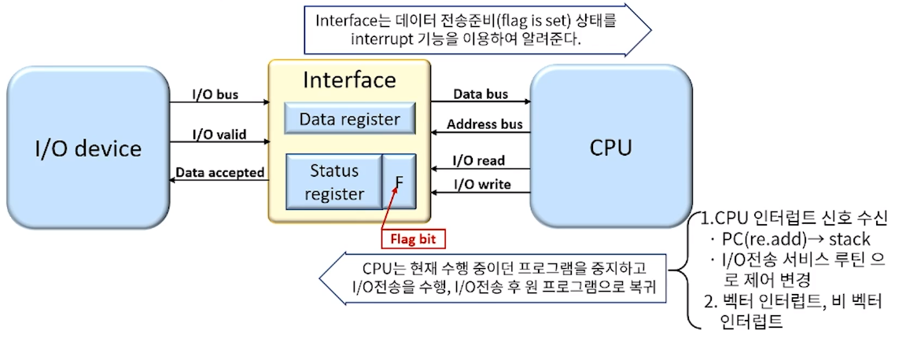
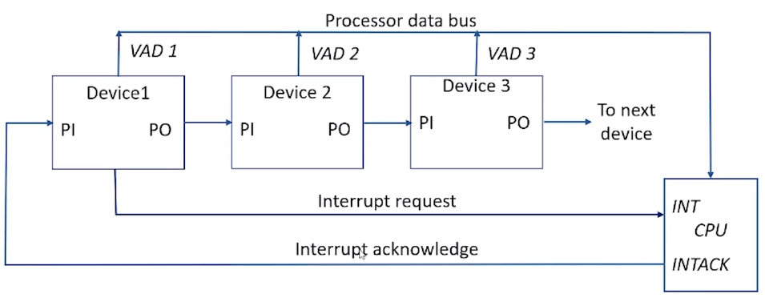
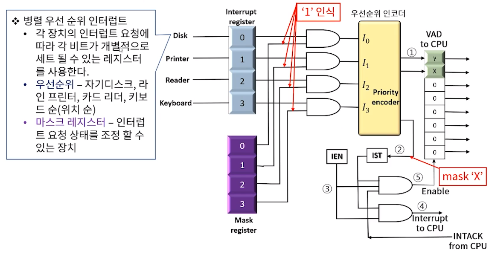
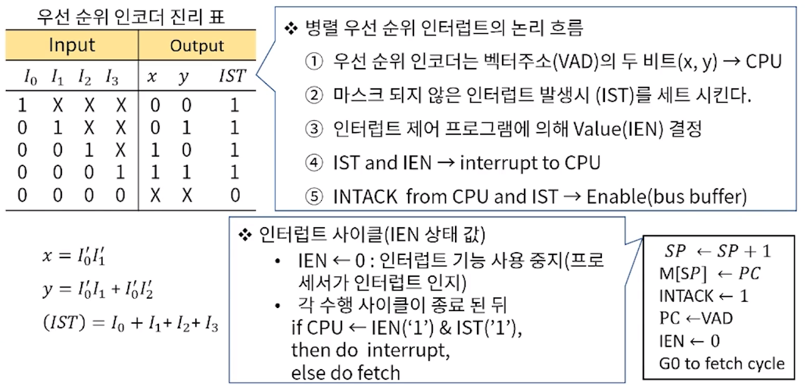

[toc]

# 입출력 구조 - 입출력 수행과 인터럽트

## :heavy_check_mark: 인터럽트에 의한 I/O

### 입출력 장치와 CPU간 전송모드 측면

- 입출력 전송(I/O transfer) 구조 상 CPU의 interrupt 활용 모드

### 입출력 장치와 CPU간 전송에 대한 소프트웨어적 고찰

- 컴퓨터는 주변 장치와의 인터페이스를 위한 H/W 못지않게 S/W루틴을 가져야 한다.
  - 주변 장치 제어
  - 프로세서와 주변 장치 사이에 데이터 전송
- I/O routine은 주변 장치의 활성화를 위한 제어 커맨드의 발송 및 데이터 전송을 위한 준비 상태 (device status) 체크 로직을 보유해야 한다.
- 입출력 소프트웨어는 시스템에 인터럽트 제어를 발 할 수 있어야 하며, 이를 실행할 주변장치에 커맨드를 발 하여야 한다.
- DMA(Direct Memory Access) 전송 시 I/O 소프트웨어는 DMA 채널을 개시 시킬 수 있어야 한다.

## :heavy_check_mark: 우선순위 인터럽트

### 입출력 장치와 CPU간 interrupt 논리

- CPU와 I/O장치 사이의 데이터 전송은 CPU에 의해 시작된다.
  - 각 장치는 통신 준비 여부(제어라인의 상태 or 플래그에 의해서만 확인)에 따라 CPU와 통신이 가능
  - 시스템 전체의 퍼포먼스를 위해 각 디바이스 인터페이스는 플래그가 enable되었을때 비로소 CPU에 인터럽트를 요청
- 프로세서가 서비스 루틴으로 분기 주소를 선택하는 방법
  - vectored interrupt
    - 인터럽트를 내는 소스가 프로세서에게 분기에 대한 정보를 제공(인터럽트 벡터) 한다.
  - Non-vectored interrupt
    - 분기 주소는 메모리의 고정 위치에 저장되어있다.

- 수많은 장치 중 인터럽트를 발생한 장치의 선별, 또한 동시에 발생한 다수개의 인터럽트의 경우 서비스의 우선 순위를 결정해야 하는 문제 발생

- **우선순위 인터럽트**는 동시 다발적으로 발생한 인터럽트에 대한 서비스 순서를 결정하기 위해 각 소스에 우선 순위를 부여한 인터럽트 시스템을 이르는 용어이다.
  - 우선순위 결정은 소프트웨어/하드웨어적으로 처리
  - 소프트웨어 적으로 인터럽트 우선순위를 결정하는 방법 -> 폴링(polliong)
    - 모든 인터럽트를 위한 공통의 서비스 프로그램 -> 소요시간이 매우 길 수 있다. -> HW적으로 해결

### 데이지 체인 우선순위 인터럽트

- 인터럽트를 발생하는 모든 장치를 직렬로 연결함으로써 이루어진다.

### 병렬 우선순위 인터럽트

### 우선 순위 인코더 & 인터럽트 사이클

