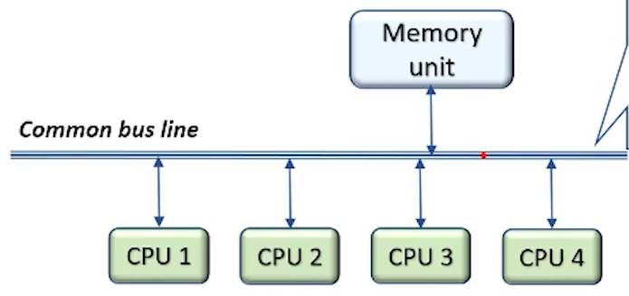
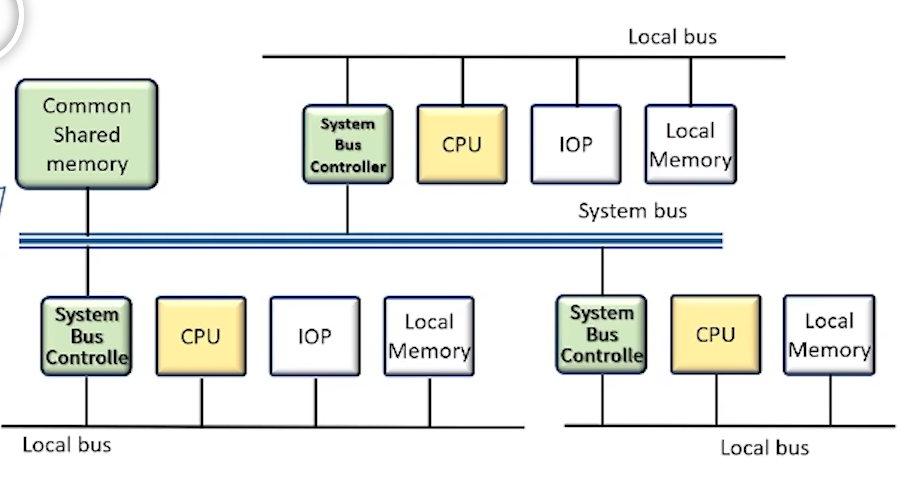
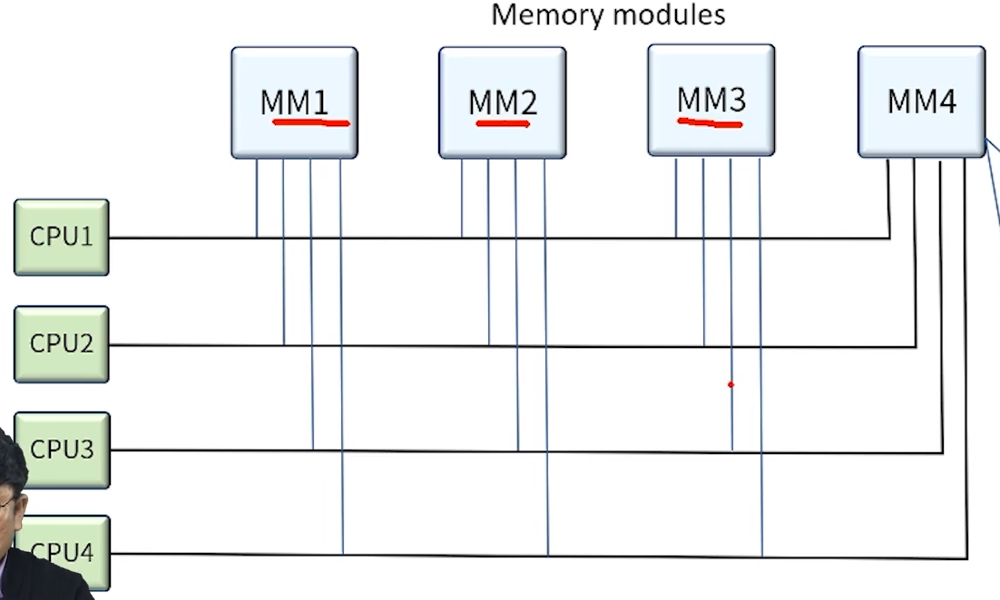
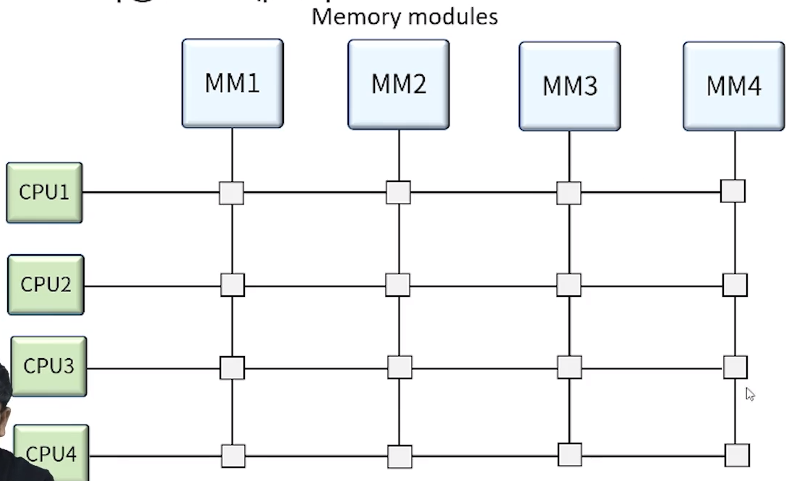

[toc]

# 멀티 프로세서

## :heavy_check_mark: 병렬 처리

### Serial Process System

- CPU가 하나뿐인 시스템
- 기계적, 논리적 프로세싱으로는 가장 효율적

 

### Parallel Process System

- 동시에 여러 명령 또는 여러 작업 실행할 수 있는 병렬 처리 시스템
- 병렬 구조
- 다중장치 구조
  - **다수의 CPU**로 동시에 여러개의 작업을 병렬로 처리할 수 있는 시스템
  - 공간적 병렬 성(spatial parallelism)
- 파이프라인 구조
  - 다수의 작업을 **각기 다른 실행 단계에서** 병렬로 처리할 수 있도록 지원되는 구조
  - 시간적 병렬 성(temporal parallelism)

## :heavy_check_mark: 멀티 프로세서

### 멀티 프로세서 특징

- 메모리와 I/O 장치를 공유하는 **두개 이상의 CPU**를 갖는 시스템
- 다중 명령어 흐름과 다중 데이터 흐름(MIMD) 시스템으로 분류된다
- 멀티 프로세서 시스템에서는 **하나의 운영체제에 의해** 프로세서와 시스템의 다른 요소들 사이의 상호 동작이 제어되며, 동일한 문제의 해결을 위해 모든 요소들이 협력함 (**멀티 컴퓨터는 아님!!**)
- 멀티 프로세서의 동작 원리 (시스템의 신뢰성 향상)
  - **다수의 독립적인 작업들이 병렬적으로 처리**
  - 하나의 작업이 여러 부분으로 나뉘어 각각이 병렬적으로 처리
- 사용자가 명시적으로 병렬 실행이 가능한 작업을 선언 (프로그램 실행의 병렬성을 구현 할 수 있는 프로그래밍 언어의 제공이 설결 과제)
- **컴파일러가 자동적으로 프로그램의 병렬성을 감지해 처리** (데이터 의존성을 검사해 수행 순서나 병렬성을 찾아냄)
- 멀티프로세서의 분류
  - 공유 메모리 또는 밀착 결합 멀티 프로세서
  - 분산 메모리 (Distributed memory)
  - Loosely coupled

 

### 상호 연결 구조

- 멀티 프로세서 시스템은 CPU, IOP 그리고 여러 모듈로 분리된 메모리 장치에 의해 구성된다.
- 공유 메모리 시스템 - 프로세스와 메모리 사이의 경로 수에 따라
- 느슨히 결합된 시스템 - 프로세싱 요소들 사이의 전송 경로 수에 따라 여러가지 물리적으로 다른 구성을 보인다.

- **단일 공통 버스 시스템**

  

  - 주어진 시간에 오직 하나의 프로세서 만이 전송을 행할 수 있다.
  - 충돌 발생 가능성 있으니 버스제어기에 의해 해결 가능
  - 시스템 내의 전체 전송률이 단일 경로의 속도에 제한 될 수 있다.

- **이중 버스 구조**

  

  - 각 프로세서들의 대기시간이 줄어들고, 여러개의 버스 전송이 동시에 진행 가능. 단, 시스템 구축비용과 복잡도가 증가
  - 시스템 버스 제어기에 의해 각 로컬 버스를 시스템 버스에 연결한다.
  - 주어진 시간엔 하나의 프로세서만이 시스템 버스를 사용한다.

- **다중 포트 메모리**

  

  - CPU 또는 IOP와 각 메모리 모듈이 버스라인을 갖고있는 시스템
  - 각 모듈은 주어진 시간에 어떤 포트가 메모리에 접근 할 수 있는가를 결정하기 위한 내부 논리 회로를 가지고 있다.
  - 메모리 접근을 위한 우선 순위는 일반적으로 포트의 위치에 따라 결정된다.
  - **프로세스와 메모리 사이의 높은 전송률**
  - 고가의 메모리 제어 논리 회로와 전선 커넥터

- **크로스바 스위치**

  

  - 프로세스 버스와 메모리 모듈 통로간의 교차점에 위치한 다수의 크로스포인트로 구성
  - 크로스포인트란 프로세서와 메모리 모듈간의 통로를 결정하는 스위치
  - 스위치는 버스에 실린 주소를 확인해 통로를 열어줄 뿐 아니라 주어진 순위에 따라 중재 역할도 가능

- 다단 교환망

  - 기본 요소는 2입력, 2출력 상호교환 스위치
  - 2개의 입력 중 하나만 선택해 전체 경로를 연결해주는 역할, 충동을 중재하는 기능으로 구성
  - 입력과 출력 단자를 연결할 수 있는 제어 신호도 있어야 한다.

- 하이퍼큐브 상호연결

  - 2의 n승 개의 프로세서가 n차원 이진 큐브로 연결된 느슨히 결합된 시스템을 의미
  - 각 프로세서는 큐브의 노드를 형성하는데 노드에는 CPU뿐만 아니라, 로컬 메모리나 I/O 인터페이스토 포함된다.

