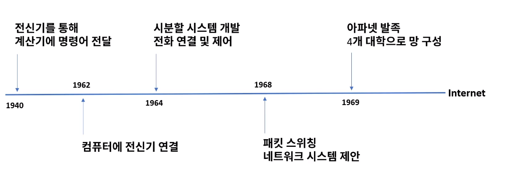
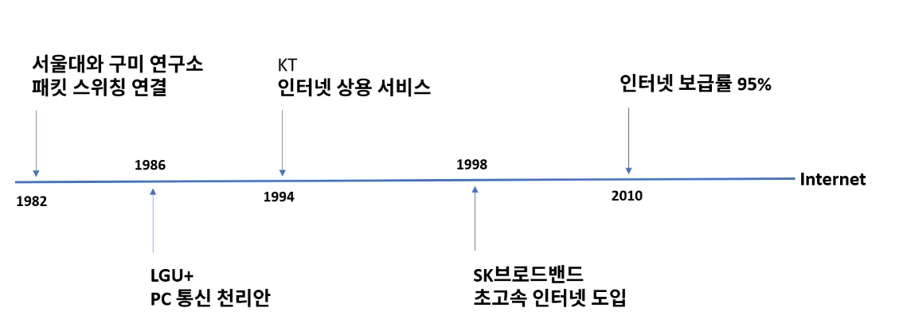
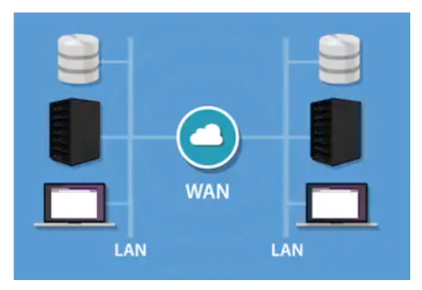

[toc]

# 네트워크 정의 및 역사

## :heavy_check_mark: 네트워크

- 분산되어 있는 컴퓨터들이 자원을 공유할 수 있게 통신망으로 연결한 것
- 4차 산업혁명 요소 기술들과 긴밀하게 연결
- 글로벌 기업과 대기업의 중요한 인프라 기술

## :heavy_check_mark: 네트워크 역사

### 미국

### 한국

## :heavy_check_mark: 네트워크 형태

###  LAN (Local Area Network) 근거리 통신망

- 사무실 또는 학교 등의 가까운 지역을 한데 묶은 네트워크

### WAN (Wide Area Network) 장거리 통신망

### VPN (Virtual Private Network) 가상 사설망

- 공중망을 사설망처럼 사용, 암호화

## :heavy_check_mark: 네트워크 표준

- 네트워크 표준 기구
  - ISO 국제 표준화 기구
  - IEEE 미국 전기 전자 협회 (LAN)
  - ITU-T 국제 전기 통신 연합 통신 표준 본부(WAN)
- 인터넷 표준 기구
  - IETF 인터넷 엔지니어 테스크포스
  - RFC - 프로토콜 정의 문서
- 이더넷
  - IEEE 802.3
- TCP/IP
  - RFC 1122 & 1123
- HTTP/1.1
  - RFC 2616

