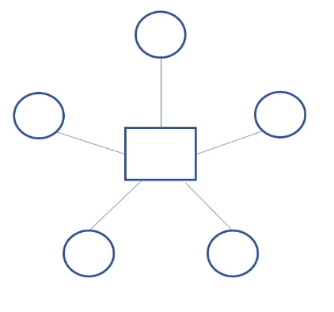
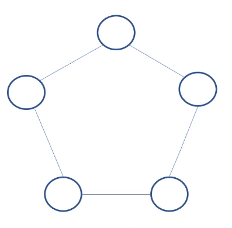
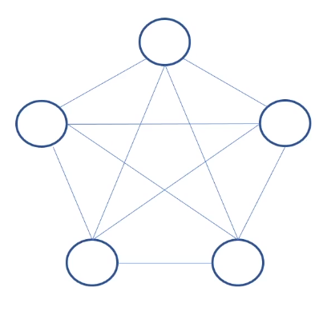
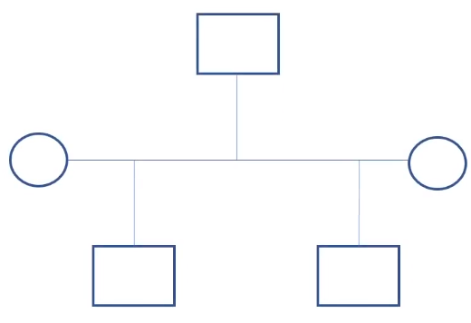
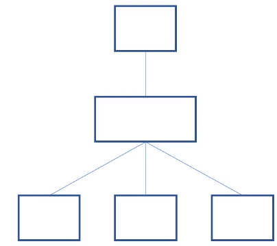
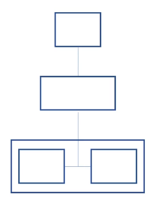
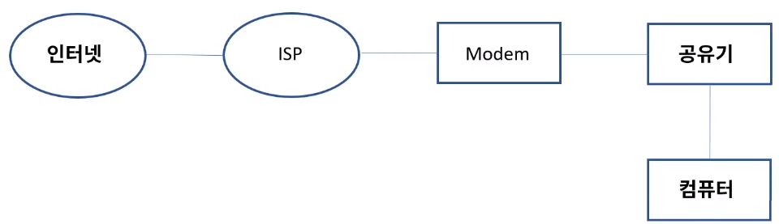
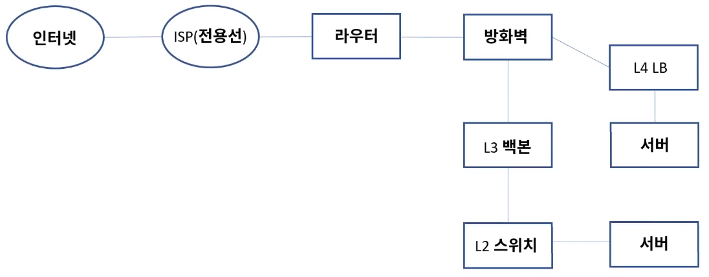
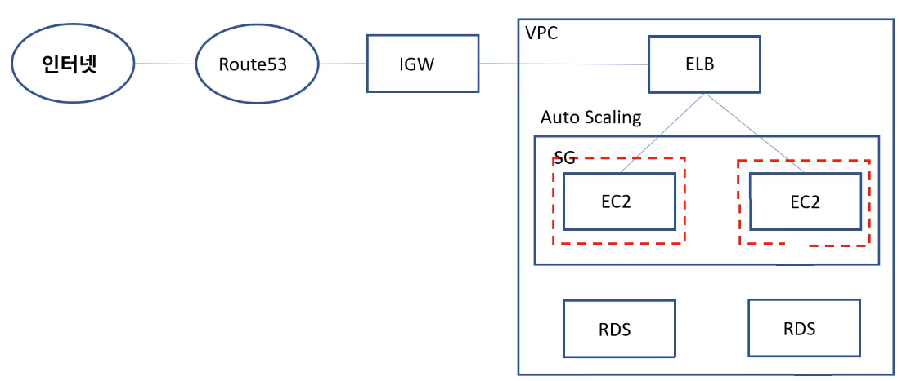

[toc]

# 네트워크 구조

- 규모: 회사나 학교 등 집단 크기에 따라 구분 - 사용자, 대역폭
- 업종: 공공기관, 제조, 금융, 게임 등의 업종에 따른 서비스 중요도
- 통신 방식과 경로: server & client, peer to peer
- 토폴로지: star, ring, mesh, bus, tree, redundancy

## :heavy_check_mark: 토폴로지

### Star

- 중계기 통해서 통신

### Ring

- 통신 거리가 멀수록 문제있음

### Mesh

- 각자 연결해서 1 depth로, 개체 늘수록 문제

### Bus

### Tree

### Redundancy

## :heavy_check_mark: 홈 네트워크

- 인터넷 - ISP - 모뎀 - 공유기 - 컴퓨터

## :heavy_check_mark: 기업용 네트워크

- ISP - 전용선 - 라우터 - 방화벽 - L3백본 - L2 스위치 - 서버, 컴퓨터 - L4 로드밸런서 - DMZ

## :heavy_check_mark: 클라우드 네트워크 (AWS 기준)

- 인터넷 - Route53 - IGW - VPC - ELB - Auto Scaling - Security Group - EC2

