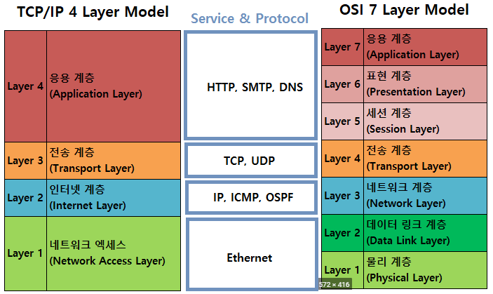
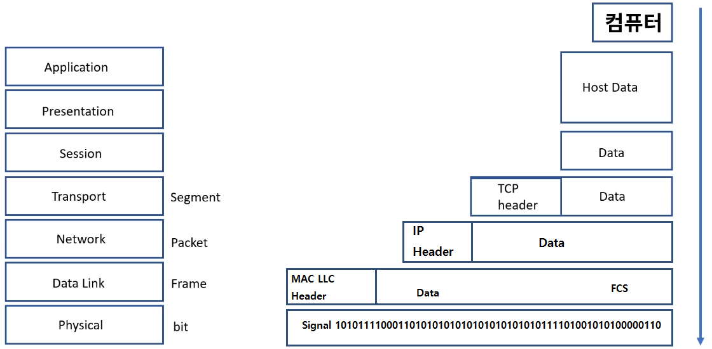
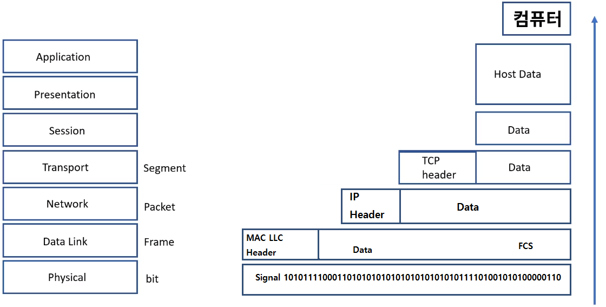

[toc]

# TCP/IP 모델 비교와 캡슐화

## :heavy_check_mark: TCP/IP 란?

- 네트워크 프로토콜의 모음으로 패킷 통신 방식의 IP와 전송 조절 프로토콜인 TCP로 이루어져있다.

## :heavy_check_mark: TCP/IP 모델 (4 Layer)

Application: 응용 프로그램간 표준화된 데이터 교환

Transport: TCP/UDP

Network: 패킷을 처리하고 다른 네트워크로 연결

Network Interface: 물리 계층으로 네트워크 노드들의 상호 연결

## :heavy_check_mark: TCP/IP와 OSI 7 Layer 비교

## :heavy_check_mark: 캡슐화

- 캡슐화를 통해서 네트워크가 통신함

### 인캡슐레이션

### 디캡슐레이션

