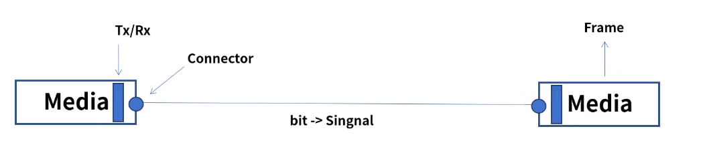
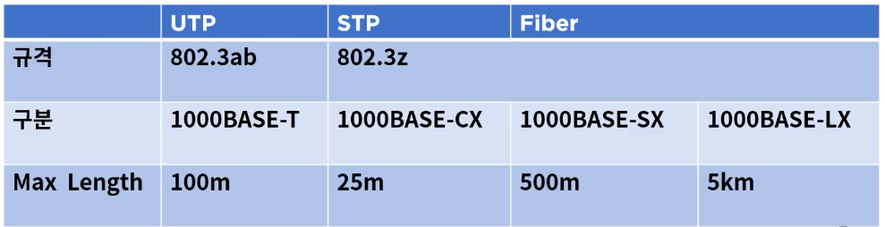
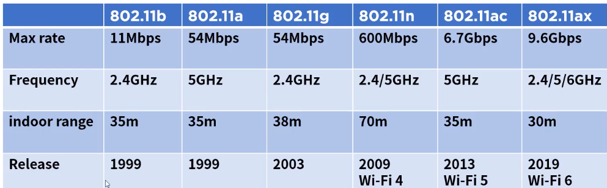
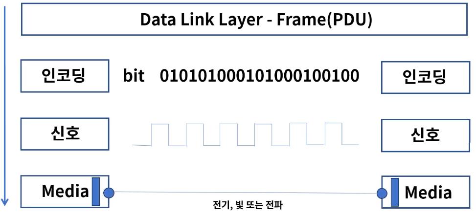

[toc]

# 물리계층의 역할과 기능

## :heavy_check_mark: 물리계층이란?

- 역할: OSI 7 Layer의 1계층으로 하드웨어로 표현
- 네트워크 장치의 전기적, 기계적 속성 및 전송하는 수단을 정의
- 상위 계층인 데이터 링크 계층의 프레임을 신호로 인코딩하여 네트워크 장치로 전송
- 통신장치와 커넥터, 인코딩(bit->signal), 송수신을 담당하는 회로등의 요소가 있다ㄴ

## :heavy_check_mark: Signaling의 종류

### 전기

- Copper 케이블을 사용하며 전화선, UTP, 동축 케이블 등이 이에 속함

### 광(빛)

- Optical Fiber 케이블이 이에 속하며 빛의 패턴을 신호로 사용

### IEEE 802.3 케이블

- 이더넷에서 물리계층과 데이터 링크 계층의 매체 접근 제어를 정의, 케이블이 이에 속함

- 주로 쓰이는 1 Gigabit 이더넷 규격 

  - 첫번째 숫자는 speed를 의미
  - 두번째 BASE는 Baseband라는 전송방식을 의미
  - 세번째는 숫자일 경우 전송거리, 영문자일때는 케이블 종류 또는 광 타입

  

### 전파

- 무선이 이에 속하며 마이크로파 패턴을 신호로 사용
- 와이파이, 주파수 ...

### IEEE 802.11 무선표준

- 무선랜 규격

## :heavy_check_mark: Signaling의 전송 방식

- 방식

  OSI 7 Layer 2계층의 Frame은 아래와 같은 형태로 전달

  

