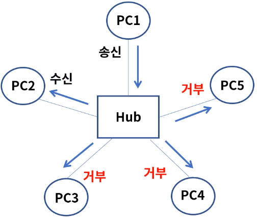
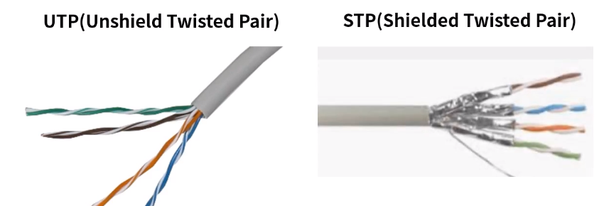
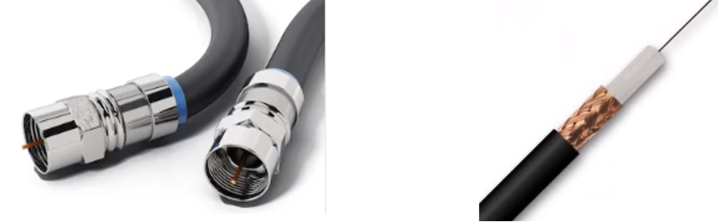
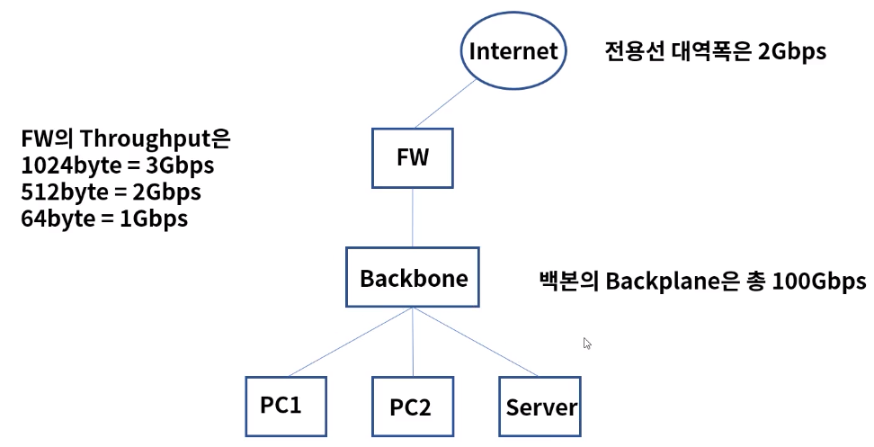

[toc]

# 물리계층 장비와 케이블

## :heavy_check_mark: 물리계층 장비

- 허브와 리피터
  - 허브: 전기신호를 증폭하여 포트에 연결된 PC 들끼리 통신이 가능하게 한다.
    - 동작방식: 단순 중계기의 역할로 허브에 연결된 PC1이 다른 PC2에게 데이터를 보내려하면, 허브에 연결된 모든 PC들에게 그 데이터를 전달하게 된다
  - 리피터: 현재 거의 쓰이지 않는 장비로 신호의 세기를 증폭하여 좀 더 먼거리까지 통신이 가능

### 허브

#### 브로드 캐스팅 통신 1-> ALL

#### 유니캐스팅 통신 1-> 1

#### 멀티캐스트 통신 1-> n

#### CSMA/CD(Carrier Sense Multiple Access / Collision Detection)

- 송신노드는 데이터를 전송하고, 다음 채널에서 다른 노드의 데이터 충돌 발생을 계속 감지
- 충돌 발생시에는 모든 노드에게 충돌 발생을 통지하고 재전송을 시도

1. Carrier Sensing: 데이터를 보내기 전에 다른 노드에서 데이터를 보내는 중인지 확인
2. Multiple Access: 데이터를 보내는 곳이 없다면 전송 시작
3. Collsion Detection: 동 시간대에 데이터를 보내게 되면 충돌이 일어나고 정지
4. 그 이후 특정 시간이 지나면 다시 첫 번째 단계로 반복

> Half Duplex: 반이중 전송방식

### 전송 방식

1. Simplex: 단방향 통신으로 수신측은 송신측에 응답 불가
2. Half Duplex: 반이중 전송방식으로 양방향 통신이나 송수신 시간은 정해짐, 무전기
3. Full Duplex: 전이중 전송방식으로 동시 양방향 통신이 가능, 전화기

## :heavy_check_mark: 케이블과 커넥터

- 종류: 전송 장치에 신호를 전달하는 통로, 주요 케이블로 TP, 동축, Fiber등이있다.

- TP(Twisted Pair)

  - 총 8가닥의 선으로 구성되며 두개의 선을 서로 꼬아놓는다.

  - 선을 꼬은 이유는 자기장 간섭을 최소화하여 성능(속도와 거리)을 향상

    

- 동축(Coaxial)

  - 선 중앙에 심선이 있으며 그 주위를 절연물과 외부 도체로 감싸고 있다.

  - 전화 또는 회선망 등 광범위하게 사용

    

- 광(Fiber)

  - 전기 신호의 자기장이 없는 빛으로 통신하기 때문에 장거리 고속 통신이 가능
  - 2개의 모드(single, multi)와 주요 커넥터 타입(LC, SC)이 있다.

- 광 트랜시버

  - 광통신에 사용되는 네트워크 인터페이스 모듈 커텍터로 SFP, GBIC이 있다.
  - SFP (Small Form-factor Pluggable transceiver), GBIC(Gigabit Interface Connector)

## :heavy_check_mark: 단위

### bit

- 2진수는 Binary 0,1로 이루어지며 True, False등 신호를 표현
- 일반적으로 회선 Speed에 쓰임
- 100Mbps 속도 = 100 Mega bit per second

### byte

- 1 Byte = 8 bit
- 일반적으로 Data Size에 쓰임
- SSD 50GB = 50 Giga Byte

Kilo, Mega, Giga, Tera

전산학에서는 2진수 기반이기에 2의 10승은 1024로 표현

1024k = 1M, 1024M = 1G, 1024G = 1T

## :heavy_check_mark: 성능 (Performance)

### BandWidth(대역폭)

주어진 시간대에 네트워크를 통해 이동할 수 있는 정보의 양

### Throughput (처리량)

- 단위 시간당 디지털 데이터 전송으로 처리하는 양

- 대역폭이 8차선 도로라면 처리량은 그 도로를 달리는 자동차의 숫자(양)와 같다

## BackPlane

- 네트워크 장비가 최대로 처리할 수 있는 데이터 용량

### CPS(Connections Per Second)

- 초당 커넥션 연결 수, L4

 ### CC (Concurent Connections)

- 최대 수용가능한 커넥션

### TPS(Transactions Per Seconds)

- 초당 트랜잭션 연결 수 , L7,  주로 HTTP 성능

### 예시

