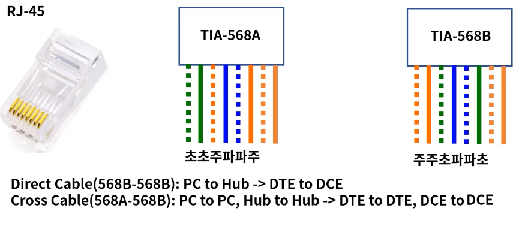
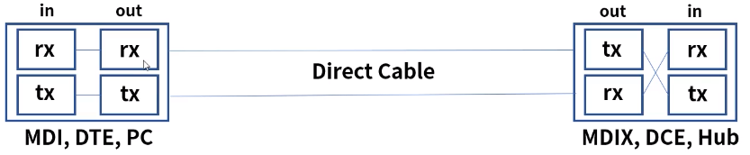
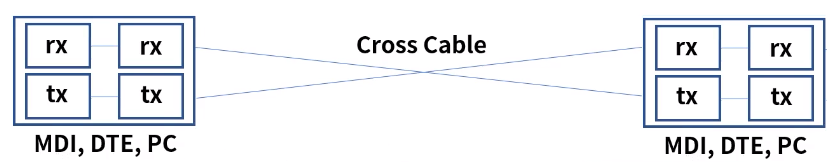
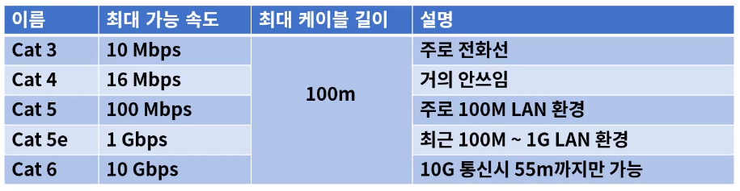
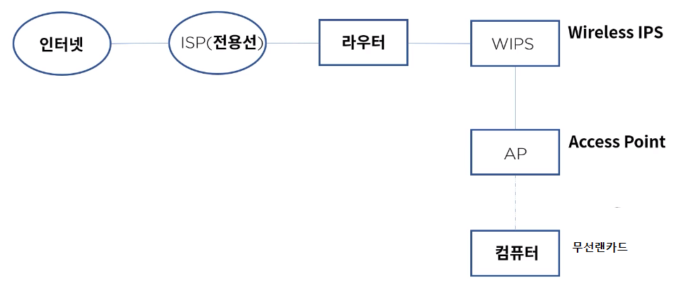

[toc]

# UTP 케이블과 WI-FI

## :heavy_check_mark: UTP 케이블이란?

- Unshielded Twisted Pair, 주로 근거리 통신망(LAN)에서 사용되는 케이블 이더넷 망 구성시 가장 많이 보게되는 케이블

## :heavy_check_mark: 코드 배열

### 8P8C

- 8개의 선 배열에 따라 다이렉트 또는 크로스 케이블로 구성한다.

### Standard

- ISO/IEC 11801
- Copper & Fiber 케이블 등을 정의

- TIA-568: 통신 제품 및 서비스를 위한 상업용 케이블 스펙을 정의
- EIA-568: 최초 통신 시스템 케이블링의 표준을 정희했고 이후 TIA로 이관

### Auto MDI-X 

- Automatic Medium Dependent Interface Crossover

- 어떤 노드의 연결인지에 따라 다이렉트와 크로스 케이블을 선택 -> 불편

- 케이블 타입에 관계없이 노드 상호간 자동으로 통신이 가능하게 하는 기술

- MDI 포트 -> DTE & MDIX 포트 -> DCE, 송신과 수신의 관계

  

  

## :heavy_check_mark: UTP 카테고리

- UTP 케이블의 전송 가능한 대여폭을 기준으로 분류

## :heavy_check_mark: Wi-Fi란?

- 비영리 기구인 Wi-Fi Aliance의 상표로 전자기기들이 무선랜에 연결할 수 있게 하는 기술

- 1999년 몇몇 회사들이 브랜드 상관없이 무선 네트워킹 기술의 발전을 위해 협회 결성

- 2000 Wi-Fi용어 채택

- 수십개 나라 수백개 회사 참여

  

## :heavy_check_mark: 무선랜 구성

- 인터넷 - ISP - 라우터 - WIPS - AP - 컴퓨터

고려사항: AP의 반경과 동시접속 단말기의 개수, 802.11 무선랜 규격 확인

## :heavy_check_mark: 정리

- UTP, 주로 근거리 통신망(LAN)에서 사용되는 케이블
- RJ-45커넥터를 사용하며 TIA-568A & TIA 568B 배열을 통해 다이렉트&크로스 케이블로 구분
- Auto MDI-X는 케이블 타입에 관계없이 자동으로 통신이 가능한 기술
- UTP는 회선 속도 및 쓰이는 용도에 따라 분류된다.
- Wi-Fi는 비영리 기구인 Wi-Fi Aliance의 상표로 전자기기들이 무선랜에 연결할 수 있게 하는 기술
- 무선랜 구성시 WIPS(보안), AP(무선 Hub)가 필요,  AP반경과 동시 접속 단말의 수를 고려해야 한다.

