[toc]

# 데이터 링크 계층의 역할과 기능

## :heavy_check_mark: 데이터 링크 계층이란?

- 역할: OSI 7 Layer의 2계층으로 인접한 네트워크 노드끼리 데이터를 전송하는 기능과 절차를 제공
- 물리계층에서 발생할 수 있는 오류를 감지하고 수정
- 대표적인 프로토콜로 이더넷이 있으며, 장비로는 스위치가 있다.

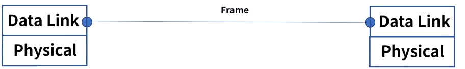

### 2개의 부 계층으로 구성

- MAC (Media Access Control): 물리적인 부분으로 매체간의 연결방식을 제어하고 1계층과 연결

  > MAC주소 `cmd > ipconfig /all` 또는 네트워크 설정에서 확인
  >
  > - 48bit (6 Bytes)로 6자리로 구성, 각 16진수로 표현
  > - 앞의 3자리는 OUI(Organization Unique Indentifier) - 제조사 식별 코드
  > - 나머지 3자리는 제조사 내 일련번호

- LLC(Logical Link Control): 논리적인 부분으로 Frame을 만들고 3계층과 연결

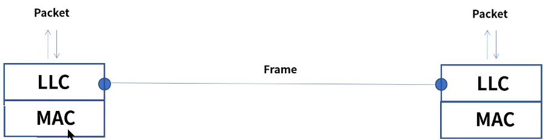

## :heavy_check_mark: 주요기능

### Framing

- 데이터그램을 캡슐화하여 프레임 단위로 만들고 헤더와 트레일러를 추가
- 헤더는 목적지, 출발지 주소 그리고 데이터 내용을 정의
- 트레일러는 비트 에러를 감지

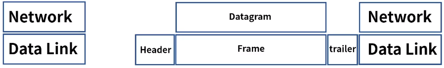

### 회선 제어

- 신호간의 충돌이 발생하지 않도록 제어
- ENQ/ACK방법
- 전용 전송 링크 1:1

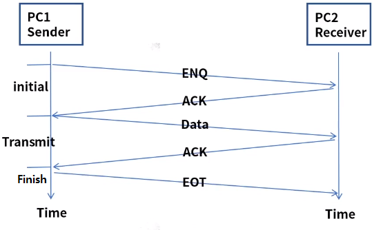

- Polling 방법, 1: 다

  - Select 모드: 송신자가 나머지 수신자들을 선택하여 전송

    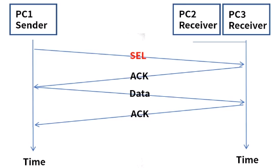

  - Poll 모드 : 수신자에게 데이터 수신 여부를 확인하여 응답을 확인하고 전송 - multipoint

    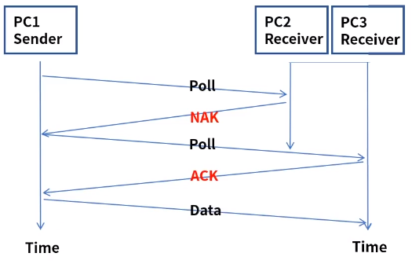

### 흐름제어

- 송신자와 수신자의 데이터를 처리하는 속도 차이를 해결하기 위한 제어

- Feedback 방식의 Flow Control이며 상위 계층은 Rate 기반

- Stop & Wait

  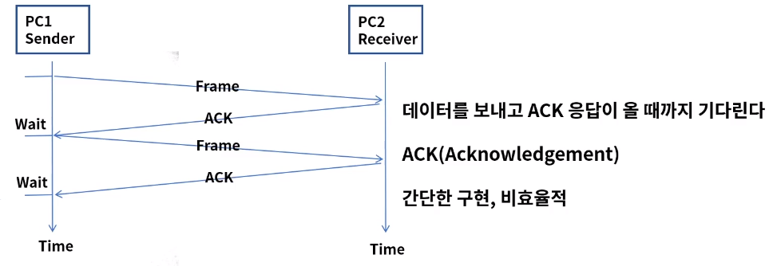

- Frame을 전달하고 ACK이 회선 문제로 응답하지 않는 경우

  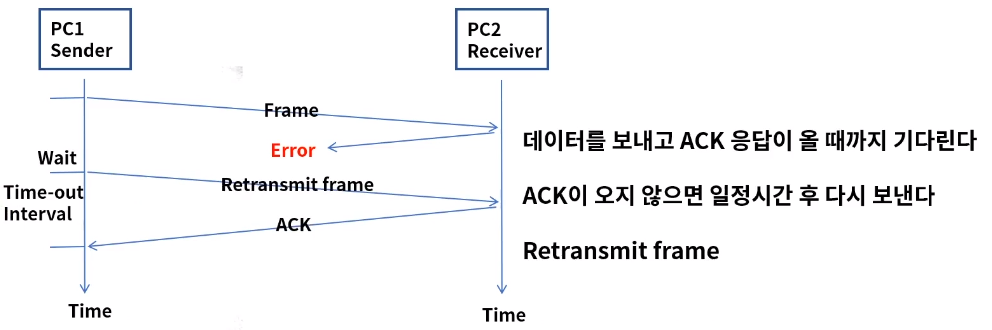

- Frame을 재전송하게되면 Duplicate Frame문제가 발생될 수 있음

  - Sequence number(1bit)를 사용해 동일 frame인지 구분하여 상위 계층으로 전달

  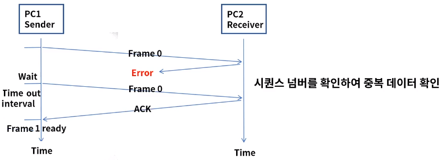

- Sliding window

  - ACK 응답 없이 여러개의 프레임이 연속으로 전송 가능
  - Window size는 전송과 수신측의 데이터가 저장되는 버퍼의 크기

  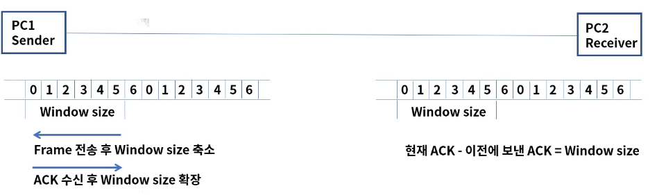

### 오류제어

- 전송중에 오류나 손실 발생 시 수신측은 에러를 탐지 및 재전송

- ARQ (Automatic Repeat Request) : 프레임 손상 시 재전송이 수행되는 과정

- Stop & Wait ARQ

  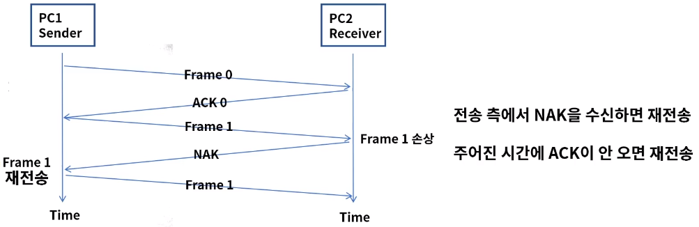

- Go Back n ARQ

  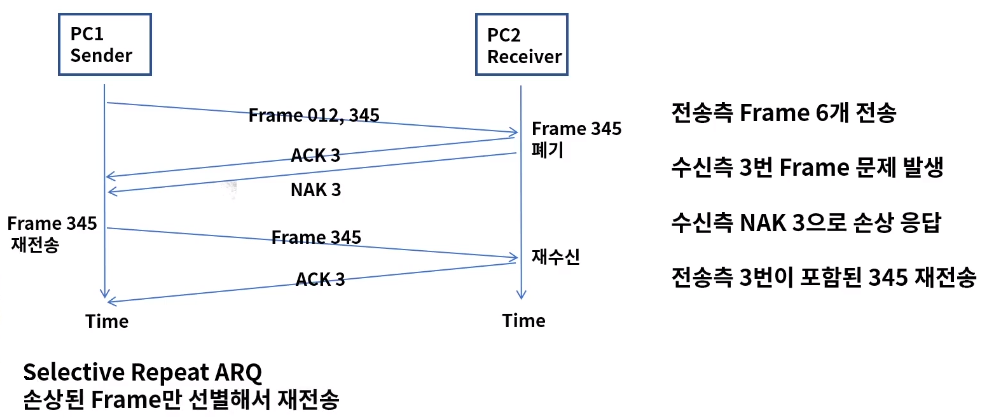

## :heavy_check_mark: 이더넷 프레임 구조

- Ethernet v2

  데이터 링크 계층에서 MAC 통신과 프로토콜의 형식을 정의

  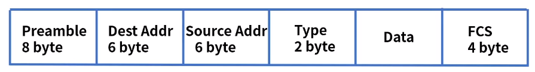

  Preamble: 이더넷 프레임의 시작과 동기화

  Dest Addr: 목적지 MAC 주소, Src Addr: 출발지 MAC 주소

  Type: 캡슐화 되어 있는 패킷의 프로토콜 정의

  Data: 상위 계층의 데이터로 46~1500바이트의 크기, 46 바이트보다 작으면 뒤에 패딩이 붙는다.

  FCS(Frame Check Sequence): 에러체크

## :heavy_check_mark: 정리

- 데이터 링크 계층은 인접한 네트워크 노드끼리 전송하는 기능과 절차를 제공
- 2개의 부계층 MAC, LLC로 구성
- 주요 기능으로 Framing, 회선제어, 흐름제어, 오류제어 등이 있다.

