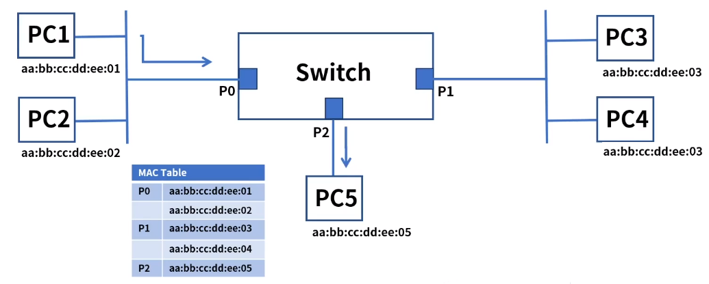
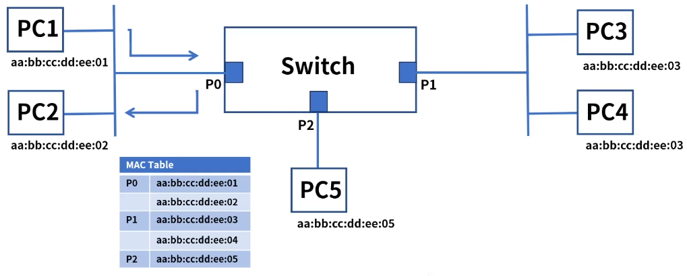
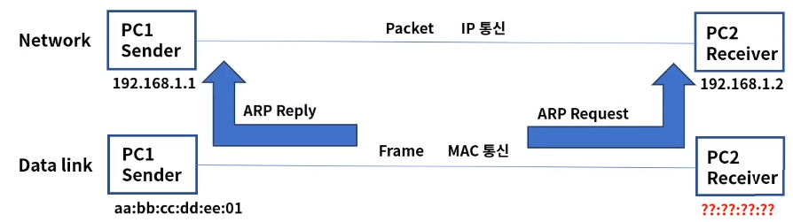
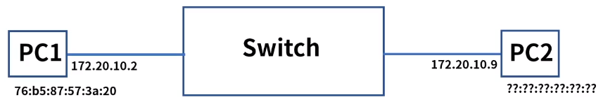

[toc]

# 스위치와 ARP

## :heavy_check_mark: 스위치

- 정의: 2계층의 대표적인 장비로 MAC 주소 기반 통신
- 허브의 단점을 보완
  - Half duplex -> Full duplex
  - 1Collision Domain -> 포트별 Collision Domain
- 라우팅 기능이 있는 스위치를 L3 스위치 라고도 부른다ㅓ

- **동작 방식** 

  > 목적지 주소를 MAC 주소 테이블에서 확인하여 연결된 포트로 프레임 전달

  1. **Learning**: 출발지 주소가 MAC 주소 테이블에 없으면 해당 주소를 저장

     - 4개의 PC는 스위치에 각 포트에 연결되고 프레임이 스위치에 전달
     - 스위치는 해당 포트로 유입된 프레임을 보고 MAC주소를 테이블에 저장

     

  2. **Flooding- Broadcasting **: 목적지 주소가 MAC 주소 테이블에 없으면 전체 포트로 전달

     - PC1은 목적지 aa:bb:cc:dd:ee:05 주소로 프레임 전달
     - 스위치는 해당 주소가 MAC Table에 없어서 전체 포트로 전달

     

  3. **Forwarding**: 목적지 주소가 MAC 주소 테이블에 있으면 해당 포트로 전달

     - PC1은 목적지 aa:bb:cc:dd:ee:05 주소로 프레임 전달
     - 스위치는 해당 주소가 MAC Table에 존재하므로 해당 프레임을 PC5로 전달

     

  4. **Filtering - Collision Domain**: 출발지와 목적지가 같은 네트워크 영역이면 다른 네트워크로 전달하지 않음

     - PC1은 목적지 aa:bb:cc:dd:ee:02 주소로 프레임 전달
     - 스위치는 해당 주소가 동일 네트워크 영역임을 확인하여 다른 포트로 전달하지 않음
     - 필터링은 각 포트별 Collision Domain 을 나누어 효율적 통신이 가능하다.

     

  5. **Aging**: Mac 주소 테이블의 각 주소는 일정시간 이후에 삭제

     - 스위치의 MAC 주소 테이블은 시간이 지나면 삭제
     - 삭제되는 이유는 테이블 저장 공간을 효율적으로 사용
     - 해당 포트에 연결된 PC가 다른 포트로 옮겨진 경우도 발생
     - 기본 300초(Cisco 기준) 저장, 다시 프레임이 발생되면 다시 카운트

     

### 정리

## :heavy_check_mark: ARP (Address Resolution Protocol)

- 역할: IP주소를 통해 MAC 주소를 알려주는 프로토콜
- 컴퓨터 A가 컴퓨터 B에게 IP통신을 시도하고 통신을 수행하기 위해 목적지 MAC주소를 알아야 한다.
- 목적지 IP에 해당되는 MAC주소를 알려주는 역할을 ARP가 해준다.

### 동작 과정

1. PC1은 동일 네트워크 대역인 목적지 IP 172.20.10.9로 패킷 전송을 시도

   목적지 MAC주소를 알기 위해 우선 자신의 ARP Cache Table을 확인

   

   > 172.20.10.9는 없음

   

   

2. ARP Cache Table에 있으면 패킷 전송, 없으면 ARP Request전송 - Broadcasting

   PC1은 목적지 IP 172.20.10.9에 대한 ARP Request 전송 - Broadcasting

   

   

   

3. IP 172.20.10.9에서 목적지 MAC주소를 ARP Reply로 전달

   

   

   

4. 목적지 MAC 주소는 ARP Cache Table에 저장되고 패킷 전송

   

   

## :heavy_check_mark: ARP 헤더 구조

## :heavy_check_mark: 정리

- L2 스위치는 2계층의 대표적인 장비로 MAC주소 기반 통신

- 스위치의 동작방식 단계

  Learning -> Flooding -> Forwarding -> Filtering -> Aging

- ARP는 IP주소를 통해 MAC 주소를 알려주는 프로토콜이다

