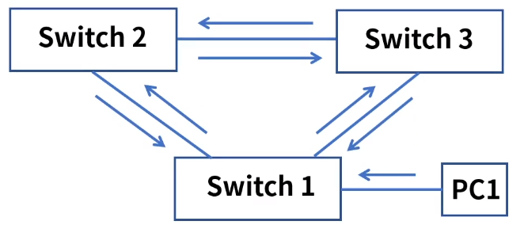
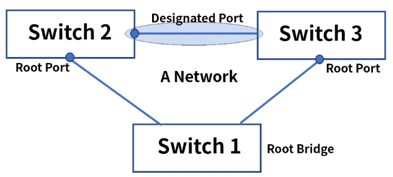
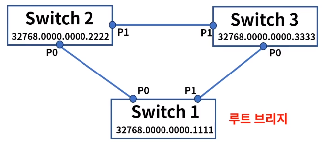
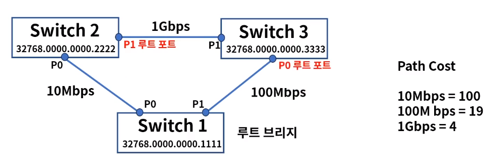
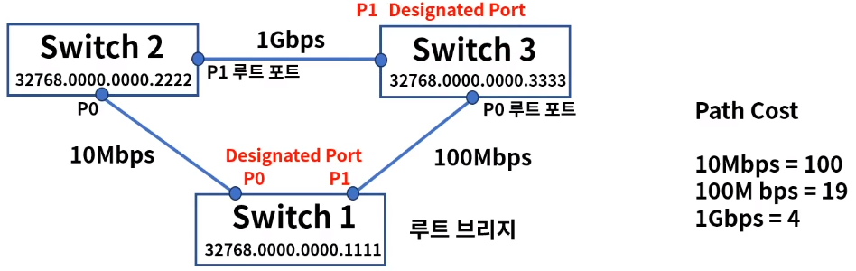
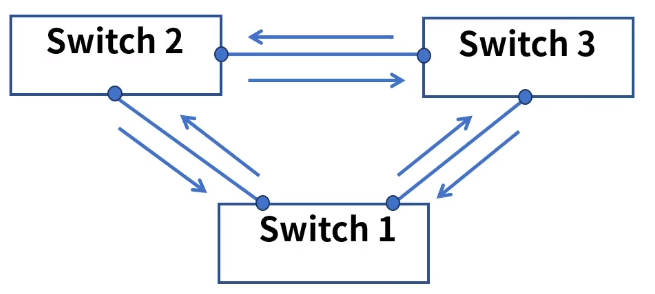
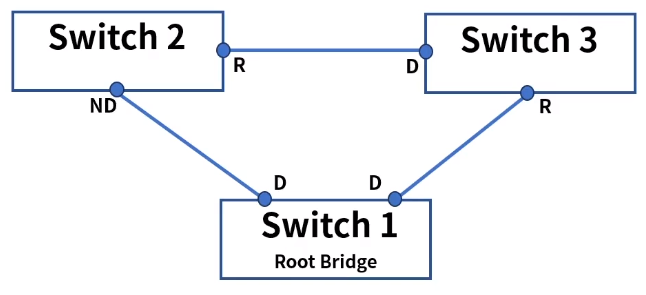
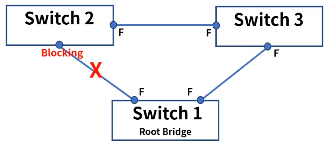

[toc]

# 스패닝트리 프로토콜과 루핑

## :heavy_check_mark: Looping

- 정의: 같은 네트워크 대역대에서 스위치에 연결된 경로가 2개 이상인 경우에 발생
- PC가 브로드캐스팅 패킷을 스위치들에게 전달하고 전달받은 스위치들은 Flooding을 한다.
- 스위치들끼리 Flooding 된 프레임이 서로 계속 전달되어 네트워크에 문제를 일으킨다.
- 회선 및 스위치 이중화 또는 증축 등에 의해 발생
- 물리적인 포트 연결의 실수 또는 잘못된 이중화 구성으로 L2에서 가장 빈번히 발생하는 이슈

### 구조

> 브로드 캐스트 스톰

1. PC1은 Switch 1 에게 브로드 캐스팅 전송
2. Switch 1은 모든 포트에 브로드 캐스팅 전송
3. 전달받은 브로드 캐스팅 프레임을 Switch 2, 3도 모든 포트에 전송
4. Switch  1은 Switch 2, 3에게 다시 전달받은 브로드 캐스팅을 다시 모든 포트에 전송

## :heavy_check_mark: STP (Spanning Tree Protocol): 스패팅 트리 프로토콜

- 자동으로 루핑을 막아주는 알고리즘 -> 스패닝 트리 알고리즘

- 스패닝 트리 알고리즘에 사용되는 프로토콜 -> STP

- IEEE 802.1d

- STP는 2가지 개념을 가지고 있음

  - **Bridge ID**

    스위치의 우선순위로 0~65535로 설정, 낮을수록 우선순위가 높다

  - **Path Cost**

    링크의 속도(대역폭), 1000/링크 속도로 계산되며 작을수록 우선순위가 높다

    1Gbps 속도가 나오면서 계산법이 적합하지 않아 IEEE에서 각 대역폭 별 숫자 정의

    10Mbps = 100, 100Mbps = 19, 1Gbps = 4

### STP의 요소

1. **Root Bridge**: 네트워크당 1개 선출
2. **Root Port**: Root Bridge가 아닌 스위치들은 1개 포트 선출
3. **Designated Port**: 각 세그먼트 별 1개 포트 지정

### BPDU (Bridge Protocol Data Unit)

스패닝 트리 프로토콜에 의해 스위치간 서로 주고받는 제어 프레임

1. **Configutation BPDU: 구성관련**

   Root BID: 루트 브리지로 선출될 스위치 정보

   Path Cost: 루트 브리지까지의 경로 비용

   Bridge ID, Port ID: 나머지 스위치와 포트의 우선 순위

2. **TCN (Topology Change Notification) BPDU**

   네트워크 내 구성 변경시 통보

- 우선순위 - 낮은 숫자가 더 높은 Priority를 가진다.

  > - 누가 더 작은 Root BID?
  > - 루트 브리지까지 더 낮은 Path Cost?
  > - 연결된 스위치중 누가 더 낮은 BID?
  > - 연결된 포트중 누가 더 낮은 Port ID?

### Root Bridge 선출

1. 각 스위치는 고유의 BID를 가진다 2바이트(우선순위) + 6바이트 MAC 주소
2. 서로 BPDU를 교환하고 가장 낮은 숫자가 루트 브리지가 된다.
3. 우선순위 숫자는 명령어로 설정이 가능하다.

### Root Port 선출

1. 나머지 스위치들은 루트 브리지와 가장 빠르게 연결되는 루트 포트를 선출한다.
2. 루트 포트는 가장 낮은 Root Path Cost 값을 가진다.
3. Switch 2는 P1 = 4+19, Switch 3은 P0 = 19

### Designated Port 선출

1. 각 세그먼트 별 루트 브리지와 가장 빠르게 연결되는 포트를 Designated 포트로 선출
2. 우선순위는 루트 브리지 ID > Path Cost > 브리지 ID > 포트 ID
3. Switch 1 P0 & P1, 1Gbps 라인에서는 Switch 3 P1이 Designated Port

### 상태 변화

스위치 포트는 스패닝 트리 프로토콜 안에서 5가지 상태로 표현된다.

1. Disabled

   포트가 Shut Down인 상태로 데이터 전송 불가, MAC 학습 줄가,  BPDU 송수신 불가

2. Blocking

   부팅하거나 Disabled상태를 UP했을 때 첫 번째 거치는 단계, BPDU만  송수신

3. Listening - 15초

   Blocking포트가 루트 또는 Designated Port로 선정되는 단계, BPDU만 송수신

4. Learning - 15초

   리스닝 상태에서 특정 시간이 흐른 후 러닝 상태가 됨, MAC 학습 시작, BPDU만 송수신

5. Forwading

   러닝 상태에서 특정 시간이 흐른 후 포워딩 상태가 됨, 데이터 전송 시작, BPDU 송수신

### 예제 - Looping 상태

1. SW1 -> SW2 경로 2개
2. SW2 -> SW3 경로 2개
3. SW3 -> SW1 경로 2개

### 예제 - BPDU 교환

1. SW 1 루트 브리지 선출
2. 각 세그먼트 별 루트, Designated Port 선정

### 예제 - 상태 변화

1. 루트, Designated Port 는 포워딩 상태, Non- Designated Port 는 블로킹 상태
2. 논리적으로 고립된 구성으로 Looping 문제 해결

## :heavy_check_mark: RSTP & MST

### RSTP (Rapid Spanning Tree Protocol)

> IEEE 802.1w

- STP를 적용하면 포워딩 상태까지 30~50초 걸림, 이 컨버전스 타임을 1-2초 내외로 단축
- Learning, Listening 단계가 없음

### MST (Multiple Spanning Tree)

> IEEE 802.1s

- 네트워크 그룹이 많아지면 STP or RSTP BPDU 프레임이 많아지고 스위치 부하 발생
- 여러개의 STP 그룹들을 묶어서 효율적으로 관리

## :heavy_check_mark: 정리

- Looping은 같은 네트워크 대역대에서 스위치에 연결된 경로가 2개 이상인 경우에 발생

- STP는 루핑 방지를 자동으로 하기 위한 프로토콜이다

- 구성 요소로는 Root Bridge, Root Port, Designated Port, Path Cost 가 있다.

- 상태 변화

  Disabled - Blocking - Listening - Learning - Frowarding

- 그 외 컨버전스 타임을 개선한 RSTP, 부하를 줄이고 효율적 관리를 위한 MST가 있다.

