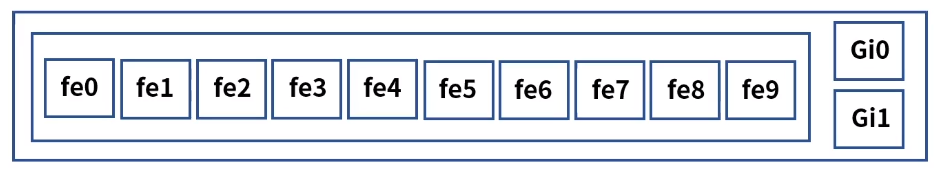

[toc]

# VLAN

## :heavy_check_mark: VLAN (Virtual Local Area Network)


- 물리적 구성이 아닌 논리적인 가상의 LAN을 구성하는 기술
- **불필요한 데이터 차단**: 브로드 캐스트 도메인 별로 나누어 관리
- **관리의 용이성과 보안**: 호스트의 물리적 이동 없이 LAN 그룹 변경이 가능
- **비용절감**: 새로운 LAN 추가시 물리적 스위치 구매 필요 X


### 종류

#### 1. **Port 기반 VLAN**

- 여러개의 VLAN을 설정하고 각각의 LAN에 물리적인 포트를 지정
- VLAN 변경이 필요한 호스트는 물리적인 포트 또는 스위치의 VLAN 설정을 변경

ex)


> 변경시 VLAN 그룹에 매핑되어있는 포트 설정 정보만 변경
>
> 또는 물리적인 케이블을 이동하여 변경

| fe0~fe4 | VLAN 100(총무팀) |
| ------- | ---------------- |
| fe5~fe7 | VLAN 200(인사팀) |
| fe8~fe9 | VLAN 300(영업팀) |


#### 2. **MAC 주소 기반 VLAN**

- 각 호스트 또는 네트워크 장비의 MAC 주소를 각각의 VLAN에 정의
- 호스트가 이동되어도 VLAN 변경 필요 없음, 신규 호스트 연결시 설정 변경 필요

ex)


> VLAN 변경시 호스트의 MAC 주소를 다른 VLAN으로 이동
>
> 신규 호스트 연결시 MAC 주소를 확인하여 VLAN 그룹에 소속

VLAN 100 (총무팀): aa:bb:cc:dd:ee:11~20

VLAN 200 (인사팀): aa:bb:cc:dd:ee:21~30

VLAN 300 (영업팀): aa:bb:cc:dd:ee:31~40

| fe0  | aa:bb:cc:dd:ee:11 | VLAN 100 |
| ---- | ----------------- | -------- |
|      | aa:bb:cc:dd:ee:21 | VLAN 200 |
| fe1  | aa:bb:cc:dd:ee:31 | VLAN 300 |
|      | aa:bb:cc:dd:ee:25 | VLAN 200 |
| fe2  | aa:bb:cc:dd:ee:14 | VLAN 100 |


#### 3. **IP 주소 기반 VLAN**

- IP 주소 서브넷 기반으로 VLAN을 나누는 방법
- IP(Internet Protocol): 3계층에서 사용하는 프로토콜, IP 주소 예)192.168.10.1
- 서브넷: IP주소의 네트워크 영역의 크기를 나눈 것



> VLAN 변경시 호스트의 IP 주소를 다른 VLAN으로 이동
>
> 신규 호스트 연결시 IP 주소를 확인하여 VLAN 그룹에 소속

VLAN 100 (총무팀): 192.168.1.0/24

VLAN 200 (인사팀): 192.168.2.0/24

VLAN 300 (영업팀): 192.168.3.0/24

| fe0  | 192.168.1.0/24 | VLAN 100 |
| ---- | -------------- | -------- |
| fe1  | 192.168.2.0/24 | VLAN 200 |
| fe2  | 192.168.3.0/24 | VLAN 300 |


## :heavy_check_mark: Trunk

- 정의: 물리적 스위치간 VLAN 연결 시 하나의 물리적 연결로 VLAN 그룹들 공유

- 대규모 망에서 스위치의 개수 증가 -> VLAN 그룹 개수도 증가 -> 물리적 연결 케이블은 복잡
- 이를 해결하려고 (하나의 연결로 VLAN공유) 많은 수의 VLAN 그룹들도 물리적 연결 케이블 하나로 구성


### 트렁크 프로토콜

- 이더넷 프레임에 식별용 VLAN ID를 삽입하여 데이터를 구분해 통신 및 제어 가능

- IEEE 802.1q
- VLAN Tagging: VLAN ID 정보


### 802.1q tagged format

- 이더넷 프레임에 삽입되며 4바이트로 구성


- TPID (Tag Protocol IDentifier): 태그되지 않은 프레임과 태깅된 프레임을 구별
- TCI (Tag Control Information): 태그 제어 정보

1. PCP (Priority Code Point): 프레임의 우선 순위
2. DEI (Drop Eligible Indicator): 트래픽 혼잡시 제거되기 적합한 프레임들을 가리킬 용도
3. VID (VLAN IDentifier): VLAN이 어느 프레임에 속하는지를 결정


## :heavy_check_mark: VLAN 구성

### VLAN 설계

1. VLAN 그룹 정의 

   - VLAN 100 (총무팀)

   - VLAN 200 (인사팀)

   - VLAN 300 (영업팀)

2. VLAN 구성 방법 정의

   - 포트, MAC주소, IP주소

   - MAC 또는 IP주소 방식의 경우 미리 사전 조사 필요

3. 트렁크 포트 정의

   - 대역폭 확인
   - 허가(Tagged)할 프레임 정의, 정의되지 않은 Tag는 통신 불가


### VLAN 설정

1. VLAN 그룹 설정

   ```
   # vlan 100
   # vlan 200
   # vlan 300
   ```

2. 엑세스 모드: 사용할 포트에 1개의 VLAN ID 설정

   ```
   # interface GigabitEthernet1/0/1
   # switchport mode access
   # switchport access vlan 100
   ```

3. 트렁크 모드: 사용할 포트에 여러개의 VLAN ID 설정

   ```
   # interface GigabitEthernet1/0/2
   # switchport mode trunk
   # switchport trunk allowed vlan 100,200,300
   ```

4. 다이나믹 모드: 연결된 포트들의 상태에 따라 엑세스 또는 트렁크로 변경되는 모드

   ```
   # interface GigabitEthernet1/0/3
   # switchport mode dynamic desirable 또는 auto
   ```

> 스위치 설정 방법은 각 제조사별 상이


## :heavy_check_mark: 정리 

- VLAN (Virtual LAN)은 물리적 구성이 아닌 논리적인 가상의 LAN을 구성하는 기술
- VLAN구성 방법은 Port, MAC주소, IP주소 기반이 있다.
- 트렁크는 스위치간 VLAN연결시 하나의 물리적 연결로 VLAN 그룹들을 공유하는 기술
- VLAN모드에는 엑세스, 트렁크, 다이나믹 모드가 있다.
- 802.1q 태그 포맷


