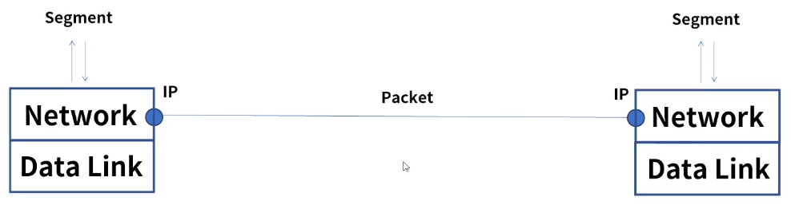
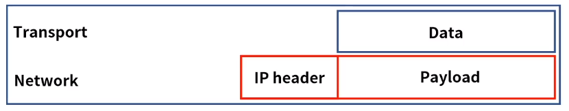
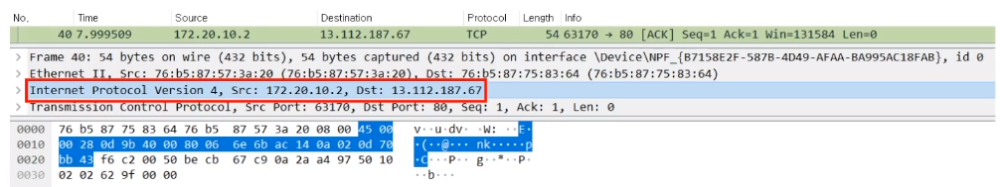
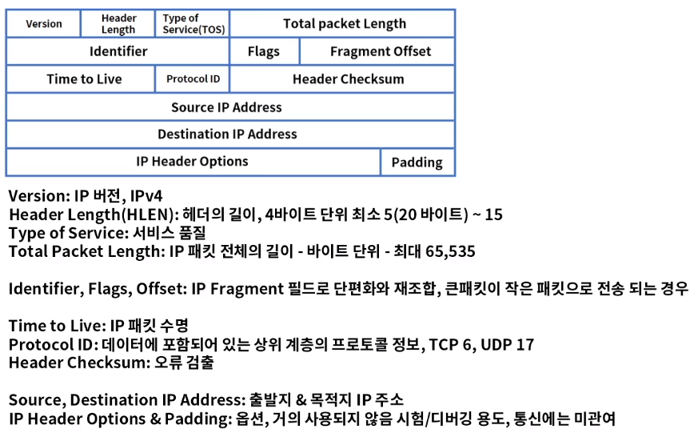
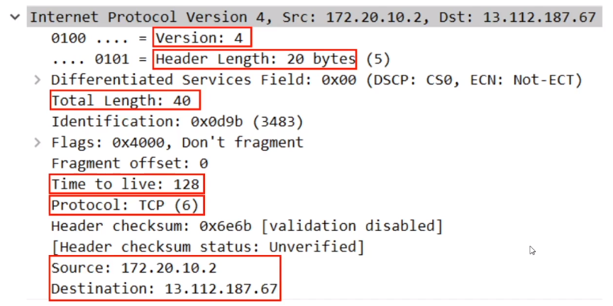
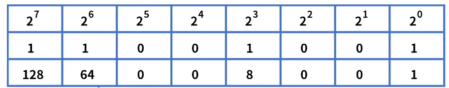
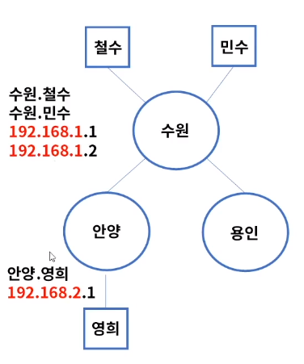
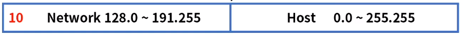
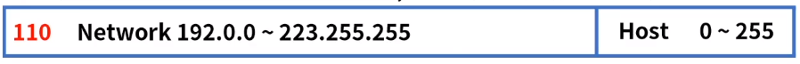

[toc]

# 네트워크 계층의 역할과 IP의 구조

## :heavy_check_mark: 네트워크 계층

- 역할: OSI 7 Layer의 3계층으로 패킷 포워딩과 네트워크간 라우터를 통한 라우팅 수행
- IP (Internet Protocol)주소를 사용하여 통신, 계층적 구조
- 대표적인 장비는 라우터 또는 L3라고 부른다.

## :heavy_check_mark: IP 정의와 구조

### IP (internet Protocol)

- 네트워크 계층에서 통신하는 주요 프로토콜로 라우팅을 구현하고 본질적인 인터넷을 구축하는 계기
- 전송 제어 프로그램의 비연결 데이터그램 서비스로 시작 -> 연결 지향 서비스로 보완
- RFC 760 -> RFC 791 IP, Conectionless
- RFC 761 -> RFC 793 TCP, Connection-oriented service
- TCP/IP 모델의 기원
- 현재 사용중인 버전은 IPv4이며 후속 버전으로 IPv6 릴리즈

### IP 주소 확인

CMD -> `ipconfig`

### IP 구조

- IP는 헤더와 페이로드로 구성되어있다.

  

- 헤더는 목적지 & 출발지 IP 주소 등을 포함, 페이로드는 전송되는 데이터를 의미

  

### IPv4 헤더 구조

최소 20바이트 (옵션 미 지정시)

### IPv4 헤더 구조 - PCAP

## :heavy_check_mark: IP 주소 클래스

### IP 주소 구성

- IP 주소는 2진수 32비트로 구성

  ex) 1010101010.01101001.01010101.1001001

- 총 2의 32승 = 4,294,967,296 = 42억 9천여개

- 최초 IP 추소 설계시 충분한 수량이였으니 현재는 거의 고갈된 상태

- 2진수는 어렵기 때문에 일반적으로 10진수로 표현 ex) 168.126.63.1

- 2의 8승은 256 = 10진수 한 옥텟은 최대 0~255까지 가능

### 2진수 -> 10진수 표현

- 2진수는 0, 1 2개로 구분
- 10진수는 0~9까지 총 10개로 표현
- 2의 0승 = 1 = 00000001, 2의 1승 = 2 = 00000010, 2의 2승 = 4 = 00000100

> 2진수 11001001 = 128 + 64 + 8 + 1 = 10진수 201

### 네트워크와 호스트

- IP주소는 네트워크 부분과 호스트 부분으로 나뉜다.

- 네트워크는 브로드캐스트 영역, 호스트는 개별 단말기

  > 192.168.1.0~255 = 192.168.1 부분 = 네트워크, 0~255 = 호스트
  >
  > ex) 경기도 수원, 안양, 용인시로 구성되었다고 가정
  >
  > 같은 수원시에 사는 철수, 민수는 시내버스를 타고 만남.
  >
  > 철수와 안양시에 사는 영희를 만나려면 시외버스를 타야함
  >
  > 
  >
  > > 수원, 안양, 용인 = 네트워크 = 라우터
  > >
  > > 철수, 민수, 영희 = 호스트 = PC
  > >
  > > 시내 = 브로드캐스트 스위칭
  > >
  > > 시외 = 라우팅

### IP 주소 클래스

- IP주소는 네트워크의 크기에 따라 5개의 클래스 (A, B, C, D, E)로 구분

- A 클래스: 0.0.0.0 ~ 127.255.255.255, 호스트는 2의 24승

  

- B 클래스:  128.0.0.0 ~ 191.255.255.255, 호스트는 2의 16승

  

- C 클래스: 192.0.0.0 ~ 223.255.255.255, 호스트는 2의 8승 256개

  

- D & E 클래스: 멀티 캐스트용 (224.0.0.0 ~ 239.255.255.255)과 연구용(240.0.0.0 ~ 255.255.255.254)

## :heavy_check_mark: 정리

- 네트워크 계층은 패킷 포워딩과 네트워크간 라우팅을 수행
- 주요 프로토콜로 IP가 있으며 1974년 IPv4 공개
- IPv4 헤더 구조
- IPv4의 주소는 32비트로 구성, 2의 32승으로 약 42억 9천여개
- IP는 네트워크와 호스트로 나뉘며 크기와 용도에 따라 5개의 클래스로 구분한다.

