[toc]

# 라우터와 서브넷팅

## :heavy_check_mark: 라우터의 이해

- 역할: 목적지 IP 주소를 확인하고 하나 또는 그 이상의 네트워크 간의 패킷의 경로를 선택하여 전송
- **Router**: 네트워크 간의 패킷을 전송해주는 장비
- **Routing**: 네트워크 간의 패킷을 전달하는 경로를 선택하는 과정, Static & Dynamic
- **Routed**: 라우터가 라우팅을 해주는 대상, IP


### 인터페이스

- 라우터의 접속 가능한 포트로 통신용&관리용으로 구분
- 통신용은 UTP, 광, 무선으로 구성, WAN(Router to Router) 연결은 시리얼 포트도 존재
- 관리용은 보통 콘솔이라 부르며 원격에서 접속 불가 또는 장애 시 장비에 직접 연결할 때 사용


## :heavy_check_mark: 서브넷 마스크

- 개념

  - 서브넷: 부분망, IP 주소는 네트워크와 호스트로 구분

  - 할당된 네트워크 영역을 좀 더 효율적으로 사용하기 위해 서브넷으로 쪼개어 구성

  - 네트워크를 여러개의 작은 네트워크 서브넷으로 구분하는 것 -> 서브넷 마스크

  - ex) 총 C 클래스 254개의 IP 할당 211.109.131.0 ~ 255

    > 네트워크 별 첫번째 숫자와 마지막 숫자는 Reserved로 사용하지 않음 
    >
    > (첫 번째: 네트워크 영역을 알림, 마지막: 브로드 캐스트 주소)
    >
    > 1. 254개의 IP주소를 할당했으나 R2망은 3개의 IP만 필요
    > 2. R2망은 총 6개 IP가 필요함을 확인
    >    - 3명 (Bob, Kim, Linda) & Gate way 주소 1개
    >    - 네트워크 & 브로드캐스트 주소 2개
    > 3. 2의 3승 = 8개로 서브넷 구성이 가장 효율적
    > 4. 211.109.131.0 ~ 7, 211.109.131.0/29로 구성
    >
    > 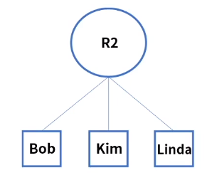


### 상세

- 디폴트 게이트웨이: 다른 네트워크로 패킷 전송시 거쳐야하는 거점
- Prefix 기법: 서브넷 마스크 표기를 간단히 표현, 네트워크 영역의 비트 "1"의 개수를 의미
- A 클래스: 255.0.0.0 = /8, B 클래스: 255.255.0.0 = /16, C 클래스: 255.255.255.0 = /24

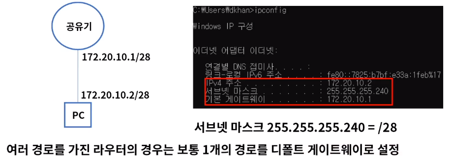


### 계산법

- 서브넷 마스크는 2진수로 "1"인 부분은 네트워크, "0"인 부분은 호스트가 된다

- 1 AND 1 = 1 의 공식으로 네트워크 주소를 확인한다.

- ex)

  IP주소: 209.217.12.11 

  서브넷 마스크: 255.255.255.0

  11010001.11011001.00001100.00001011 = 209.217.12.11

  11111111.11111111.11111111.00000000 = 255.255.255.0

  11010001.11011001.00001100.00000000 = 209.217.12.0 -> 서브넷 네트워크

  - 255.255.255.0은 호스트 영역 "0"이 8개이므로 2의 8승 256개 IP 할당, 209.217.12.0/24로 표현

- ex 2)

  IP주소: 8.8.8.114

  서브넷 마스크: 255.255.255.192의 네트워크 주소와 IP할당된 개수는?

  00001000.00001000.00001000.01110010 = 8.8.8.114

  11111111.11111111.11111111.11000000 = 255.255.255.192

  00001000.00001000.00001000.01000000 = 8.8.8.64 -> 네트워크 주소

  - 호스트 "0"이 6개  = 2의 6승 = 64개 할당됨 = 8.8.8.64 ~ 127까지 호스트 범위, 8.8.8.64/26

  - 서브넷 마스크는 LAN 설계시 C 클래스(256개) 단위로 많이 나눔

  - 2의 n승을 외워두면 계산에 도움이 됨

  - - /24 = 256개를 기준으로

    - /25 = 128
    - /26 = 64
    - /27 = 32
    - /28 = 16
    - /29 = 8
    - /30 = 4
    - /32 = 1


## :heavy_check_mark: 라우터의 동작 방식

### Static 라우팅

- 가장 기본적인 라우팅 방식으로 수동으로 경로를 라우터에 설정하여 패킷을 처리한다.
- 경로는 라우팅 테이블에 목적지 IP주소 & 인터페이스 정보를 설정

#### ex) 테스트 망 구성

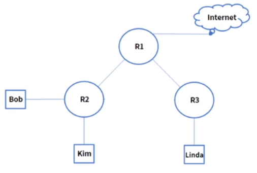

```
- IP 대역 할당: 211.109.131.0/24
- Router 대수: 3
- PC 대수: 3
- 세그먼트 (경로) = 6개
- 서브넷 나누기: 총 6개의 네트워크
```

#####  1. IP 네트워크 할당 - 서브넷 마스크

211.109.131.0/24를 7개 대역으로 분할 25_128, 26_64, 27_32, 28_16, 29_8, 4, 2

128 X 1 = 128개, 32 X 2 = 64개, 16 X 4 = 64개

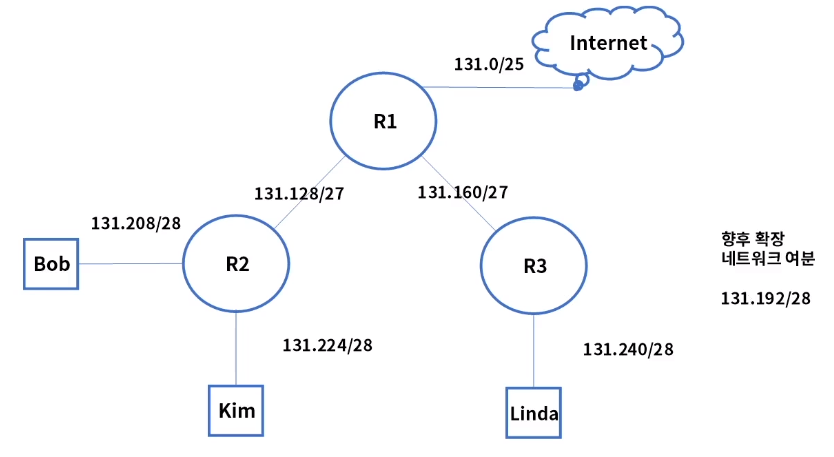


##### 2. IP 주소 할당 - 각 서브네팅된 네트워크에 맞추어 IP 설정

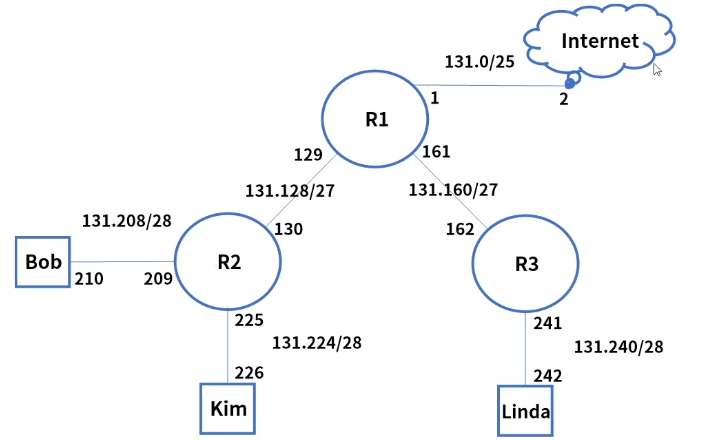


##### 3. 각 PC의 정적 라우팅 테이블 작성

- 각 PC의 경로는 1개, 곧 자신의 대역을 제외하고 전부 인접한 라우터(게이트웨이)로 경로 설정 
- 보통 디폴트 게이트웨이만 설정

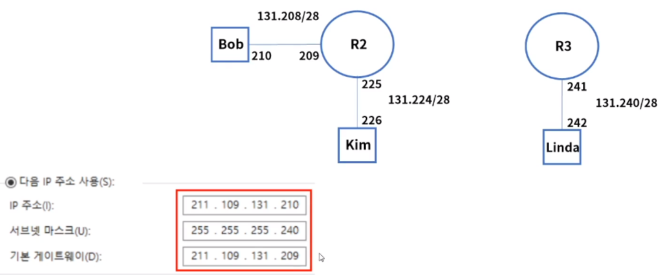


##### 4. 각 라우터들의 정적 라우팅 테이블 구성

- 경로 별 네트워크 대역을 확인하여 커넥티드, 정적, 디폴트 라우팅 설정
- 커넥티드는 포트에 직접 연결된 네트워크 대역, 설정 필요 없음

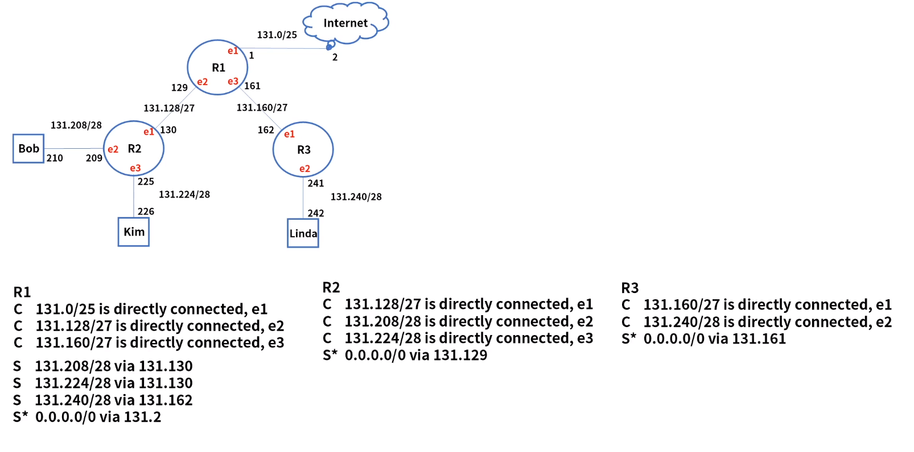


##### 5. 응용예제01 - Bob to Linda

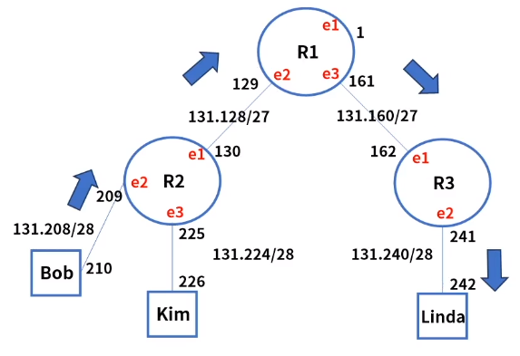

1. Bob은 목적지 Linda 131.242로 통신 시도
2. 목적지 IP 주소는 자기대역이 아니므로 R2로 전달 - 디폴트 게이트웨이
3. R2도 Connected 대역이 아니므로 R1으로 전달
4. R1은 정적 라우팅 테이블을 참조
5. "S 131.240/28 via 131.162" to R3
6. R3는 connected 대역인 e2포트로 전달
7. Linda 패킷 수신 완료


##### 6. 응용예제01 - Kim to 인터넷(google)

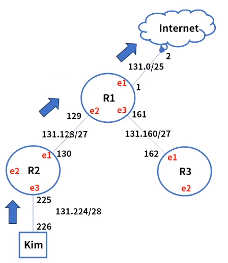

1. Kim은 목적지 인터넷 (구글) 8.8.8.8로 통신 시도
2. 목적지 IP주소는 자기대역이 아니므로 R2로 전달 - 디폴트 게이트웨이
3. R2도 Connected 대역이 아니므로 R1으로 전달
4. R1은 정적 라우팅 테이블을 참조했으나 없는 대역
5. "S* 0.0.0.0/0 via 131.2"로 전달
6. 인터넷 라우터들을 통해 구글에 도착


### Hop & TTL

- 전세계 네트워크 호스트는 IP 라우팅을 통해서 연결

- Hop: 소스와 목적지 간의 경로
- TTL(Time To Live): 패킷이 폐기되기전 hop 카운트
- 각 라우터는 패킷이 인입되면 TTL값을 1씩 감소
- TTL = 0이 되면 폐기
- 부정확한 패킷의 루프 방지

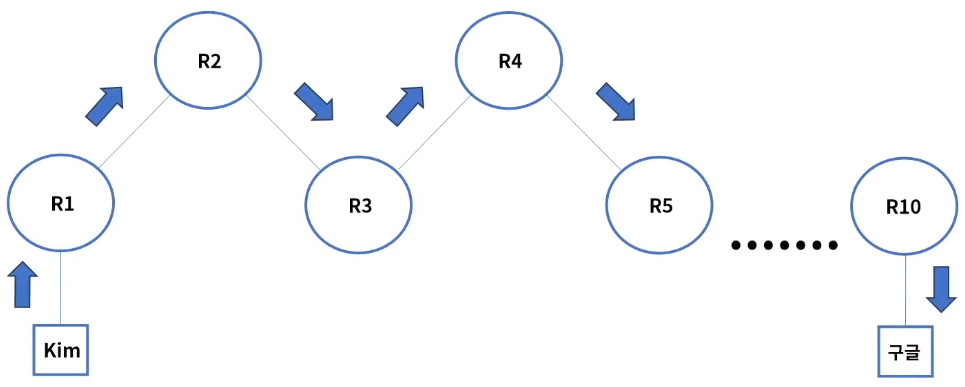


### Traceroute or Tracert

- 라우팅 경로 확인 명령어: 출발지에서 목적지 IP까지 거치는 라우터 최적 경로 확인

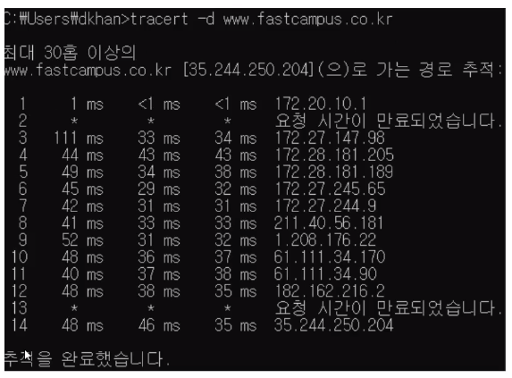


## :heavy_check_mark: 정리

- 라우터는 목적지 IP 주소를 확인하고 하나 또는 그 이상의 네트워크 간의 패킷의 경로를 선택하여 전송
- 서브넷 마스크는 네트워크를 여러개의 작은 부분 네트워크로 구성하는 것
- Static 라우팅은 라우팅 테이블의 목적지 IP & Next Hop을 참조하여 경로 선택
- 라우팅 테이블은 커넥티드, 수종(정적), 디폴트 라우팅 설정이 포함된다
- Traceroute 명령어를 통해서 라우팅 경로 정보를 추적할 수 있다.


