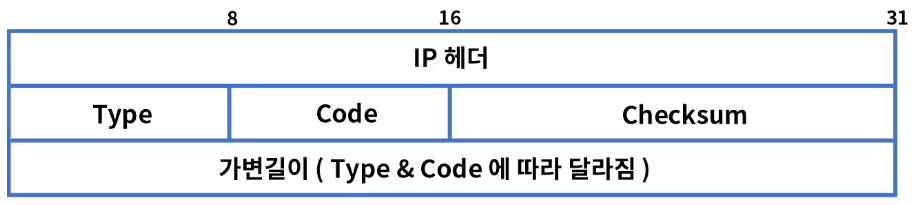
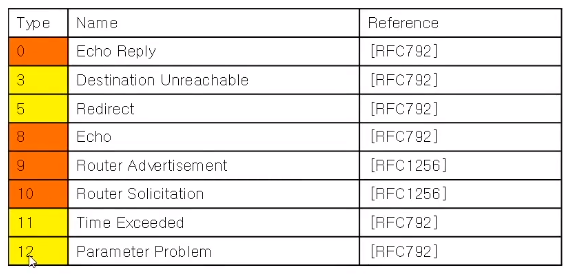
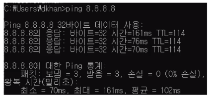
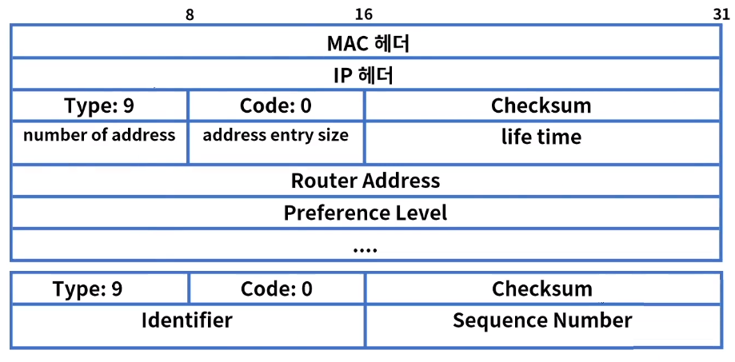
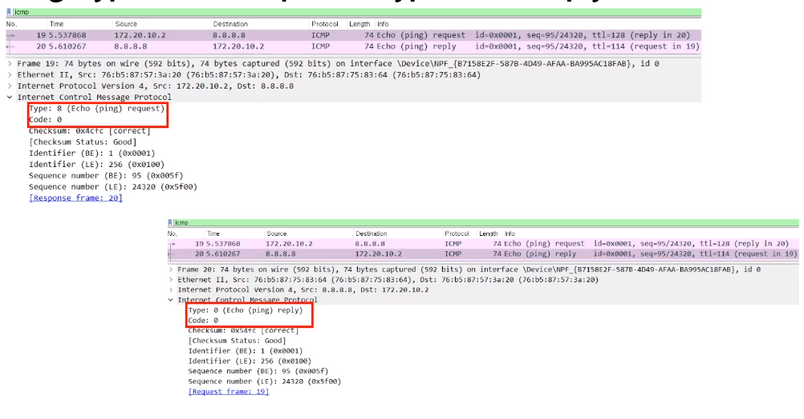
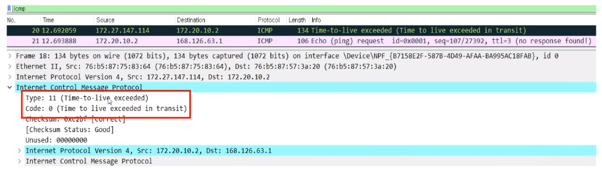

[toc]

# ICMP

## :heavy_check_mark: ICMP의 정의 

- Internet Control Message Protocol : 인터넷 제어 메시지 프로토콜
- IP 통신은 목적지에 패킷을 정상적으로 전달하는 방법은 있지만 에러 발생시 처리 불가
- ICMP는 IP통신의 에러 상황을 출발지에 전달 & 메세지 제어 역할
- RFC 792, 1981년 소개됨
- ICMP는 IPv4패킷으로 캡슐화
- Protocol ID = 1
- Ping & Traceroute 명령어를 사용

## :heavy_check_mark: ICMP의 기능

### ICMP 포맷 구조

- IP 패킷에 포함
- Type: ICMP 메세지 종류
- Code: 메세지 Type 별 세부 코드 정보
- Checksum: ICMP 헤더 손상 여부 확인

### ICMP Type

- 0 ~ 254 까지 정의

- 주로 쓰이는 타입은 아래와 같으며, 오류보고 & 정보성으로 나눈다
- 정보용: 8, 0, 9, 10
- 오류 보고용: 3, 5, 11, 12

### Type 8 & 0 Echo Request & Reply

- 네트워크 문제 진단시 사용
- 출발지에서 목적지 IP로 ICMP Echo Request 메세지를 보내면 목적지는 Echo Reply로 응답

- 목적지 도달 여부, RTT(Round-Trip delay Time), hop count 확인

  

- TTL값에 따라 일반적인 OS 종류를 알 수 있다.

  Windows계열 128, Linux 계열 64

### Type 9 & 10 라우터 광고 & 정보 요청

- 자신이 라우터임을 응답 & 네트워크 진입시 라우터 정보 요청

### Type 3 Destination Unreachable & 5 Redirect

- 라우터가 IP 패킷을 라우팅하지 못하는 경우에 발생
- 0 = net unreachable
- 1 = host unreachable
- 2 = protocol unreachable
- 3 = port unreachable
- 4 = fragmentation needed and D F set
- 5 = source route failed

- Type 5 Redirect: 로컬 네트워크에 2개이상의 경로가 있을 때 더 좋은 경로를 알려줌

### Type 11 Time Exceeded & 12 Parameter Problem

- 시간초과, TTL 값이 "0"이 되면 출발지에게 응답
- 0 = Time to Live Exceeded
- 1 = Fragment Reassembly Time Exceeded
- IP Fragmentation: IP 패킷을 작은 패킷으로 나누어서 전송하고 목적지에서 재조합
- MTU(Maximum Transmission Unit): IP 패킷을 전송할 수 있는 최대 크기
- Type 12 Paremeter Problem: IP 옵션을 잘못 사용하여 라우터에 패킷 폐기

### Ping Type 8 echo Request & Type 0 echo reply

### Traceroute

Type 11 Time Exceeded

## :heavy_check_mark: 정리

- ICMP (Internet Control Message Protocol)
- IP 통신의 에러 상황을 출발지에 전달 또는 메세지 제어 역할
- 포맷
- 주 타입은 정보용(8, 0, 9, 10)과 오류 보고용 (3, 5, 11, 12)으로 구분
- Ping & Traceroute 명령어를 통해서 사용