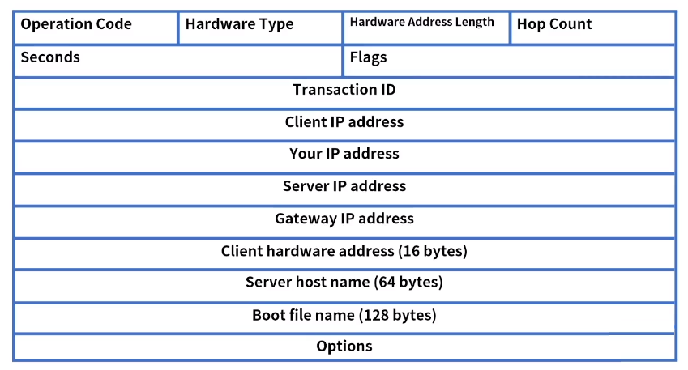
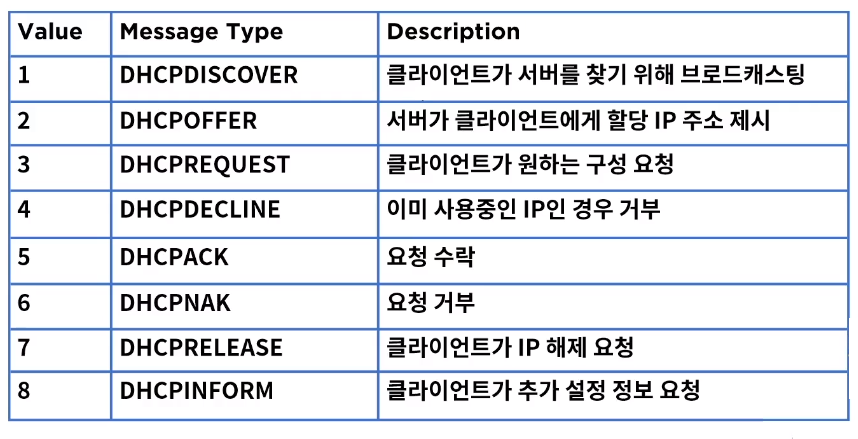
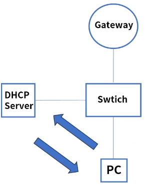
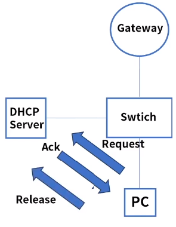
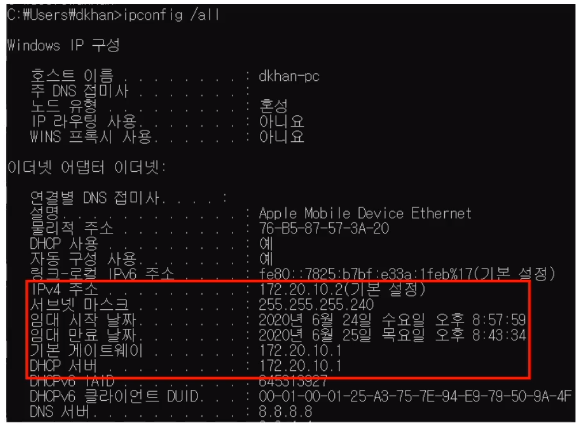

[toc]

# DHCP

## :heavy_check_mark: DHCP 정의

- Dynamic Host Control Protocol
- 동적 호스트 구성 프로토콜
- DHCP 서버를 이용해 클라이언트인 네트워크 장치에 IP 주소를 자동으로 할당
- 요청에 의한 IP 할당으로 효율성 극대화
- 잘못된 IP 설정으로 인한 장애 예방

- IP 변경이 잦은 호스트의 관리

### DHCP 메세지 포맷

- operation code: 1 Request (client -> server), 2 Reply (server -> Client)
- Hardware Type 1, Ethernet
- Hardware address length: 6, MAC addredd
- Hop count: 0에서 시작, 네트워크 망 이동시 증가
- Transaction ID: 클라이언트가 선택하는 랜덤 수, 요청과 응답 매칭
- Seconds: IP 할당 후 경과한 초의 수
- Flags: 서버 응답에 대해 0 unicast 또는 1 broadcst 응답 구분 값
- client IP: 최초 0.0.0.0
- Your IP: 할당될 IP
- Options: DHCP 메세지 타입 포함

### DHCP 메세지 타입

## :heavy_check_mark: DHCP 동작 과정

### IP 할당

- 기본 네트워크 구성, Gateway - Switch - DHCP Server - PC

1. DHCPDISCOVER: PC는 DHCP Server를 발견
2. DHCPOFFER: DHCP Server는 PC에게 IP 제안
3. DHCPREQUEST: PC는 제안받은 IP할당을 요청
4. DHCPACK: DHCP Server는 요청 수락

### IP 갱신

- 지정된 IP 갱신 타임이 도래하면 갱신을 요청

1. DHCPREQUEST: PC는 기존 IP 재 할당을 요청
2. DHCPACK: DHCP Server는 IP확인 후 요청 수락

### IP 해제

- 사용중인 PC가 전원이 off되는 경우

1. DHCPRELEASE: PC는 더이상 IP 할당이 필요 없음을 알림

### DHCP 자동 할당 정보

cmd > `ipconfig /all`

## :heavy_check_mark: 정리

- DHCP: 동적 호스트 구성 프로토콜
- DHCP 서버를 사용해 클라이언트인 네트워크 장치에 IP주소를 자동으로 할당
- DHCP 메세지 타입
- DHCP 동작은 IP할당, 갱신, 해제의 과정이 있다. 

