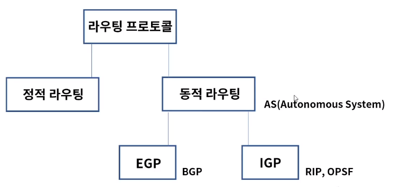
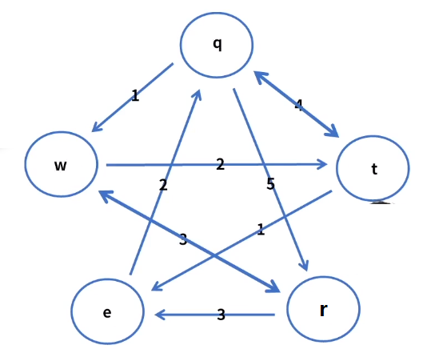
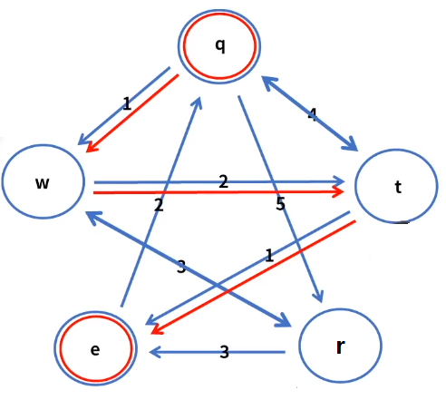
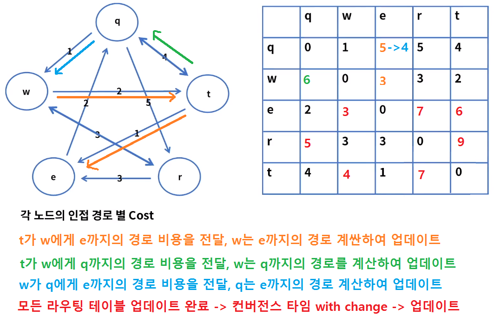
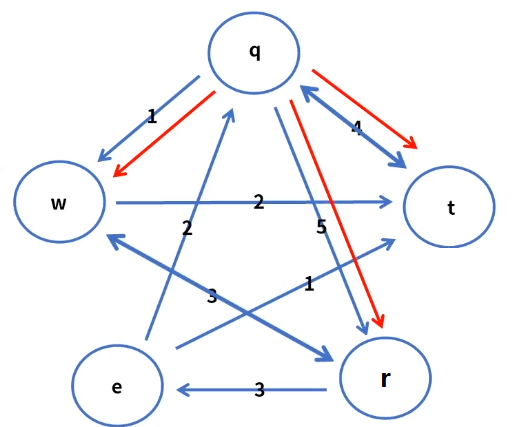
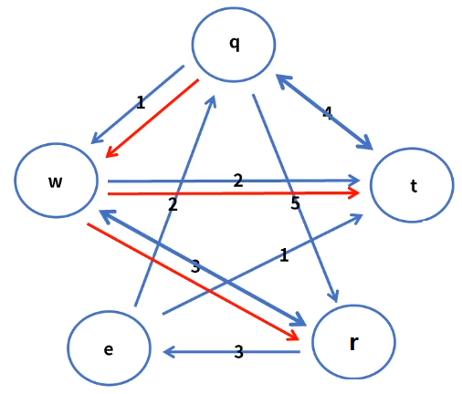
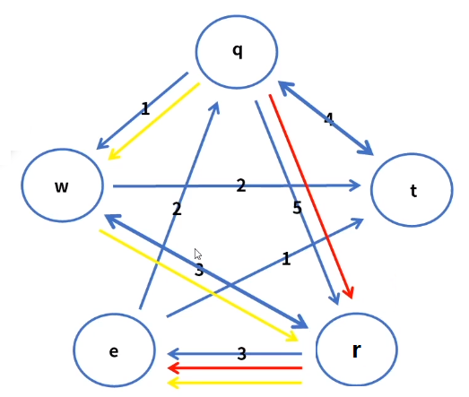

[toc]

# 동적 라우팅의 개요

## :heavy_check_mark: 라우팅 프로토콜

> 라우팅 프로토콜은 정적(Static), 동적(Dynamic)으로 구분된다

- 정적 라우팅: 경로 정보를 라우터에 미리 저장하여 패킷 전송

- 동적 라우팅: 경로 정보가 네트워크 상황에 따라 더 빠른 경로로 변경되어 패킷 전송

## :heavy_check_mark: 라우팅 알고리즘

- 역할: 목적지까지 최적 경로를 계산하고 라우팅 테이블에 업데이트

- 동적으로 라우팅 테이블을 유지 및 관리하는 알고리즘

- Distance Vector & Link State routing 으로 구분한다.
  - Distance Vector
    - 분산 업데이트, 각 라우터들에 의해 최소 비용 경로 계산 - 인접 노드와 교환
    - 소규모 네트워크, 주기적이며 비동기 방식
  - Link State routing 
    - 중앙 집중형 업데이트
    - 네트워크 전체 정보를 통해서 최소 비용 경로 계산
    - 대규모 네트워크에 적합
    - 이벤트 기반의 라우팅 테이블 관리

### Distance Vector - 거리 + 방향

- 목적지 IP까지의 거리 = Hop 카운트 = 라우터와 라우터 사이의 거리 + 인터페이스 방향
- 인접 라우터들과 주기적으로 라우팅 테이블을 교환하여 확인 및 관리
- 인접 라우팅 테이블만 관리 -> 메모리 절약

- 비교적 구성이 간단
- 주기적 라우팅 테이블 업데이트 -> 무의미한 트래픽 발생 가능
- Convergence time (라우팅 테이블 업데이트 시간)이 느리다.

- 소규모 네트워크에 적용
- 1969년 Bellman-Ford 알고리즘에 기반하여 설계, APANET 최초의 라우팅 알고리즘

### Bellman-Ford 알고리즘

- 최단 경로 문제를 풀어주는 알고리즘

- ex) 

  

  노드 5개, 간선 10개 (양방향 포함)

  - 최단 경로: dq(e) = q에서 e까지의 총 경로

  - 비용: c(q,w) = 인접 노드간의 비용

  - 갱신: dq(e) = min {

    ​	c(q,w) + dw(e)

    ​	c(q,r) + dr(e)

    ​	c(q,t) + dt(e)

    }

- ex2) 

  

  - 최단경로: dq(e)

  - 비용: c(q,w) = 1, c(q,r) = 5, c(q,t) = 4

  - 최소 값: dq(e) = min {

    ​	1 + dw(e)

    ​	5 + dr(e)

    ​	4 + dt(e)

    }

  - dw(e) = c(w,t) + c(t,e) = 2 + 1 = 3
  - dr(e) = c(r,e) = 3
  - dt(e) = c(t,e) = 1
  - dq(e) = min {4, 8, 5} = 4

- 주기적 업데이트

  - 연결 링크의 비용 변경
  - 최단거리의 변경

  Listening -> Change -> Estimate -> Notify -> Update

  기다림 -> 최단거리 값 & 연결 링크 비용 변경 -> 인접노드로 전달

  

###  Link State 라우팅 - 링크상태

- 즉, 회선의 대역폭을 고려하여 가중치를 부여
- 네트워크 토폴로지 경로를 모든 라우터들에게 전달
- 라우팅 정보가 변경되는 이벤트 건에 대해서만 전파 -> 네트워크 트래픽 감소
- 전체 네트워크 상의 라우터들의 테이블 정보가 동일하게 유지
- 각 라우터들은 최상의 경로를 계산 -> Dijkstra's algorithm
- 1959년 컴퓨터 과학자 Dijkstra가 발표
- 1980년 ARPANET에서 개발 -> 1989년 OSPF 발표

### Dijkstra's 알고리즘

- 주어진 출발지와 목적지 사이의 최단 경로 문제를 푸는 알고리즘

- ex) 

  

  - 노드: 5개, 간선: 10개 (양방향 포함), 초기값은 무한
  - 출발지는 q -> 목적지는 e
  - s = {}
  - d[q] = 0
  - d[w] = 무한
  - d[e] = 무한
  - d[r] = 무한
  - d[t] = 무한
  - Q = {q,w,e,r,t}

 

- q -> e
- S = {q}
- d[q] = 0
- d[w] = 1
- d[e] = 무한
- d[r] = 5
- d[t] = 4
- Q = {w,e,r,t}

- q -> e
- s = {q, w}
- d[q] = 0
- d[w] = 1
- d[e] = 무한
- d[r] = 5 -> 1 + 3 = 4
- d[t] = 4 -> 1 + 2 =3
- Q = {e,r,t}

- q -> e
- s = {q, w, r}
- d[q] = 0
- d[w] = 1
- d[e] = 무한 -> 5 + 3 = 8 -> 1 + 3 + 4 = 7
- d[r] = 5 -> 1 + 3 = 4
- d[t] = 4 -> 1 + 2 =3
- Q = {e,t}

## :heavy_check_mark: 정리

- 동적 라우팅은 네트워크 상황에 따라 경로 정보가 변경되어 패킷을 전송
- Distance Vector 라우팅은 거리(hop count) + 방향이며 분산형으로 주기적으로 업데이트
  - Bellman-Ford 알고리즘을 사용하며 APANET 최초의 라우팅 알고리즘
- Link State 라우팅은 회선의 대역폭을 고려하며 중앙 집중형으로 이벤트 기반으로 업데이트
  - Dijkstra's 알고리즘을 사용하며 1980년 ARPANET에서 개발