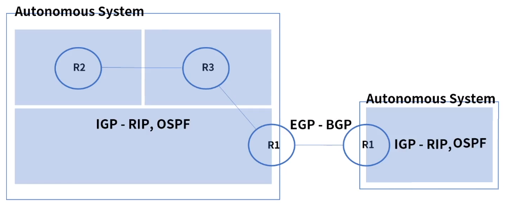
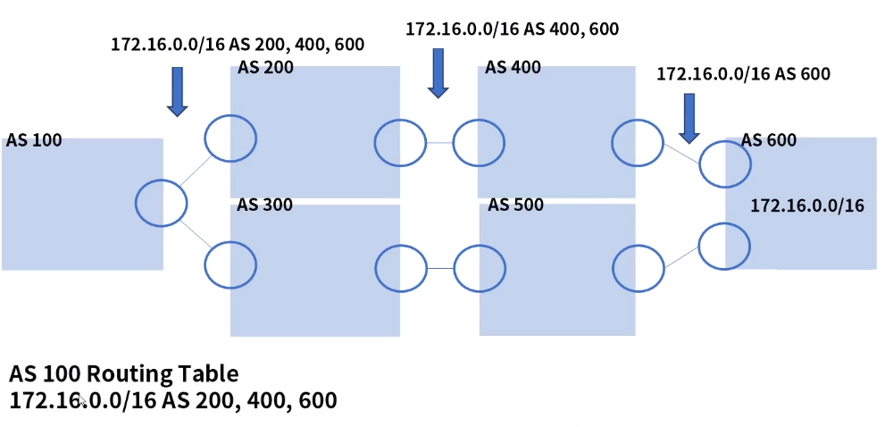
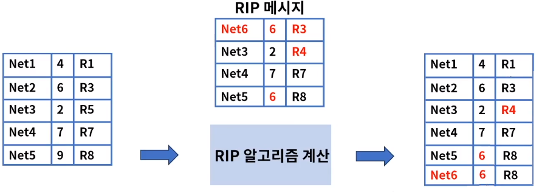

[toc]

# 동적라우팅 - BGP & RIP

## :heavy_check_mark: 동적 라우팅 구분

- 개요: 동적 라우팅 프로토콜은 AS(Autonomous Sustem)에 따라 구분된다

- IGP (Interior Gateway Protocol): AS내에서 동작하는 라우팅 프로토콜

- EGP(Exterior Gateway Protocol): AS와 AS간의 라우팅 프로토콜

  

### AS (Autonomous System)

- 하나의 회사 또는 단체안에서 동일한 정책으로 관리되는 라우터들의 집단

## :heavy_check_mark: EGP - BGP

### EGP (Exterior Gateway Protocol)

- BGP (Border Gateway Protocol)
  - 현재 인터넷에서 쓰이는 가장 대표적인 EGP 라우팅 프로토콜
  - ISP to ISP 연결 간 사용
  - 경로 벡터 라우팅 프로토콜을 사용 - 루핑 방지
  - 2006 BGP4 릴리즈 - RFC 4271
  - 유니 캐스트로 라우팅 정보 전송 - TCP 179
  - 변경 또는 추가된 부분만 업데이트
  - 빠른 속도 보다는 조직 또는 단체간 맺어진 정책에 의거하여 최적 경로 결정

### BGP 구성

### BGP 구성 - eBGP & iBGP

### BGP 설정

- Router ID, Neighbor, Network 설정
- Router ID: 라우터 별 식별용 IP 설정
- Neighbor: 자동 탐지 불가, 수동으로 인접 라우터의 AS 번호를 설정, Connected 인터페이스로 Net hop 설정
- Network: 전파할 네트워크 대역

### BGP 메세지 4가지

- 인접 라우터 관계 확인 및 라우팅 정보 교환

1. OPEN: 인접 라우터와 연결된 후 보내는 메세지

   BGP 버전, AS 번호, Hold Time, Oeration parameter

2. UPDATE: 경로에 대한 속성 값

   Unreachable Route, Path Attribute, Network Layer Rechablility

3. NOTIFICATION: 에러가 감지되면 에러 코드를 보내고 BGP 연결 종료

4. KEEPALIVE: 주기적으로 인접 라우터와의 연결을 확인

###  BGP FSM (Finite State Machine)

- 피어 라우터와의 동작을 결정하기 위해 6가지 유한 상태 머신 사용

- Idle: 모든 자원을 초기화하고 피어 연결 준비 상태
- Connect: 연결이 완료되기를 기다리는 상태
- Active: 연결 실패 이후 다시 연결을 시도하는 상태
- Open Sent: OPEN 메세지를 보내는 상태
- Open Confirm: OPEN 메세지를 수신 상태
- Established: KEEPALIVE 메세지 수신 상태

- 예지 : 상태별 처리과정

  

  **1: idle -> Connect**

  1-1: 연결 성공: Open 메세지 전송

  1-2: 연결 실패: Active 상태로 변경

  **2: Connect 또는 Active -> Open Sent**

  2-1: 오류 검출: NOTIFICATION 메세지를 보냄

  2-2: 정상: KEEPALIVE 메세지를 보냄

  **3: Open Sent -> Open Confirm**

  3-1: KEEPALIVE 메세지를 받으면 Established

  3-2: NOTIFICATION를 받으면 다시 idel 상태로

## :heavy_check_mark: IGP - RIP

IGP (Interior Gateway Protocol)

### RIP (Routing Information Protocol)

- Distance Vector 기반의 IGP용 라우팅 프로토콜
- 속도가 아닌 거리(라우터의 홉) 기반 경로 선택
- 주기적으로 전체 라우팅 테이블 업데이트 (30초)
- 최대 홉 카운트는 15
- 구성이 간단, 적은 메모리 사용, 소규모 네트워크에서 주로 사용
- RIPv1: Classful 라우팅, 라우팅 업데이트시 서브넷 마스크 정보를 전달하지 않음, 브로드캐스팅
- RIPv2: classless 라우팅, 라우팅 업데이트시 서브넷 마스크 정보 전달, 멀티캐스팅, Triggerd Update 설정 가능

### RIP 메세지 포멧

### RIP 동작

1. 요청 메세지

   라우터가 초기화 또는 라우팅 테이블의 특정 엔트리 타이머 종료시 특정 네트워크 주소 또는 전체 라우팅 정보를 요청

2. 응답 메세지

   요청 메세지 수신 후 응답 또는 주기적(30초)으로 자신의 라우팅 정보를 전파,

   일정 시간(180초)동안 특정 경로에 대한 응답이 없으면 홉 카운트 16으로 설정

#### RIP 메세지 수신

- 신규 목적지 -> 라우팅 테이블에 추가
- Next Hop 정보가 수정된 경우 -> Next Hop 정보 변경
- Hop Count 비교 -> 숫자가 작으면 변경, 크면 무시

## :heavy_check_mark: 정리

- 동적 라우팅은 AS에 따라 IGP, EGP로 구분
- AS는 하나의 회사 또는 단체 안에서 동일한 정책으로 관리되는 라우터들의 집단
- BGP(Border Gateway Protocol)은 현재 인터넷에서 가장 널리 쓰이는 EGP라우팅 프로토콜 BGP4
- RIP은 Distance Vector기반의 IGP용 라우팅 프로토콜 RIPc1, RIPv2

