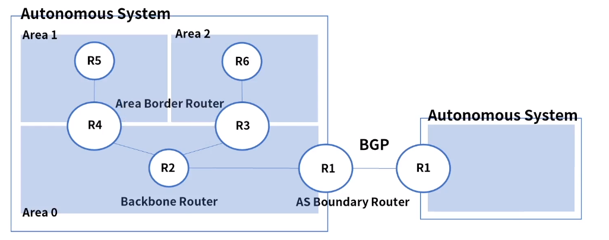
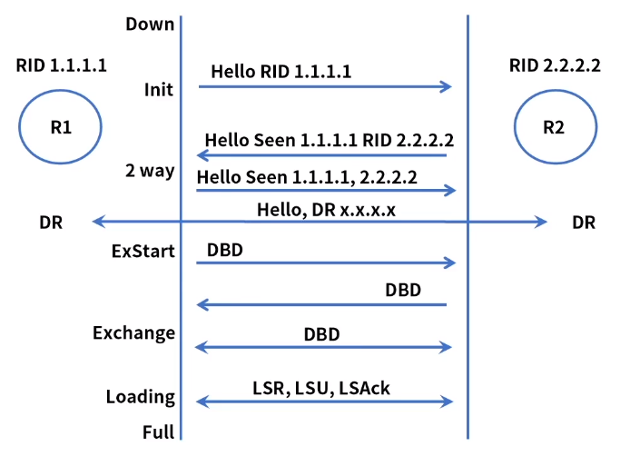
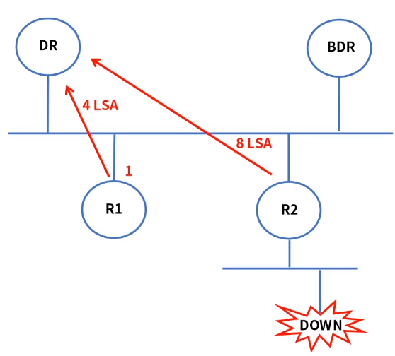

[toc]

# OSPF

## :heavy_check_mark: IGP - OSPF

OSPF (Open Shortest Path First)

- 링크 스테이트 라우팅 알고리즘을 사용하는 IGP용 라우팅 프로토콜

- RIPv1의 단점을 보완
  - 홉 카운트의 제한이 없음

- VLSM(Varialbe-Length Subnet Mask) 사용해 효율적 IP관리
- 변경된 정보만 전파, 적은 량의 라우팅 트래픽 유발

- 단순 라우터의 홉이 아닌, 링크의 상태로 경로 설정

- Convergence 타임이 빠름

### 구성

계층적 구조, 여러개의 Area로 나뉘고 각 영역을 독립적으로 라우팅 수행

- ASBR (AS Boundary Router): 다른 AS에 있는 라우터와  라우팅 정보 교환
- Backbone Router: AS내의 여러 Area를 모두 연결, OSPF 도메인 내에서 모든 링크 상태 정보 취합, 분배
- ABR (Area Border Router): 각 Area와 백본 Area 0을 연결

## :heavy_check_mark: OSPF 메세지

- 프로토콜 ID: 89
- 인접 라우터의 발견 및 관계 유지, 멀티캐스트 사용

### LSDB(Link State Database)

- 각 OSPF Area내 전체 망 정보, 링크 상태 및 경로 정보

### LSA(Link State Advertisement)

- 패킷들에 의해 구축, LSU & DD 메세지를 통해 전달

### LSDB 

- 정보 업데이트 및 관리  메시지

### 1. Hello

- 인접 라우터 및 로컬 링크 상태 검색, 관계를 설정하고 주요 매개변수 전달

- 일정 간격으로 인접 라우터들의 상태(Keepalive)를 확인

### 2. DBD (Database Description)

- OSPF 정보 구축을 위해 LSDB 내용을 전달

### 3. LSR(Link State Request)

- 상대 라우터에게 링크 상태 정보를 요청

### 4. LSU(Link State Update)

- 네트워크 변화 발생시 인접 라우터에게 상태 전달

### 5. LSAck(Link State Acknowledgment)

- 수신 확인, 신뢰성 확보

## :heavy_check_mark: OSPF  테이블 종류

### 1. OSPF Neighbor 테이블

- Neighbor를 성립한 인접 라우터 정보 관리
- Neighbor 라우터 ID 확인

### 2. OSPF DB 테이블

- Neighbor에게 수신한 라우팅 업데이트 정보를 관리
- LSA 메세지를 이용해 LSDB 동기화
- LSDB 정보를 기반으로 최적 경로를 선출

### 3. 라우팅 테이블

- 최적 경로 등록
- Inter Area 라우팅 정보, 다른 Area 업데이트 정보, 외부 AS 업데이트 정보

### 

### Neighbor 테이블의 라우터 상태 변화

1. **Down**

   power off

2. **init**

   Hello 메세지를 받으면 init 상태, 의식

3. **2 way**

   Hello 메세지로 Neighbor 확인

   확인된 내용을 Neighbor List에 업데이트

4. **Exstart(실행)**

   DBD 메세지를 통해 마스터/슬레이브 선출

5. **Exchange(교환)**

   DBD 메세지를 통해 링크 상태 정보 교환

6. **Loading(전송)**

   LSR을 통해 완전한 정보

   LSU를 통해 상대방에게 를 LSAck? 를 보낸다

7. **Full**

   

## :heavy_check_mark: 링크 종류

### 1. Point to Point

- 라우터와 라우터가 1:1로 직접 연결

### 2. Transient

- 여러개의 라우터가 동일한 Area에서 버스를 통해서 연결

### 3. Stub

- 하나의 Area에 1개 라우터만 연결

### 4. Virtual

- 물리적으로 백본영역과 연결이 어려운 상태에서 가상으로 연결

## :heavy_check_mark: DR & BDR

DR: Desiganated Router

BDR: Back-up Desiganated Router

DR과 BDR은 중복되는 LSA 교환을 방지하고자 선출

>LSA ? (Link State Advertisement)
>
>- 라우팅 기초 정보가 담겨진 패킷으로 링크 상태, 인접 관계 형성, 요약 정보
>- 네트워크/링크의 경로 비용 포함

그외 라우터들은 LSA 정보를 교환하지 않고 Hello만 교환하고 Neighbor 관계를 형성

DR/BDR은 다른 라우터들과 LSA 정보를 교환하여 인접 Neighbor 관례를 형성

OSPF Priority가 가장 높은 라우터를 DR로 선출

Priority가 동일하면 라우터 ID로 선출

## :heavy_check_mark: OSPF 동작 과정

1. R1이 새로 OSPF 라우팅으로 구성

2. Hello 메세지로 인접 라우터 확인

3. DR & BDR주소 확인

4. LSA 정보를 DR & BDR 에게 전달

5. BDR은 타이머 세팅, DR 수행 감시

6. DR은 LSA정보를 다른 모든 라우터들에게 전달

   모든 라우터들에게 ack을 수신

7. DR이 BDR 타이머동안 제대로 역할을 수행하지 못하면,

   BDR이 DR로 선출되고, 추가로 Hello 패킷을 보내 BDR 선출

8. 링크 다운시 R2는 DR에게 8 LSA를 보냄

   DR은 다시 모든 라우터에게 전달

## :heavy_check_mark: 정리

- OSPF는 링크 스테이트 라우팅 알고리즘을 사용하는 IGP용 라우팅 프로토콜
-  RIPv1의 단점을 보완했고 계층적 구조로 여러개의 Area로 나뉜다
- OSPF 메세지는 Hello, DBD, LSR, LSU, LSAck의 5가지로 구성된다.
- OSPF 테이블은 Neighbor, DB, 라우팅 테이블로 구성된다
- Neighbor 테이블은 Down -> Init -> 2way -> ExStart -> Exchange -> Loading -> Full 상태로 표현
- DR과 BDR을 선출하고 LSR은 DR에게만 보내 중복 패킷을 방지한다.
- LSA는 링크 상태, 인접 관계 형성, 요약 정보 등 네트워크/링크의 경로 비용을 포함한다.

