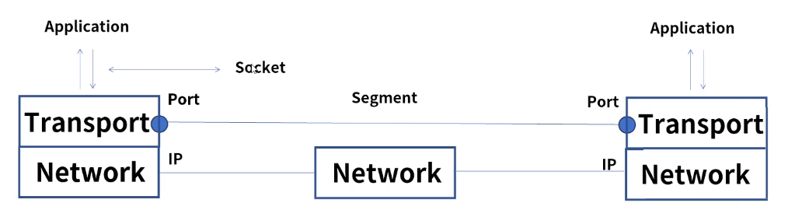
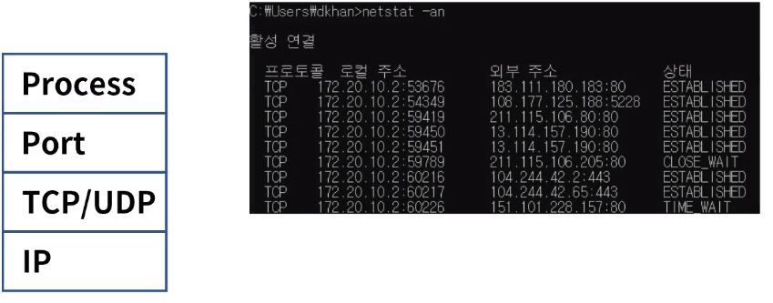
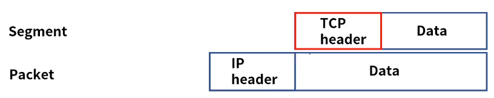
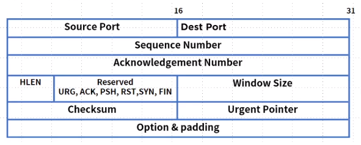
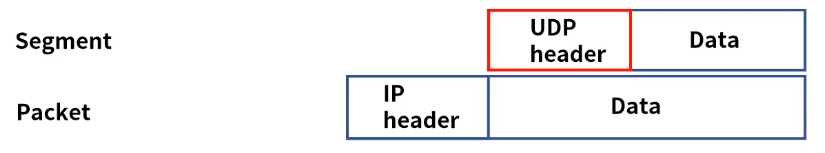
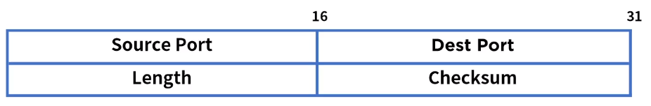
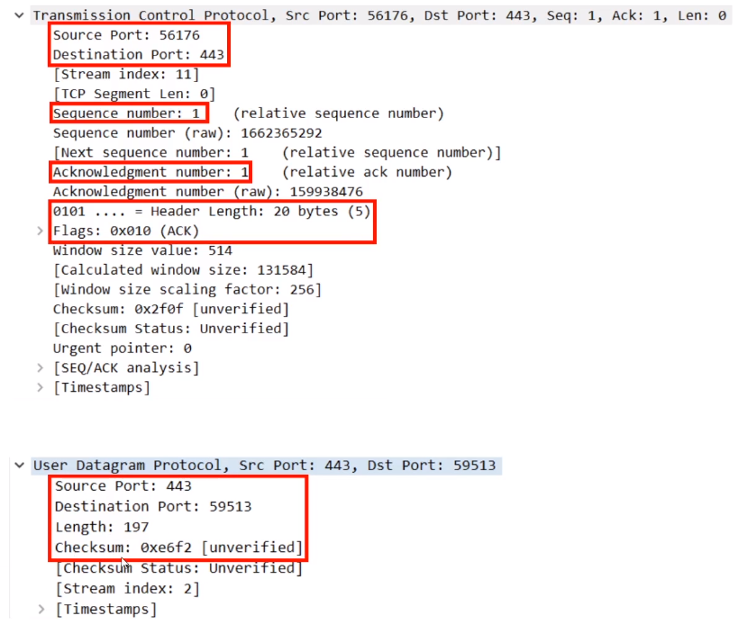

[toc]

# TCP & UDP 개요

## :heavy_check_mark: Transport 계층

- End to End 서비스, 커넥션(연결)을 관리
- Connection-oriented, Relicability, Flow control, Multiplexing
- TCP & UDP, 소켓을 통한 프로세스 별 통신
- 5 tuple = Source IP, Source Port, Dest IP, Dest Port, Protocol

### Port

- 전송 계층에서 사용되며 특정 프로세스를 구분하는 단위
- 0 ~ 65535
- 0 ~ 1023: well-known port
- 1024 ~ 49151: registed port
- 49152 ~ 65535: dynamic port
- 웹 TCP 80, FTP TCP 21

## :heavy_check_mark: TCP

- TCP (Transmission Control Protocol): 전송 제어 프로토콜
- 인터넷을 구성하는 핵심 프로토콜, 1981년 RFC 793 릴리즈
- 신뢰성을 기반으로 데이터를 에러없이 전송, 1:1 통신
- 연결 지향, Connection-oriented, 패킷의 상태 정보를 확인하고 유지
- 에러 발생시 재전송을 요청하고 에러를 복수한다

### 헤더 포맷

1. Source & Dest Port: 소스 포트와 목적지 포트
2. Sequence Number: 순서번호, 패킷 순서화와 중복 패킷 방지
3. Acknowledgement Number: 승인 번호, 수신측에서 수신 확인하고 다음 송신 데이터 요청
4. HLEN: 20~60
5. TCP 제어 플래그: TCP 회선 및 제어 관리
6. Window Size: TCP 흐름 제어, 수신 버퍼의 여유 용량을 통보
7. Checksum: 데이터 무결성 확인
8. Urgent Pointer: 긴급 데이터 알림
9. Option & Padding: 옵션, MSS 조절이나 타임 스탬프

### TCP 제어 플래그

> 6가지로 구성되며 활성화 값을 비트 "1"로 표현

1. URG: 긴급함을 알림, 긴급 데이터로 우선 순위를 높여 먼저 송신
2. ACK: 확인, 수신측에서 송신된 패킷을 정상적으로 받았음을 알림
3. PSH: 버퍼링되지 않고 바로 송신
4. RST: 비정상 상황에서 연결을 끊음
5. SYN: 연결을 맺기 위해 보내는 패킷 000010
6. FIN: 정상 종료, 송신측에서 수신측에 연결 종료 요청

## :heavy_check_mark: UDP

- UDP (User Datagram Protocol)
- 신뢰성은 낮으나 데이터 전송이 빠르다 
- 1980년 RFC 768 릴리즈
- 송신측은 일반적으로 데이터를 보내고 확인 안함, 1:n 통신 가능
- Connectionless, 재전송 불가, 실시간 데이터 전송에 적합
- 스트리밍 서비스의 경우 전송 문제가 발생해도 재전송 보다는 실시간 데이터 전송이 중요

### 헤더 포맷

1. Source Port: 출발지 포트
2. Dest Port: 목적지 포트
3. Length : 전체 데이터 길이 (header + data)
4. Checksum: 데이터 무결성 확인

## :heavy_check_mark: 비교

### 헤더 포맷 - PCAP

| -           | TCP 20 Byte           | UDP 8 Byte     |
| ----------- | --------------------- | -------------- |
| Protocol ID | 6                     | 17             |
| 순서 확인   | 가능                  | 불가능         |
| 신뢰성      | 높음                  | 낮음           |
| 연결성      | Connetcion-oriented   | Connectionless |
| 제어        | 흐름 & 혼잡 제어 가능 | 없음           |
| 속도        | 느리다                | 빠르다         |

## :heavy_check_mark: 정리

- Transport 계층은 소프트웨어 레벨로 End to End 서비스로 부르며 커넥션을 관리
- 대표적인 프로토콜로  TCP & UDP가 있으며 소켓을 통한 프로세스 별 통신
- 포트는 전송 계층에서 사용되는 특정 프로세스를 구분하는 단위로 범위는 0~65535이다.
- UDP (User Datagram Protocol)는 1980년 RFC 768 릴리즈, 1:n 가능 및 비 신뢰성 통신
- TCP(Transmission Control Protocol)는 1981년 RFC 793 릴리즈, 1:1 신뢰성 기반 통신

