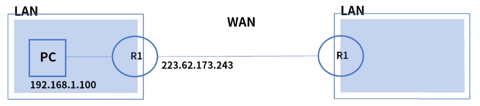
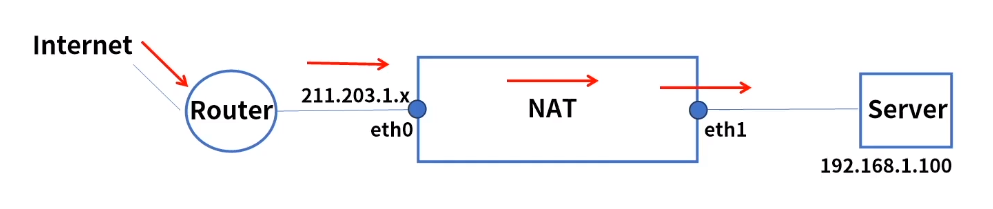
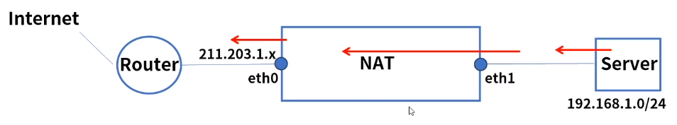
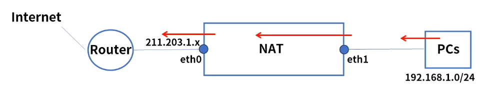
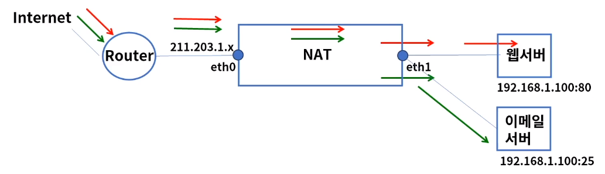
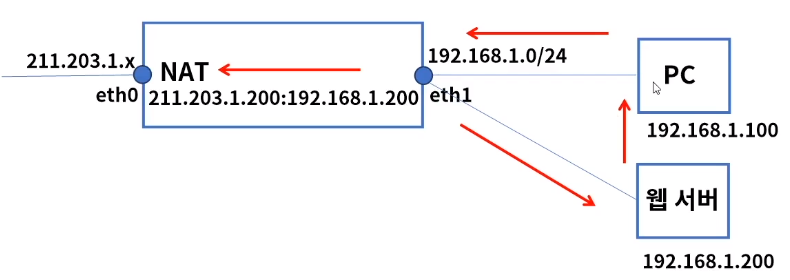
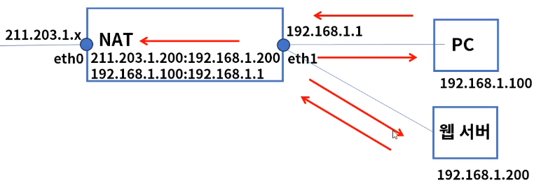

[toc]

# NAT의 개요

## :heavy_check_mark: 공인 IP & 사설 IP

### 공인 IP

- ICANN (Internet Corporation for Assigned Names and Numbers)

  공인 기관에서 인정하는 IP 주소이며, 인터넷을 통한 외부망에서 식별되고 통신 가능한 IP 

### 사설 IP

- 내부망에서 사용 및 식별 가능한 IP

- IPv4개수의 한계

  10.0.0.0/7, 172.16.0.0/12, 192.168.0.0/16

### IP 정보 확인

- 자신의 PC가 외부 인터넷으로 통신시 사용하는 공인 IP 정보 확인

## :heavy_check_mark: NAT(Network Address Translation) 개요

- 네트워크 주소 변환
- 사설 IP 네트워크를 인터넷으로 연결 -> 라우팅 가능한 공인 IP로 변환
- 보안: 내부 IP 주소를 외부에 공개하지 않음
- 유연성: 공인 IP 대역은 영향을 주지 않고 내부 네트워크 구성 변경이 가능, 기존 사용하던 외부에 공개된 공인 IP 주소는 변겨오디지 않으나 내부 IP만 변경
- 비용: 공인 IP 할당 비용 감소
- L3이상의 장비 또는 방화벽에서 NAT가능

## :heavy_check_mark: NAT 종류

### Static NAT

- 1:1 NAT, 정적 NAT
- 사설 IP 1개를 공인 IP 1개로 매핑하며 주로 외부 공개형 서버에 구성

1. 외부에서 211.203.1.100 으로 접속 시도
2. 외부 -> 211.203.1.100, 패킷이 eth0에 도달
3. 211.203.1.100 to 192.168.1.100로 1:1 NAT됨을 확인
4. 192.168.1.x 대역인 eth1로 전달
5. 외부 -> 192.168.1.100, 패킷은 Server에 도착

### Dynamic NAT

- 내부 IP주소와 외부 IP 주소가 범위 내에서 매핑
- 내부 PC들은 외부로 통신시 공인 IP 대역 Pool에서 할당 받는다

1. 내부 192.168.1.0/24 대역의 내부 PC 20대는 웹 사이트 접속 시도
2. eth1에 패킷 도달, NAT 테이블의 공인 IP 대역 Pool을 확인하고 매핑
3. eth0에서 매핑된 공인 IP 주소 211.203.1.x로 변환되어 외부로 통신 시도
4. 나머지 PC들도 NAT Pool을 확인하고 동일한 방식으로 매핑

### PAT (port Address Translation)

- 1:N NAT, 여러개의 내부 사설 IP들이 1개의 공인 IP로 변환
- 공개형 서버가 아닌 내부 -> 외부로 접속이 필요한 PC들이 사용
- IP가 중복되기 때문 Port로 세션 구분

1. 내부 192.168.1.0/24 대역의 내부 PC 20대는 웹사이트 접속 시도
2. eth1에 패킷 도달, NAT 테이블의 PAT 대표 공인 IP:Port를 확인하고 매핑
3. eth0에서 매핑된 공인 IP 주소 211.203.1.x로 변환되어 외부로 통신 시도
4. 나머지 PC들도 동일한 방식으로 매핑 - 공인 IP는 동일, Port번호는 다름

### Port Fowarding

- 공인 IP 1개로 여러대의 사설 IP를 Port로 구분하여 연결
- 공인 IP 1개로 여러대의 공개형 서비스를 구축할 때 사용

1. 외부에서 211.203.1.100으로 웹 접속 시도
2. 외부 -> 211.203.1.100, 패킷이 eth0에 도달
3. 211.203.1.100:80 to 192.168.1.100:80으로 포트 포워딩 됨을 확인
4. 192.168.1.x 대역인 eth1로 전달되고 패킷은 웹 서버에 도착

5. 외부에서 211.203.1.100으로 이메일 접속 시도
6. 외부 -> 211.203.1.100, 패킷이 eth0에 도달
7. 211.203.1.100:25 to 192.168.1.100:25로 포트 포워딩 됨을 확인
8. 192.168.1.x 대역인 eth1로 전달되고 패킷은 이메일 서버에 도착

## :heavy_check_mark: Hairpin NAT

### NAT 이슈

- 동일 사설 네트워크 내 공인 IP로 목적지 서버에 접속하는 경우

1. PC는 211.203.1.200으로 웹 접속 시도
2. NAT 테이블에서 211.203.1.200은 192.168.1.200으로 매핑된 것을 확인
3. 192.168.1.x 대역인 eth1로 전달되고 패킷은 웹 서버에 도착
4. 웹 서버는 응답 패킷을 전달 시도, 192.168.1.200 -> 192.168.1.100
5. 목적지는 PC는 동일 대역대 IP로 확인되고 PC에게 바로 응답 패킷 전달
6. PC입장에서 기존 커넥션이 아닌 신규 패킷으로 판단돼서 통신 불가

### 해결책

- NAT 장비에서 출발지 IP를 NAT 장비 IP로 변경

1. PC는 211.203.1.200으로 웹 접속 시도
2. NAT 테이블에서 211.203.1.200은 192.168.1.200으로 매핑된 것을 확인
3. 192.168.1.x 대역인 eth1로 전달되고 패킷은 웹 서버에 도착
4. 웹 서버는 응답 패킷을 전달 시도 192.168.1.200 -> 192.168.1.1
5. 192.168.1.00:192.168.1.11 매핑 정보를 확인하고 PC에게 응답 패킷 전달
6. 소켓 프로그래밍 작성시 사설 IP & 공인 IP의 FLow를 확인 못하여 빈번한 장애 발생

## :heavy_check_mark: 정리

- 공인IP 는 공인 기관에서 인정하는 IP주소로 외부망에서 식별되고 통신 가능한 IP

- 사설 IP는 내부망에서 사용 및 식별 가능한 IP

  10.0.0.0/8, 172.16.0.0/12, 192.168.0.0/16

- NAT는 네트워크 주소를 변환해주는 기능

  L3 이상의 장비 또는 방화벽에서 설정 가능

- NAT 종류로는 Static NAT, Dynamic Nat, PNAT, 포트 포워딩 등이 있다.

- 헤어핀 NAT는 동일 사설 네트워크 내에 목적지 서버를 공인 IP로 접속시 생기는 이슈를 해결하는 방법

