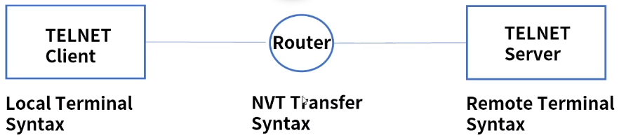
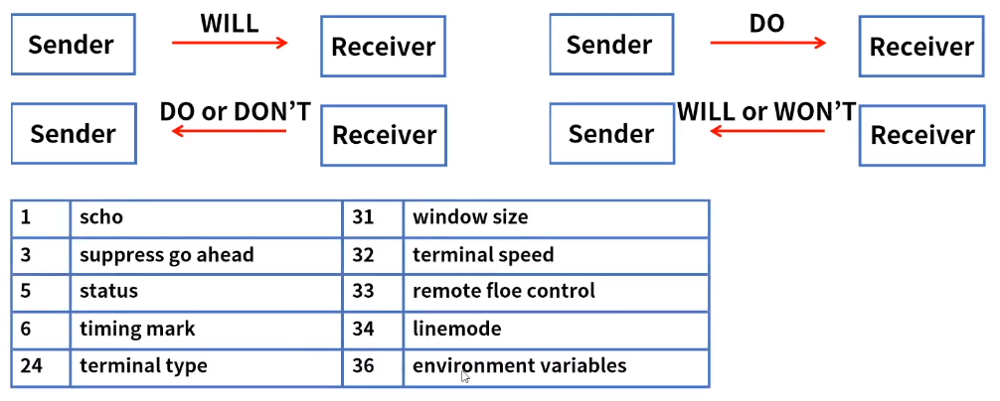
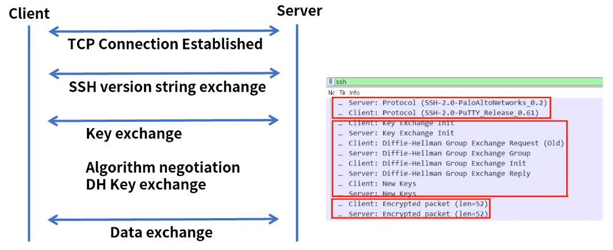
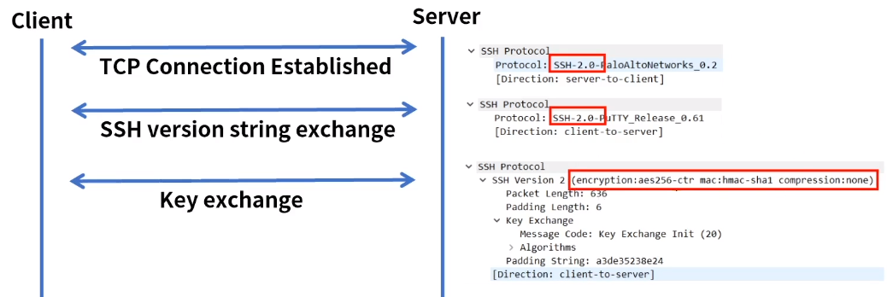
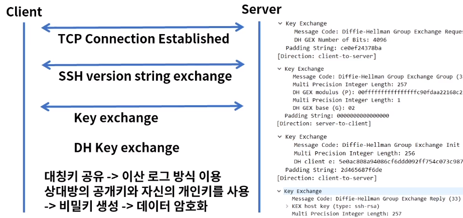
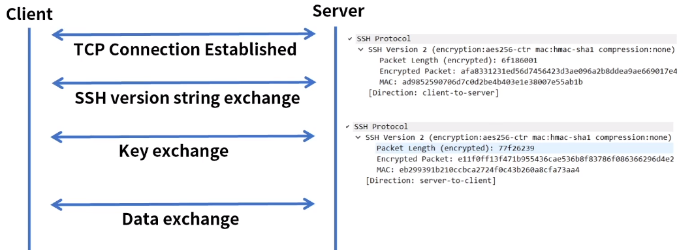

[toc]

# TELNET & SSH

## :heavy_check_mark: TELNET 

### 역할

- 원격지 호스트 컴퓨터에 접속하기 위해 사용되는 프로토콜
- RFC 854, TCP 23번 사용, Terminal 에뮬레이터
- 장비 관리 또는 서버 접속 시 사용 - Shell - Command Line Interface
- 클라이언트 소프트웨어인 경우 , 포트 테스트 용도로 많이 사용
- 해당 도메인 또는 IP 주소에 서비스 포트(서비스)가 열려있는지 확인 가능

### 기능

- NVT (Network Virtual Terminals) 지원: 데이터 변환 가상 장치
- 협상 가능한 옵션
- 프로세스와 터미널의 1:1 symmetric 관계

### Negotiation Commands

- WILL -> 옵션 활성화를 원한다
- WON'T -> 옵션 활성화를 원하지 X
- DO -> 옵션 활성화를 요청한다
- DON'T -> 옵션 활성화를 요청하지 않는다

### 접속 및 옵션 ID 협상 확인

- 원격지 IP:Port로 접속 시도 -> ID:Password 입력 -> 원격지 서버에 연결
- 윈도우 CMD 또는 리눅스 터미널에서 접속 가능

- 리눅스 쉘에서 TELNET 옵션 협상 확인 - tcpdump

## :heavy_check_mark: SSH

### 역할

- secure shell
- TELNET을 대체하기 위해 1995년 개발
- 원격지에 있는 컴퓨터를 명령어를 통해서 제어
- 강력한 인증 방법 및 암호화 통신을 제공, TCP 22
- OpenSSH - 1999년 OpenBSD팀에서 개발 -> GNU Public License
- SSHv1, SSHv2

### 특징

- 인증(Authentication): 사용자가 서버 접속시 패스워드 또는 공개키 기반의 인증 방식을 지원

- 암호화(Encryption): 대칭키 방식 사용 - AES, Blowfish, 3DES

- 무결성(Integrity): 데이터 위변조 방지 - MAC(Message Authentication Code)

- 압축(Compression), 다중화 통신

- 대칭키: 동일한 키로 암복호화를 동시에 할 수 있는 방식

- 공개키(공개키+개인키) 방식

- 공개키 암호화 -> 데이터 보완, 서버의 공개키로 데이터를 암호화 -> 서버의 개인키로 복호화

- 개인키 암호화 -> 인증 보안, 개인키 소유자가 개인키로 암호화 하고 공개키를 함께 전달

  -> 암호화 데이터 + 공개키로 신원 확인 -> 전자서명 방법

### 통신 과정

## :heavy_check_mark: 정리

- TELNET은 원격지 호스트 컴퓨터에 접속하기 위해 사용되는 프로토콜로 TCP 23 사용
- 주요 기능으로 NVT(Network Virtual Terminals), 협상 가능한 옵션, 1:1 Symmetric 관계
- SSH(Secure Shell)는 TELNET을 대체하기 위해 개발, 강력한 인증 방법 & 암호화 통신을 제공, TCP 22사용
- SSH 특징으로 인증, 암호화, 무결성, 압축 등이 있다.

