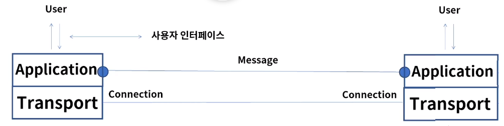
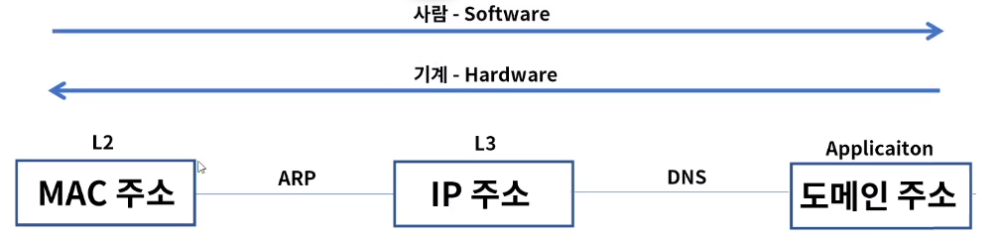
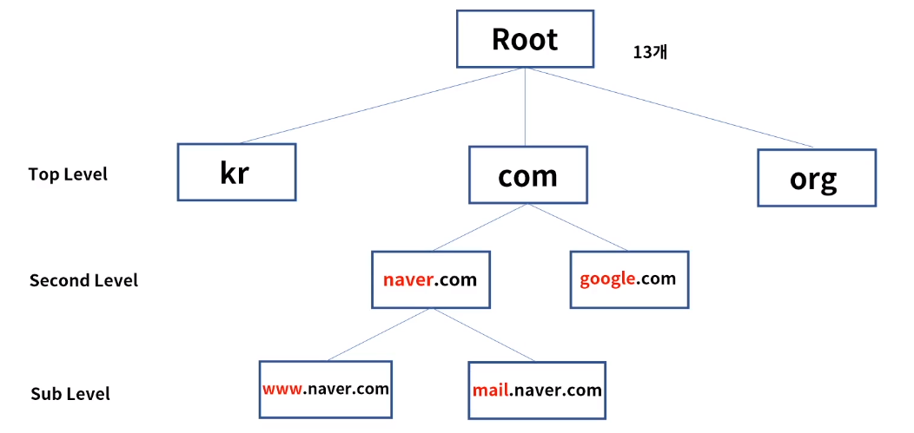
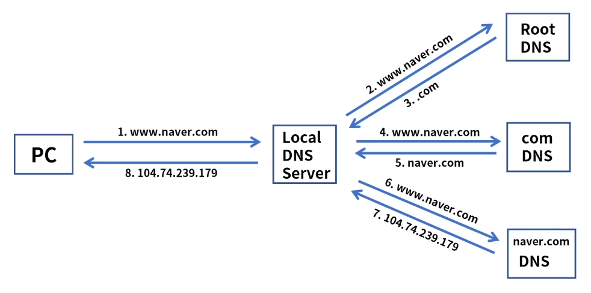
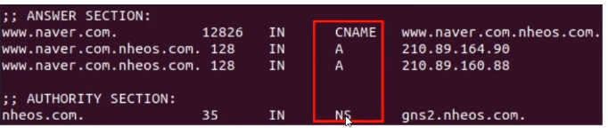
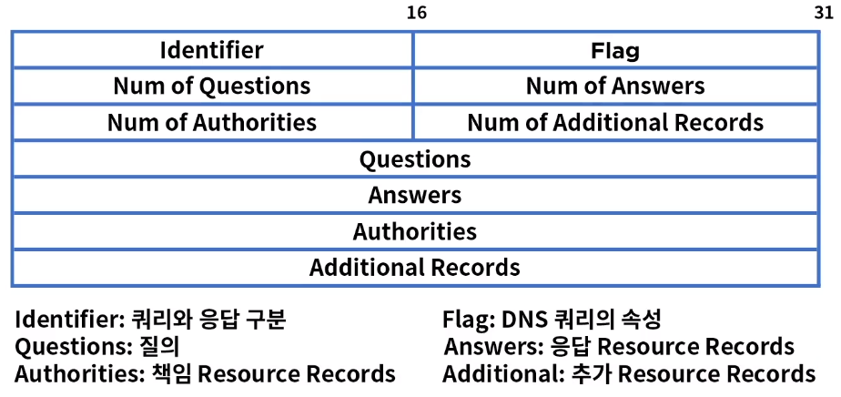
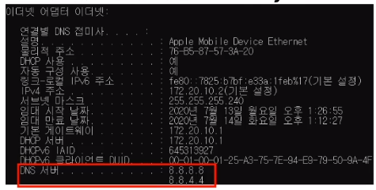

[toc]

# DNS

## :heavy_check_mark: 애플리케이션 계층

### 역할

- TCP/IP 모델에서 최상위 계층으로 사용자와 가장 가까운 소프트웨어
- 여러 프로토콜 개체들의 서비스에 대한 사용자 인터페이스 제공
- HTTP, DNS, SMTP, SSH, BGP, DHCP 등이 이 범주에 속함

## :heavy_check_mark: DNS 개요

- DNS (Domain Name Service)
- 호스트(도메인) 이름을 IP 주소로 변환 
- 웹 사이트 접속 또는 이메일 전송시 `google.com`등의 도메인 이름으로 접속
- 사람이 좀 더 기억하기 쉬운 문자 형태의 도메인 개발 - 컴퓨터는 IP로 통신 - > 변환 필요!
- 스탠포드 연구소에서 hosts.txt(Host:IP) 파일 관리로 시작 - DNS 표준으로 개발

### 계층적 구조

### 쿼리 과정

Recusive Query : Local DNS 서버가 재귀적으로 여러 서버에게 질의하여 응답 받음

- Interative Query : Local DNS서버가 반복적으로 질의

### Resoure Records

- DNS 레코드, DNS 서버가 가지고 있는 IP 매핑 정보 테이블
- 4 tuple : {Name, Value, Type, TTL}

### Type

- A: 호스트, IP - www.naver.com, A, 1.1.1.1
- NS: 네임서버 - naver.com, NS, ns.naver.com
- CNAME: 별칠 - nv.naver.com, CNAME, naver.com
- MX: 메일서버 - mail.naver.com, MX, 2.2.2.2

`# dig @168.126.63.1 www.naver.com`

### DNS 메세지 - 쿼리와 응답으로 구분

- Query: Header + Question
- Response: Header + Question + Answer + Authority + Additional

### Hosts.txt

- 호스트 이름과 IP 주소가 매핑되어 저장된 파일
- Local DNS로 쿼리 전에 우선 참조하는 파일
- `C:\windows\system32\drivers\etc\hosts`

### DNS Cache 테이블

- 기존에 응답받은 DNS 정보를 일정시간(TTL) 저장하고 동일한 질의 시 응답

## :heavy_check_mark: DNS 동작 과정

### PC -> 웹 사이트 접속 (www.daum.net)

1. PC 네트워크 환경 확인 - Primary DNS 8.8.8.8로 설정

   

2. hosts.txt파일 참조 - 해당 도메인이 설정된 경우 mapping된 ip로 응답

3. dns cache table 참조 - 해당 도메인이 저장된 경우 저장된 ip로 응답

4. hosts.txt와 cache table에 없는 경우 Local DNS (8.8.8.8)에게 쿼리

5. Local DNS (8.8.8.8)에서 응답

## :heavy_check_mark: 정리

- 애플리케이션 계층은 TCP/IP 모델에서 최상위 계층으로 사용자와 가장 가까운 인터페이스를 제공
- DNS는 도메인 주소를 IP 주소로 변환해주는 서비스이며 계층적 구조
- Recusive Query는 Local DNS 서버가 재귀적으로 여러 서버에게 질의하여 응답을 받는 과정
- DNS 서버의 정보 타입으로 총 4가지 A, NS, CNAME, MX가 있다.
- DNS메세지는 쿼리와 응답으로 구분되며, 쿼리 전에 hosts.txt & DNS 캐시 테이블을 참조한다.

