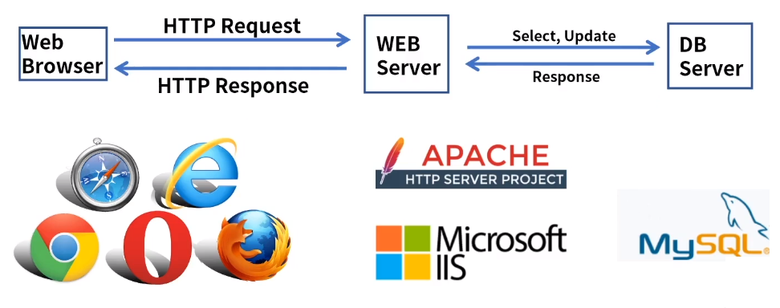

[toc]

# HTTP의 이해

## :heavy_check_mark: HTTP 개요

- 정의: HTTP (HyperText Transfer Protocol)

- WWW상에서 정보를 공유하는 프로토콜 - Port 80 - HTML
  - WWW (World Wide Web): 전세계에 연결된 인터넷을 통해 정보를 공유
- HTML(HyperText Markup Language) - 웹페이지 언어
- 팀버너스리 - 1989년 WWW 프로젝트 제안
- 1996년 HTTPv1.0 - RFC 1945
- 1999년 HTTPv1.1 - RFC 2616 - 개선 및 업데이트
- 2015년 HTTP/2 - RFC 7540

### URL (Uniform Resource Locator)

- 웹페이지를 찾기위한 주소

### HTML (HyperText Markup Language)

- 웹페이지 언어
- 1995 HTML 2.0 - RFC 1866, 2014년 HTML5

## :heavy_check_mark: HTTP Request

- Client가 Server에게 특정 Method를 사용하여 요청
- Head(+Start Line), Body 구성
  - Start Line
    - HTTP Method / Request target / HTTP version
    - HTTP Method: 요청의 목적 - GET, POST, PUT, HEAD, DELETE
    - HEAD: 리소스에 대한 정보만 요청
    - Request target: 리소스 경로
    - HTTP version: HTTP 1.1 or HTTP/2

### HEAD

- Accept: 클라이언트가 허용 가능한 파일 형식
- User-Agent: 클라이언트 OS, 브라우저 정보
- Host: 서버의 도메인 네임

## :heavy_check_mark: HTTP Response

- Client 요청에 따른 Server의 응답
- Head + Body
- Version / Status / Status Message
- Version: HTTP 버전, Status: 상태, Status Message: 상태 메세지
- Date, Content-location, eatg: 캐시정보 업데이트
- Last-modified: 요청한 데이터의 최종 수정일
- Content-Length: 요청한 데이터 길이

### Status Code

- 2xx: Success 200 OK
- 3xx: Redirection 
  - 307 Temporary Redirect
- 4xx: Client Error
  - 400 Bad Request
  - 401 Unauthorized
  - 404 Not Found
- 5xx: Server Error
  - 500 Internal Server Error
  - 502 Bad Gateway
  - 503 Service Unavailable

## :heavy_check_mark: 정리

- HTTP는 WWW상에서 정보를 공유하는 프로토콜
- HTML - 웹페이지 언어
- URL은 웹페이지를 찾기위한 주소
- HTTP통신은 Request-Client Response-Server로 구성
- HTTP 주요 요청 메소드 GET, PUT, POST, DELETE 등이 있다.

