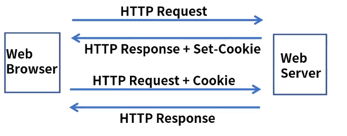
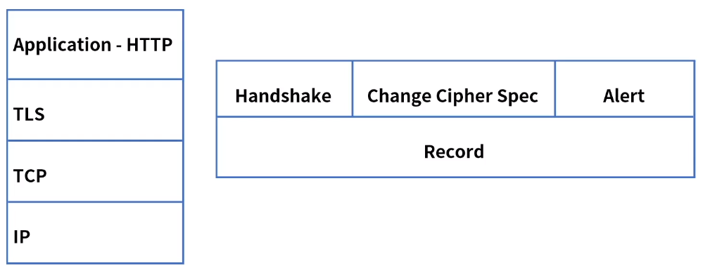
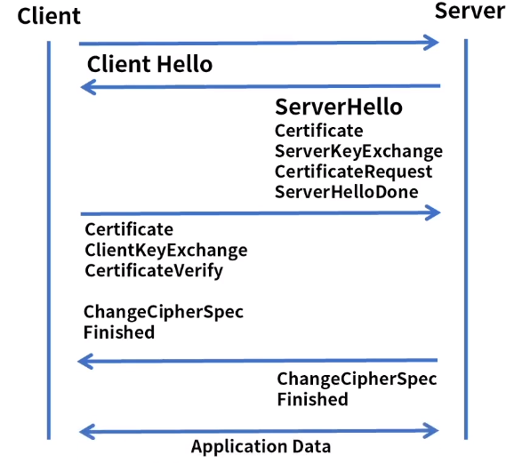

[toc]

# Cookie TLS

## :heavy_check_mark: HTTP 속성

### Stateless

- HTTP는 통신이 끝나면 상태 정보를 유지하지 않는다.
- 서버는 HTTP 요청에 대한 응답을 보내고 접속을 끊어 커넥션 리소스 비용을 줄인다.
- 단순 페이지 또는 문서 정보 열람은 가능
- 하지만 클라이언트가 새로운 페이지를 접속할 때마다 서버는 신원을 알 수 없다.
- 예를들어, 인터넷 쇼핑몰의 경우 페이지마다 인증이 필요
- 회원정보 식별, 로그인여부, 결제정보 및 장바구니 등
- 해결책: Cookie & Session
- Stateful: 상태정보 유지

## :heavy_check_mark: HTTP Cookie

- 클라이언트 웹 브라우저 로컬에 저장되는 키와 값이 들어있는 파일
- 이름, 값, 도메인, 만료일, 경로 - 일정 시간 정보 저장 -> 로그인, 장바구니 ... 

### Session

- 서버는 일정 시간 같은 웹 브라우저의 요청이 들어오면 하나의 상태로 유지
- 서버는 클라이언트에 대한 세션 ID 발급, 보유 -> 쿠키로 전달 -> 동일 세션 ID로 접속 ->  response

- cookie는 사용자 로컬에 정보 저장 - 유출, 조작 가능
- session은 서버에 정보를 저장(안전) - 인증에 세션을 사용 
  - 세션 하이재킹(해킹기법)? -> HTTPS가 나옴 

## :heavy_check_mark: SSL/TLS

- SSL (Secure Socket Layer)
- TLS (Transport Layer Security)
- HTTPS (Hypertext Transfer Protocol Securt)

### 기능

- 인증 - Client to Server 통신 간 상대방에 대한 인증 - RSA, DSS
- 무결성 - 메세지 인증 코드로 제공 HMAC - MD5, SHA-2
- 기밀성 - 데이터 암호 - 3DES, RC4

### 프로토콜 구성

- 상위
  - HandShake: 키 교환 방식, 암호화 방식, HMAC 방식, 압축 방식 등을 협상
  - Change Cipher Spec: 협상 정보가 적용됨을 알림
  - Alert: 협상 과정에서 제시한 암호화 방식을 지원 못하는 경우 알림
- 하위
  - Record: 데이터 교환, 메세지를 전송

### TLS Stack

- TLS 계층은 상위 3개 프로토콜, 하위 Record 프로토콜로 구분
- 상위 계층에서 협상 후 Record 프로토콜에서 Application 데이터를 분할, 압축, 암호화

### 동작 과정

1. 클라이언트는 지원 가능한 cipher suite 전달

2. 서버는 자신이 지원하는 cipher suite 전달

3. Certificate: 서버 인증서 전달

   - ServerKeyExchange: DH 키 교환 - 키 전달
   - CertificateRequest: 인증서 요청
   - ServerHelloDone: 모든 메세지 전달 완료

4. Certificate: 클라이언트 인증서 전달

   - ClientKeyExchange: DH, 클라이언트 키 교환
   - CertificateVerify: 인증서 확인

   버전, cipher suite 결정, 상대방 신원 확인 완료

5. ChangeCipherSpec Finished

   - TLSCiphertxt 전송, 협상

## :heavy_check_mark: 정리

- HTTP 는 stateless로 통신이 끝나면 상태 정보를 유지하지 않음
- 상태정보가 필요한 경우를 위해 쿠키,세션 기술이 있음
- 쿠키는 클라이언트 웹 브라우저 로컬에 저장되는 정보 - 로그인
- 세션은 동일한 웹 브라우저의 요청을 하나의 상태로 구분하여 서버에 정보를 저장
- SSL/TLS은 TCP/IP 통신간 보안을 제공하는 프로토콜
- TLS는 상위, 하위로 구성

