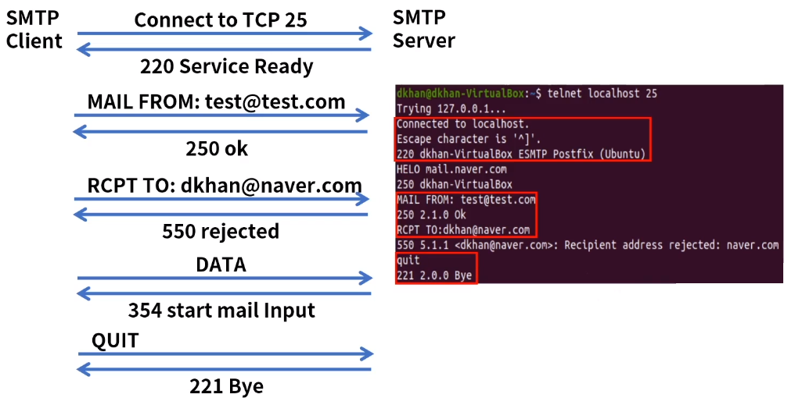
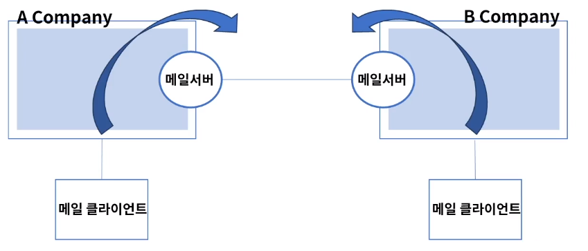
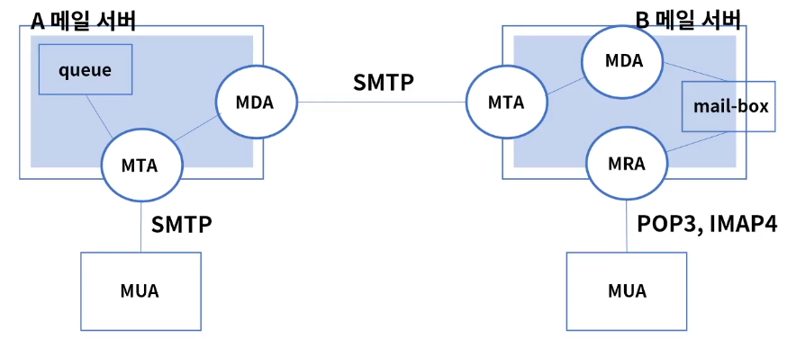

[toc]

# 메일 서비스

- SMTP(Simple Mail Transfer Protocol): 메일 발신
- POP3(Post Office Protocol Version3): 서버에서 메일을 가져오고 서버에서 삭제
- IMAP4(Internet Message Access Protocol4): 중앙 서버에서 메일을 관리, 접속하여 확인

## :heavy_check_mark: SMTP

- 전자메일 전송을 위한 표준 프로토콜
- TCP 25 - RFC 821,2821
- 클라이언트 - 서버 통신
- SMTP 명령어
  - HELO: 인사, 세션 초기화
  - MAIL: 메일 전송 시작, 송신자 이름
  - RCPT: 수신자, 수신자 이름
  - DATA: 데이터 전송 시작
  - QUIT: 세션 종료
- SMTP 응답
  - 220 세션 준비
  - 221 세션 종료
  - 250 요청한 명령이 정상적으로 수행
  - 421 서비스 불가
  - 450 다른 프로세스에 의해 접근 불가
  - 500 명령이 잘못됨
  - 551 잘못된 사용자 요청

### SMTP 통신 예제

## :heavy_check_mark: POP3

- 수신서버의 메일 박스에서 메일을 가져오고 삭제하는 프로토콜
- TCP 110 - RFC 1939, 2449
- 아웃룩같은 메일 클라이언트 프로그램에서 사용
- POP3 명령어
  - USER: 사용자 ID
  - PASS: 사용자 Password
  - STAT: 서버 상태
  - LIST: 메세지 리스트와 크기 확인
  - DELE: 메세지 삭제
  - QUIT: 연결 종료
- POP3 응답
  - OK 정상
  - ERR 에러

## :heavy_check_mark: IMAP4

- 메일서버로 접속하여 메일을 읽거나 삭제하는 프로토콜
- TCP 143 - RFC 3501
- IMAP4는 원하는 메일 메세지만 전송, 다중 접속 가능, 메일 보관함 연동
- 메일 서버의 자원 사용률이 높아짐
- IMAP4 명령어
  -  LOGIN: 사용자 접속
  - SLECT INBOX: 메일 박스 선택
  - FETCH: 리스트 보기

## :heavy_check_mark: 동작 과정

- 메일서버, 메일 클라이언트

메일서버: MTA(Mail Transfer Agent): 메일 전송

메일 클라이언트: MTU(Mail User Agent): 메일 송수신 프로그램

MDA(Mail Delivery Agent): MTA가 수신한 메일을 수신자 우편함에 기록

MRA(Mail Retrieval Agent): 리모트 서버의 우편함에서 사용자에게 메일을 가져옴

### A 메일서버에서 B 메일서버로 메일 전송

- A: MUA에서 SMTP를 통해 메일 송신 - MTA - MDA (큐에 저장하고 순서대로 전송)
- B: MTA에서 메일 수신 - MDA - 지정된 메일박스로 전달 - MRA(POP3 or IMAP4) - MUA

## :heavy_check_mark: 정리

- Email (Electronic Mail)은 전자메일로 1982년 표준 RFC 821 공개 되었음
- SMTP: 메일 송수신
- POP3
- IMAP4: 메일 열람

