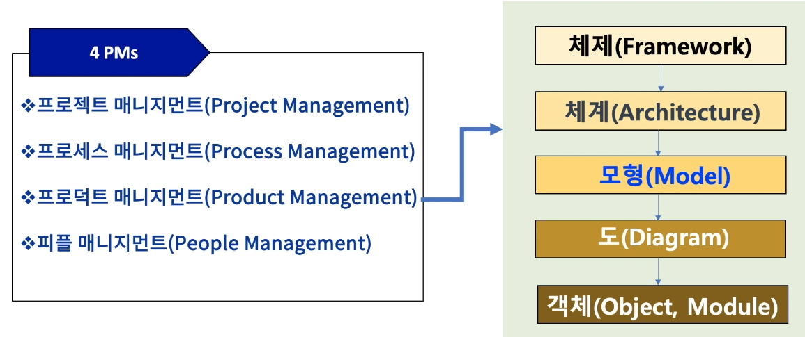
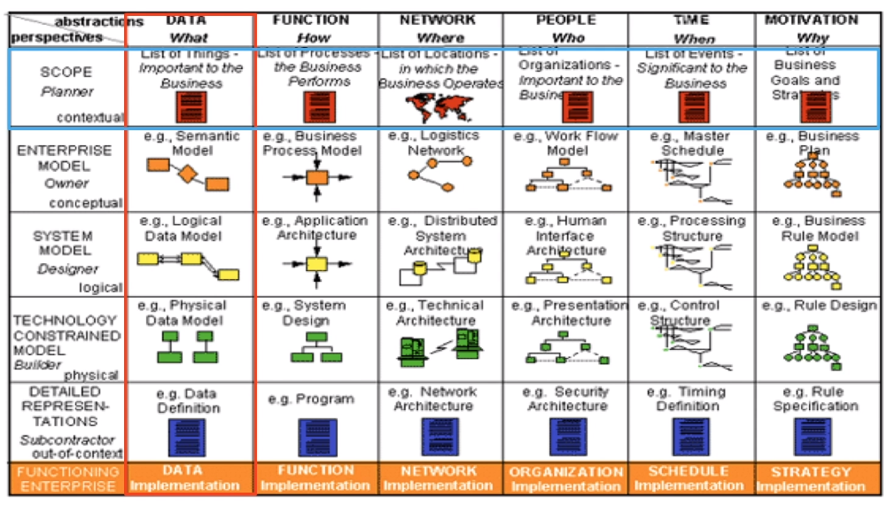
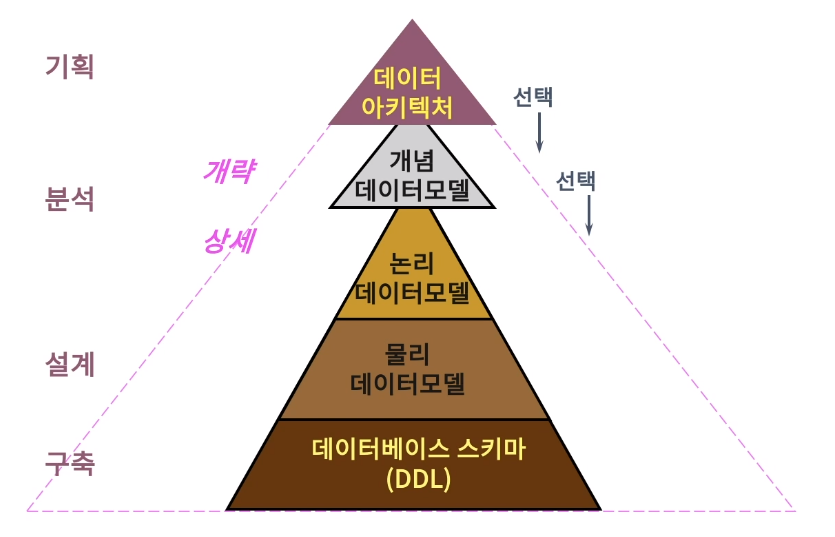
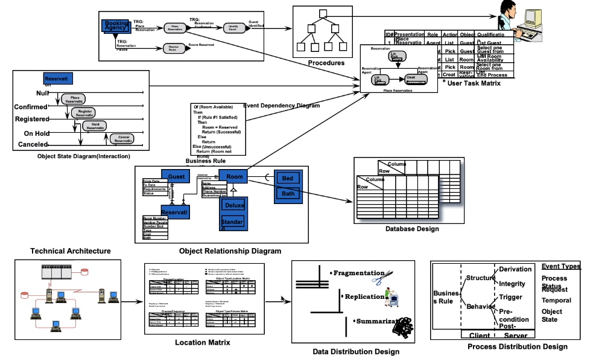

[toc]

# 프로덕트 계층 구조

## :heavy_check_mark: 프로덕트 계층 구조도

## :heavy_check_mark: 엔터프라이즈 아키텍처(EA)에서 데이터 아키텍처 관점 계층

## :heavy_check_mark: 데이터 아키텍처 - 데이터 모델 - 데이터 베이스 스키마

## :heavy_check_mark: 프로덕트 계층 구조 연계 예

