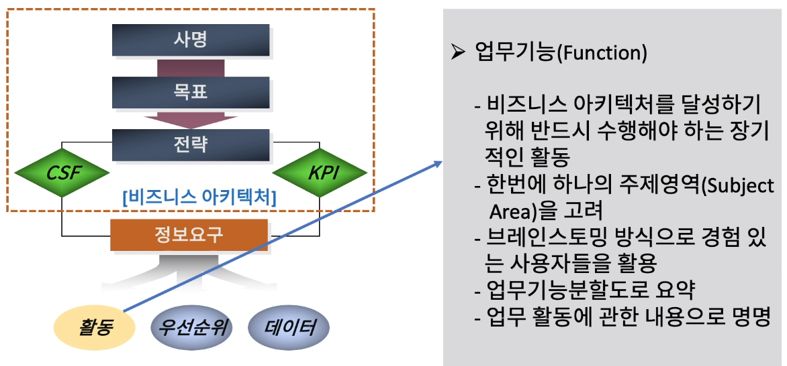
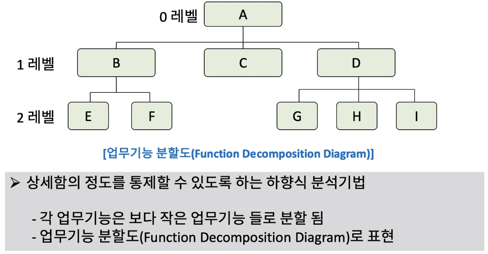
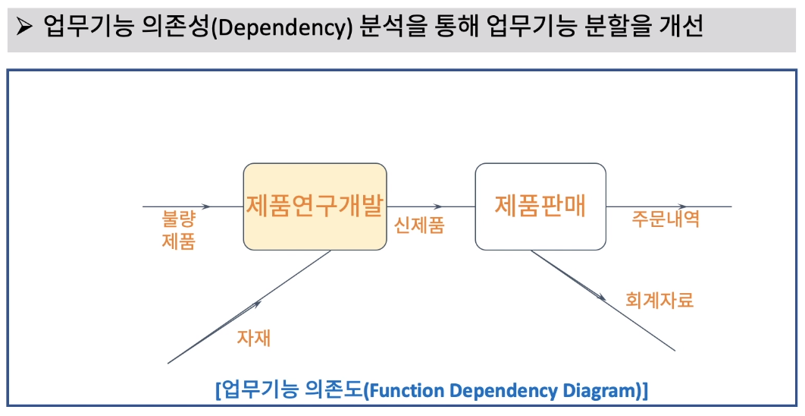
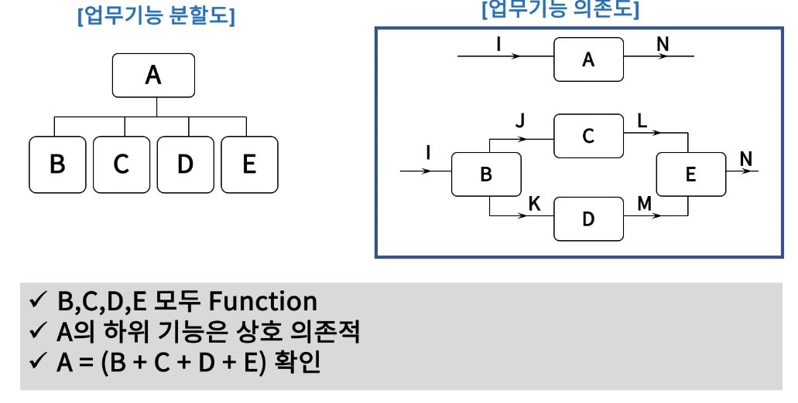

[toc]

# 정보요구에서 비즈니스 활동 정의

## :heavy_check_mark: 정보 요구에서 업무기능(Function) 도출

## :heavy_check_mark: 업무 기능 분할도 (FDD)로 정의하기

## :heavy_check_mark: 업무기능 의존도를 통한 정련화

- 업무기능 의존성 분석을 통해 업무기능 분할을 개선

## :heavy_check_mark: 업무기능 분할과 의존성 분석

