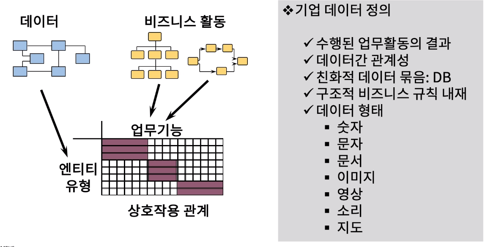
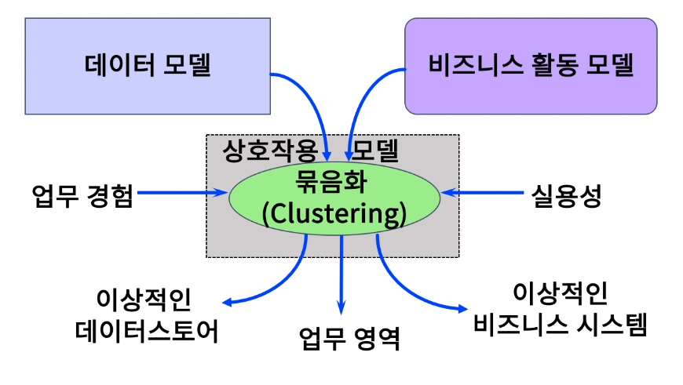
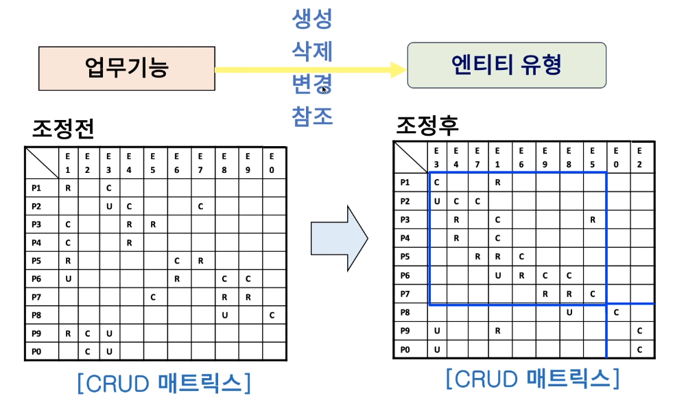
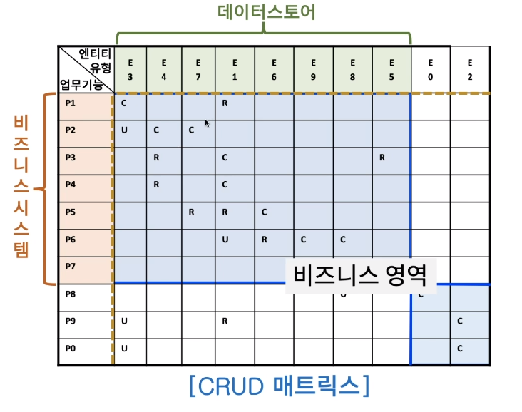
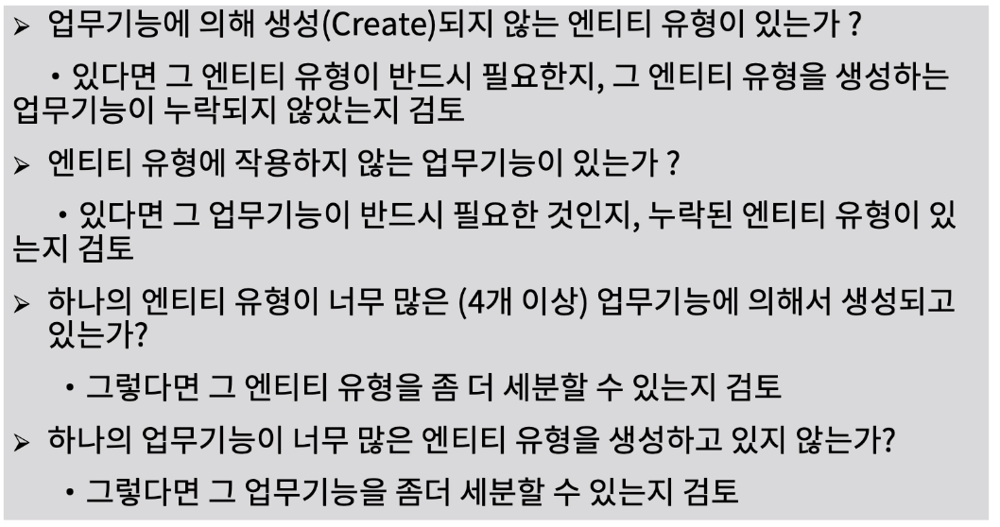

[toc]

# 비즈니스 활동과 데이터, 상호작용성 정의하기

## :heavy_check_mark: 엔터프라이즈 비즈니스 활동을 통한 데이터

## :heavy_check_mark: 데이터-프로세스 간의 상호 작용성 모델

## :heavy_check_mark: 데이터-프로세스 CRUD 매트릭스

## :heavy_check_mark: 비즈니스 활동 묶음화를 통한 비즈니스 시스템 및 영역 정의

## :heavy_check_mark: CRUD 매트릭스 점검사항

