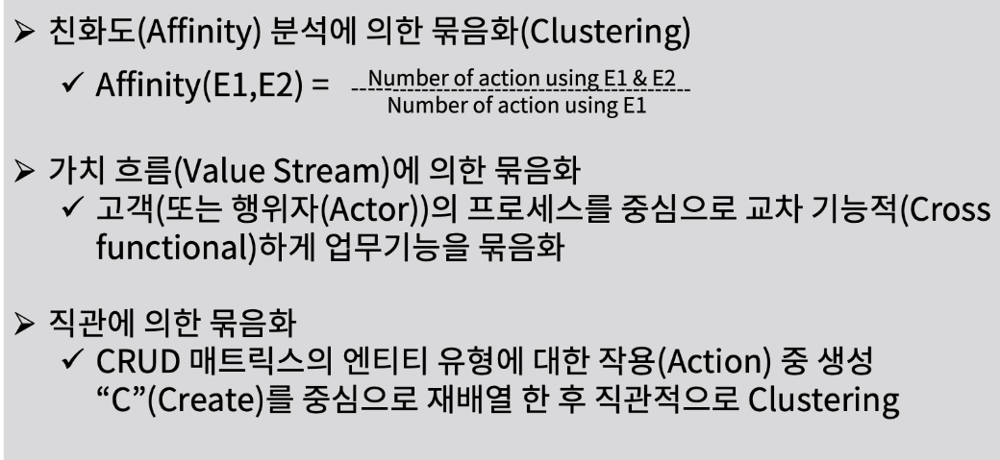
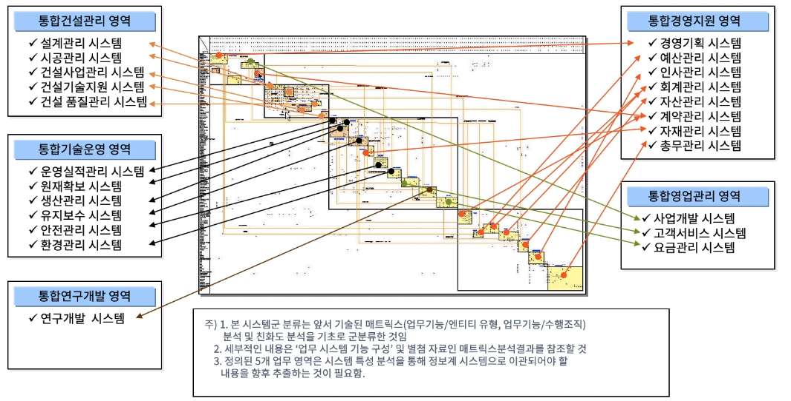
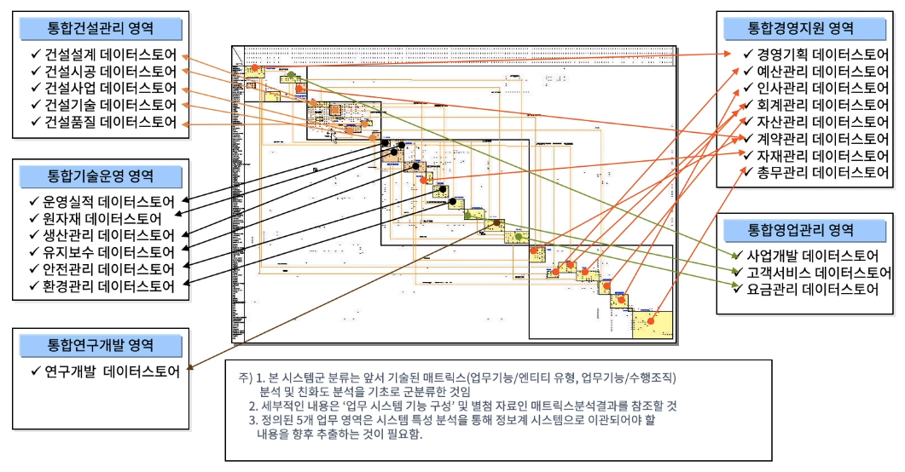
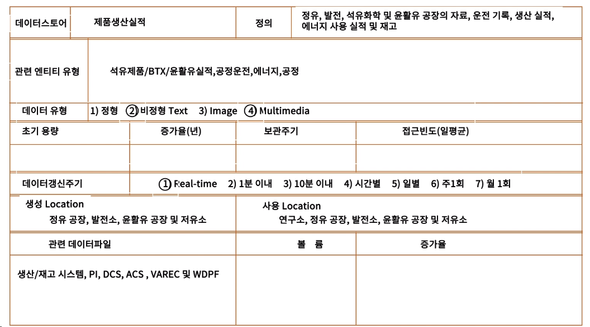

[toc]

# 데이터 친화성 묶음화로 데이터 베이스 정의하기

## :heavy_check_mark: 친화도 묶음화(Affinity Clustering) 기법

## :heavy_check_mark: 업무기능 친화도 묶음화 결과 - 비즈니스 시스템 예 

## :heavy_check_mark: 엔티티 유형 친화도 묶음화 결과 - 데이터 스토어 예 

## :heavy_check_mark: 데이터스토어 프로파일 예 

