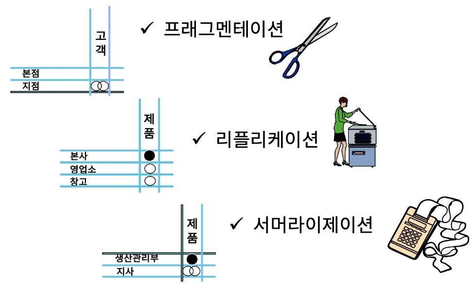

[toc]

# 데이터 분산 분석 빛 볼륨 산정

## :heavy_check_mark: 데이터 분산 분석을 위한 업무처리/수행 위치 빈도 매트릭스

## :heavy_check_mark: 비즈니스 시스템 정의서 예 

## :heavy_check_mark: 데이터 분산 분석을 위한 업무처리 vs 비즈니스 위치 점유도 매트릭스

## :heavy_check_mark: 데이터 분산 전략 결정

## :heavy_check_mark: 데이터 볼륨 산정하기

