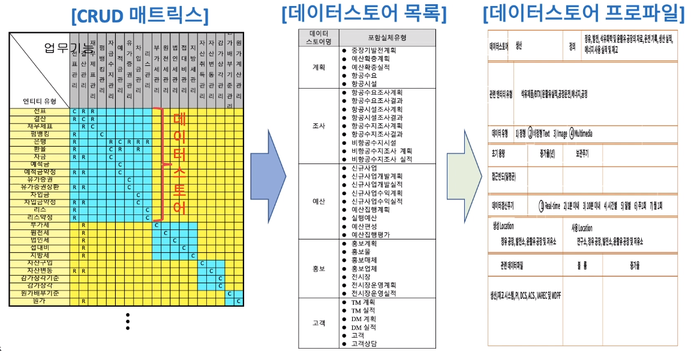
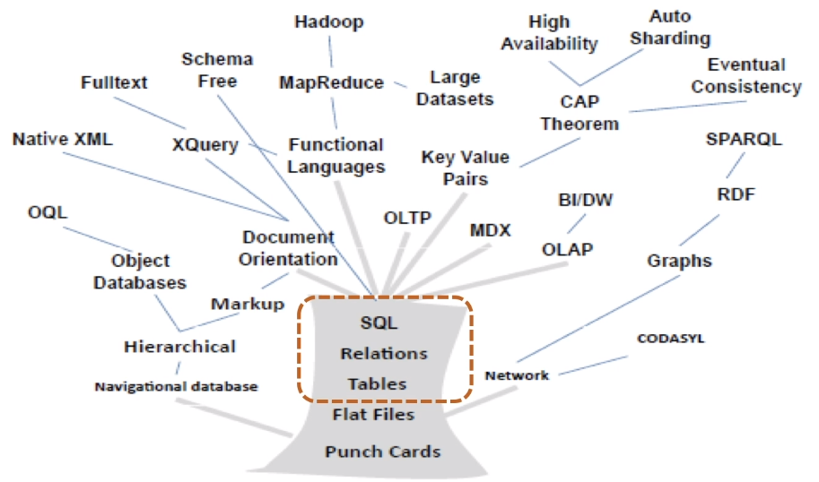
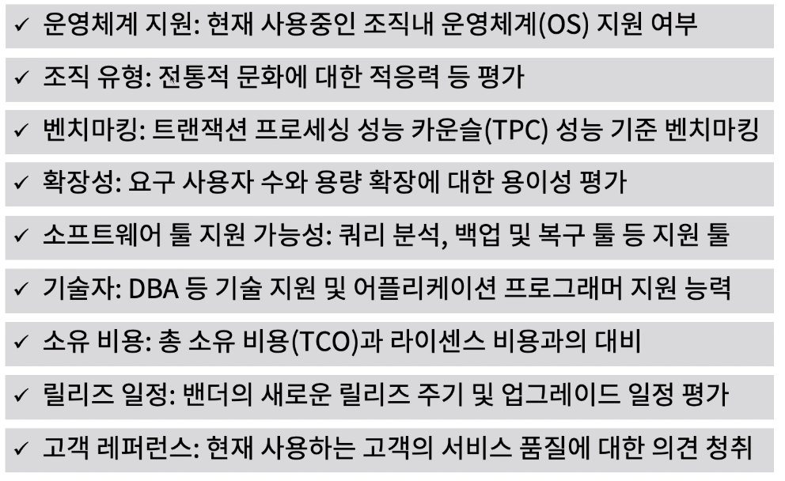
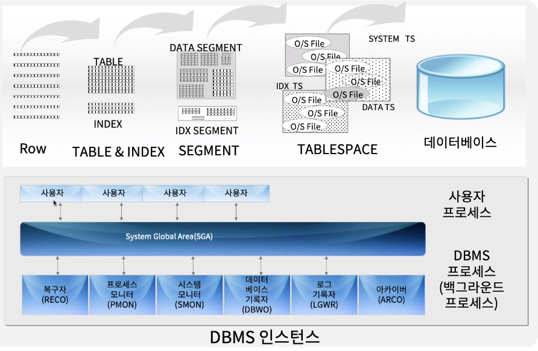

[toc]

# 데이터 베이스 관리 시스템 결정

## :heavy_check_mark: 데이터 아키텍처의 데이터 스토어 정의로부터 출발

## :heavy_check_mark: 데이터베이스 기술환경 개념 트리

## :heavy_check_mark: 데이터 베이스 관리 시스템 (DBMS) 선정을 위한 고려사항

## :heavy_check_mark: 데이터베이스 관리 시스템 (DBMS) 아키텍처 예

