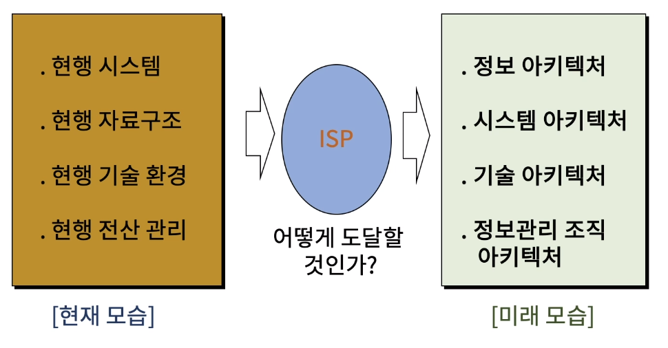

[toc]

# 데이터 정보 아키텍쳐 완성하기

## :heavy_check_mark: 현행 시스템을 새로운 모습으로 변화하기 위한 아키텍처

## :heavy_check_mark: 데이터/정보 아키텍처 관계

## :heavy_check_mark: 엔터프라이즈 데이터 아키텍처 완성

## :heavy_check_mark: 한국 범정부 엔터프라이즈 아키텍처 프레임워크(EAF)에서의 데이터/정보 아키텍처

## :heavy_check_mark: 데이터 아키텍처 거버넌스 시작

