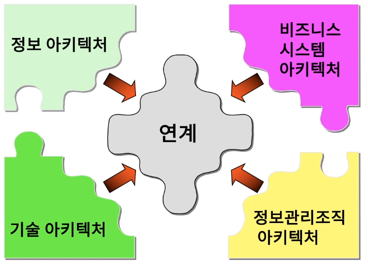
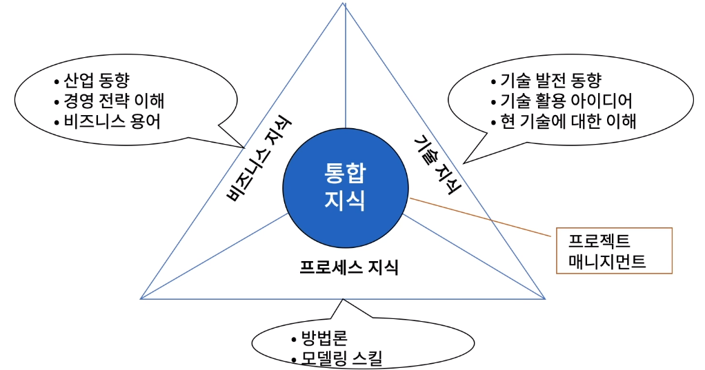
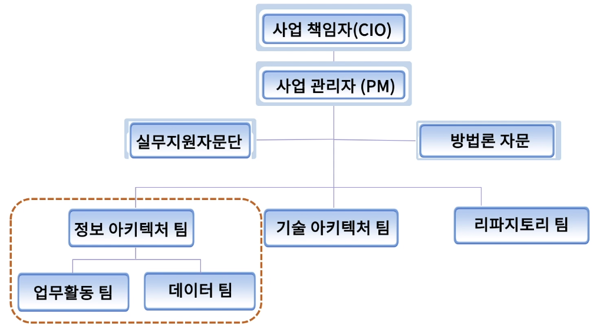
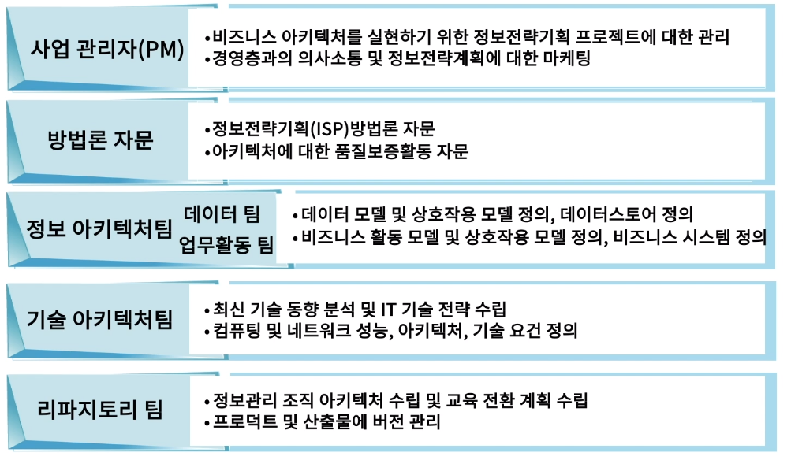
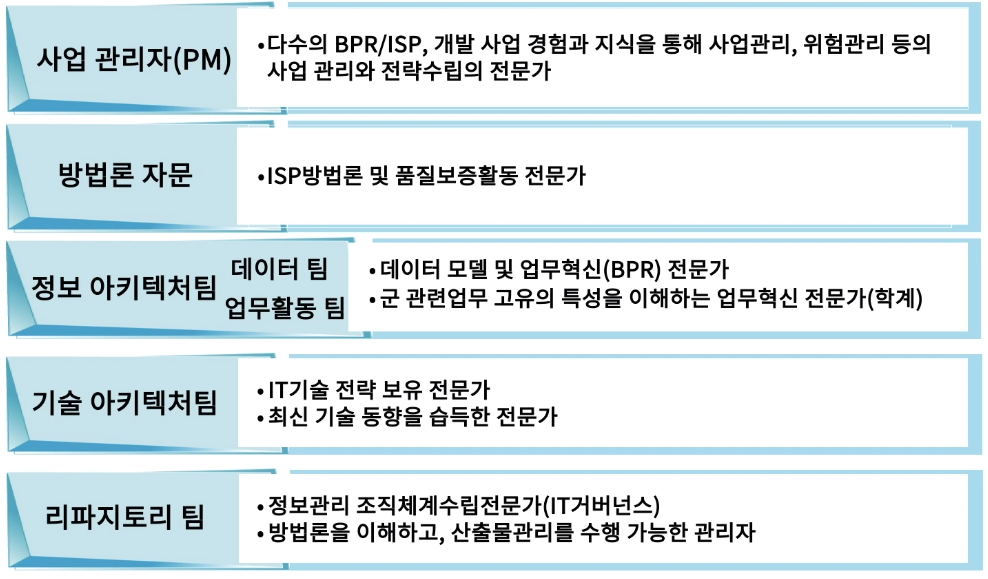

[toc]

# 데이터 아키텍처는 누가 만드는가?

## :heavy_check_mark: 정보전략 계획 수립을 통한 아키텍처 정의

## :heavy_check_mark: 아키텍처 수립 팀 구성 요건

## :heavy_check_mark: 정보 전략 계획 수립 프로젝트 수행 조직 구조 - 데이터 팀

## :heavy_check_mark: 정보 전략 계획 수립 프로젝트 수행 조직 역할

## :heavy_check_mark: 정보 전략 계획 수립 프로젝트 수행 조직 자격 요건

