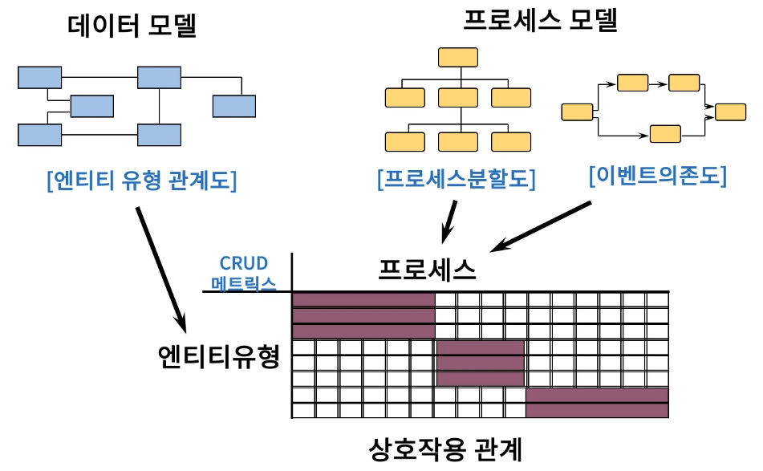
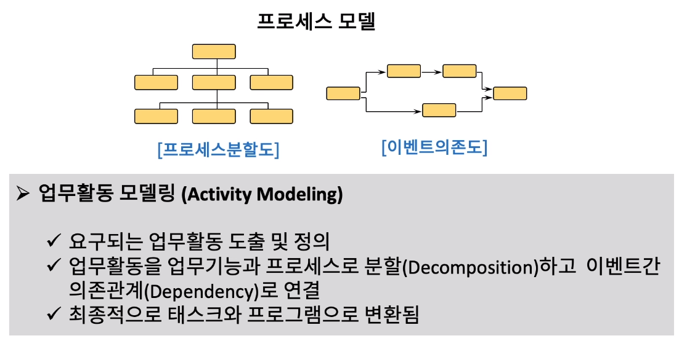
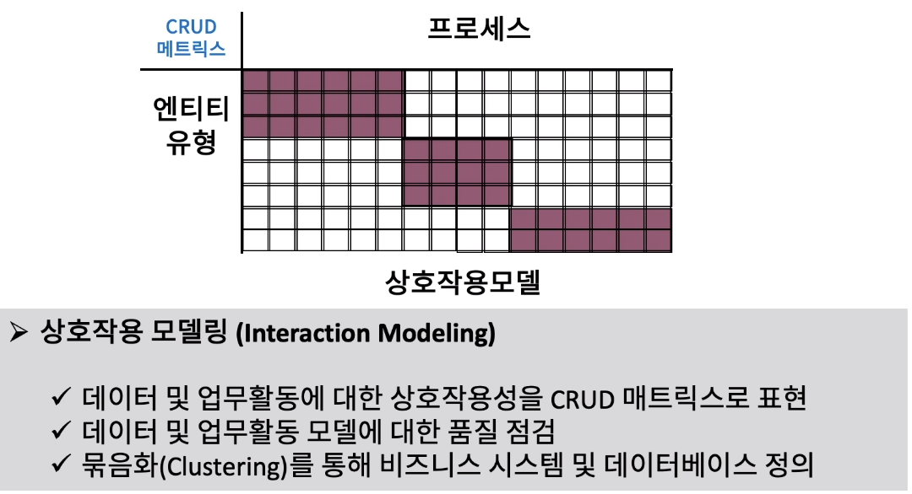

[toc]

# 데이터 모델링 하는 이유

## :heavy_check_mark: 모델링 장점

- 업무활동에 관한 혁신적, 발전적인 사고 지원
- 업무담당자나 정보 시스템 담당자가 공히 이해하기 용이
- 비즈니스가 변화할 경우, 모델에 반영할 수 있는 기본 틀 제공
- 완벽한 하향식(top-down) 분석에 의한 공학적 접근을 지원

## :heavy_check_mark: 데이터 아키텍처 - 데이터 모델 - 데이터베이스 스키마ㄴ

## :heavy_check_mark: 엔터프라이즈 정보 모델

### 엔터프라이즈 업무활동 모델

### 엔터프라이즈 데이터 모델

### 엔터프라이즈 상호작용 모델

