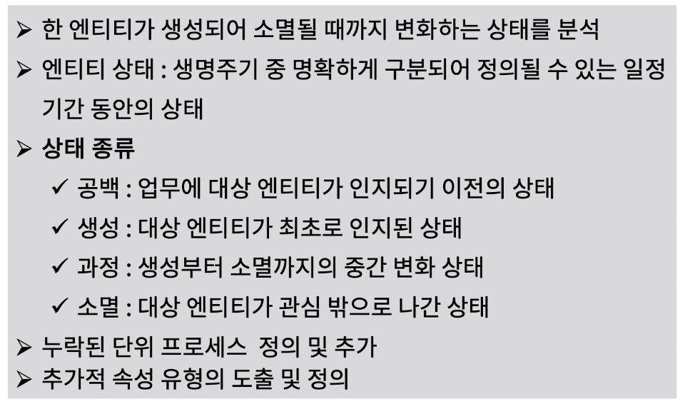
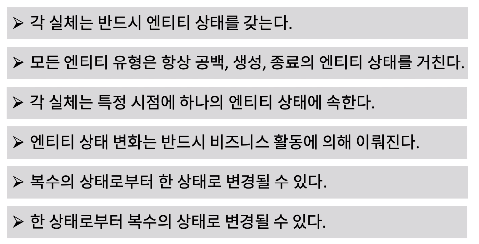
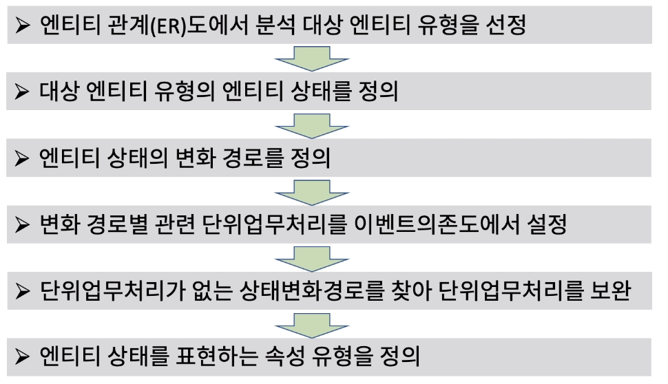
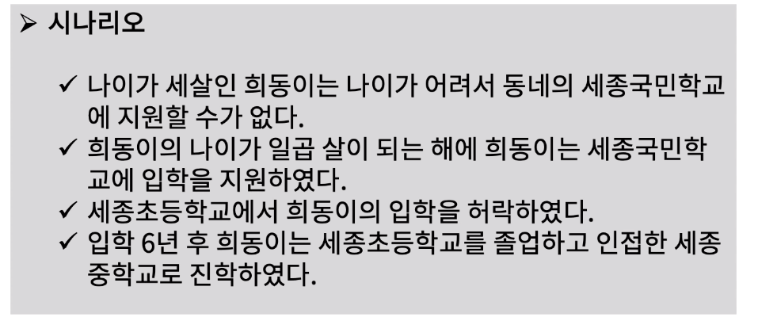
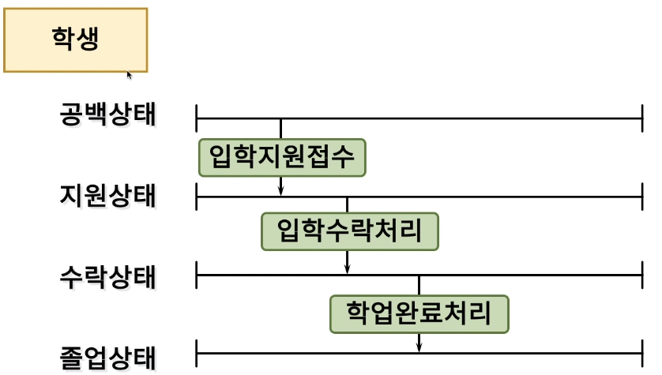

[toc]

# 엔티티 생명주기(Lifecycle) 분석을 통한 데이터 모델

## :heavy_check_mark: 엔티티 생명주기 분석 (Entity Lifecycle Analysis)란?

## :heavy_check_mark: 엔티티 생명주기 분석 규칙

## :heavy_check_mark: 엔티티 생명주기 분석 태스트 순서

## :heavy_check_mark: 엔티티 생명주기 분석 예) 시나리오

### 시나리오

### 엔티티 상태 분석도

